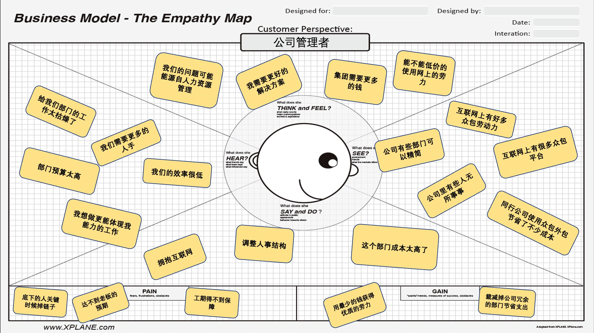
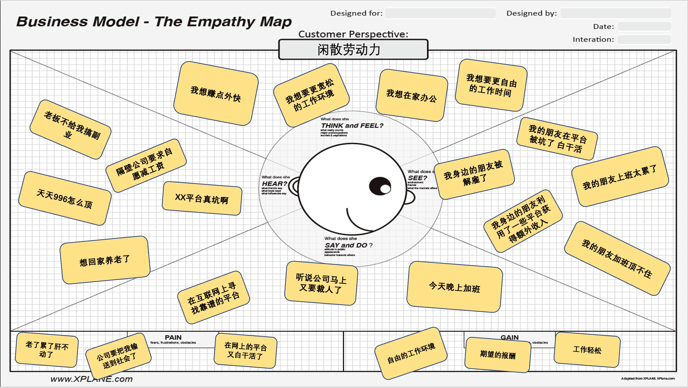
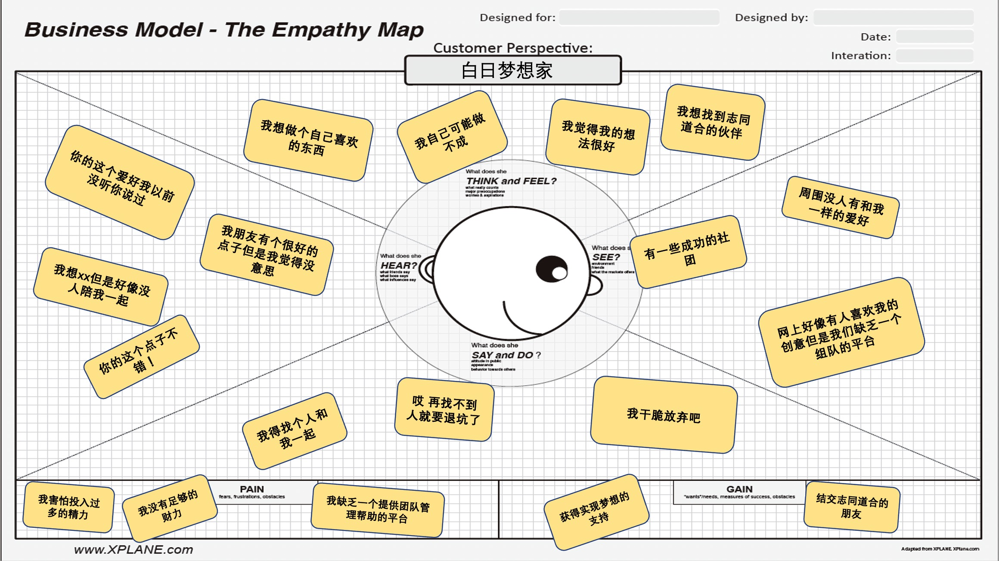
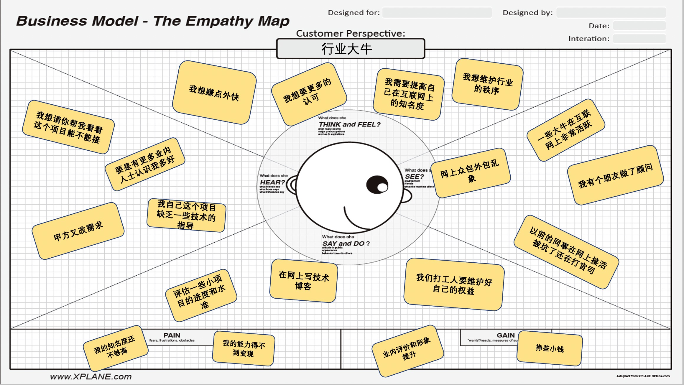
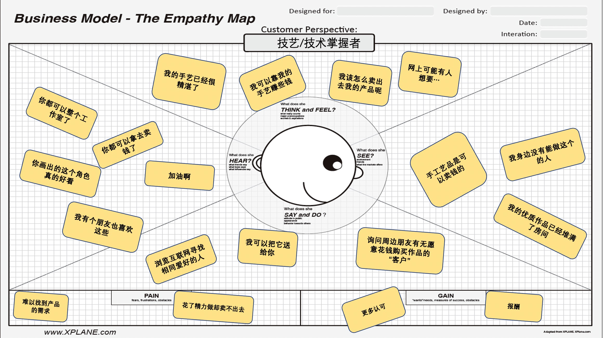
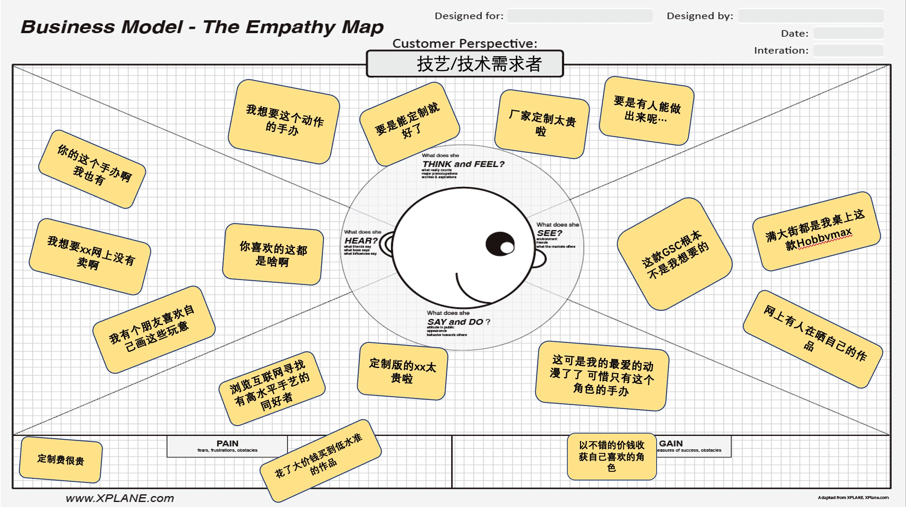

# Linker平台商业模式设计文档

[toc]

## 小组成员

- 戴祺佳 181250023（组长）
- 曹邵恒 181250005
- 王海辰 181850154
- 徐宇轩 181250167


## 度量数值

- 移情图数量：6
- 候选构思数目：7
- 更新的商业模式画布要点数量：32
- 更新的商业模式画布关联关系：19
- 引用的调研报告和新闻报告数目：10
- 故事数目：6
- 场景要点数目：6


## 文档简介

本文档为需求与商业模式创新课程的第二次大作业，旨在使用设计方法对商业模式进行设计。

### 作业说明

- 任务
  - 沿用上次提交的商业模式画布，使用教材讲述的六种设计方法展开商业模式设计
- 要求
  - 产物需要是一个pdf文档，包括以下内容：
    - 文档简介
    - 客户洞察
    - 构思
    - 视觉化思考
    - 模型构建
    - 讲故事
    - 场景
  - 本次作业的商业模式需源于上一次，允许少于20%的调整
  - 本次作业需要体现出细致的产品设计
  - 六个设计方法的产物在内容上要一致、自洽
  - 文档排版清晰整洁，行文流畅，满足度量数值
  - 内容分析有深度
- 度量数值要求
  - 移情图不少于2个
  - 候选构思不得少于3个
  - 模型构建
    - 商业模式画布总要点数量不少于30个
    - 商业模式画布关联关系不少于15个
    - 引用的调研报告和新闻报道不少于10篇
  - 讲故事的故事不少于3个
  - 场景部分要点不少于6个

### 内容说明

在本阶段中，我们对上一阶段产出的商业模式画布进行了进一步的设计和优化。首先，我们通过客户洞察方法分析了我们的客户群体，从中选出了比较典型、具有代表性的积累群体，并以一个个体为例子分析其所见所闻所感，进而更深层次地理解客户的需求。其次，我们通过头脑风暴构思分析筛选出一系列商业模式创意，希望通过这些创意来解决用户的需求，并最终整合出我们最终的商业模式；在此之后，我们使用视觉化思考的手段对我们的创意进行进一步的分析，通过在白板-便利贴上的讨论分析各个模块的要点和它们之间的联系；进而，我们得以使用模型构建的方式来较为全面的描述我们的商业模式构思，并进行一些较为细致的调研；然后，我们使用了讲故事这一手段对已经大致建构好的商业模式进行描述，通过各个参与方的“讲述”验证用户体验与构思可行性；最后，我们对客户视角的故事设计详细的场景，获取最细致的用户体验描述。以上的设计过程将通过以下的文档内容加以记录和阐述。


# Linker商业模式设计

## 一、客户洞察

客户永远是上帝，任何一个想要为客户提供良好的服务并最终从客户处获取收益的商业模式都必须坚持以客户为中心的理念，这要求在商业模式设计的初始阶段对我们所准备服务的客户群体进行分析和某种意义上的描述，理解他们最真实的体验和需求，进而为商业模式的构建提供指导。

在这一部分，我们分析了企业的管理者、一位35岁“被输送到社会”成为闲散劳动力的程序员、一位希望推广自己，把能力变现的行业大牛、一群希望在爱好上找到更多伙伴和资源的“白日梦想家”、一位“身怀绝技”的小众技艺掌握者和一位正有相关技艺需求的需求者。通过以小见大地分析这些客户群体，我们将能更好地设计我们这个旨在为他们解决需求的平台。

### 1.1 公司管理者

利根川幸雄是帝爱集团的一个普普通通的中层管理者，手下管理着一票员工，他们共同为帝爱集团的霸道总裁兵藤和尊工作，兵藤和尊是一个令人胆寒的老板，在使用强力手段与其他的集团进行竞争的同时，对属下的各个部门也是毫不仁慈，要求他们花最少的钱做最多最好的事。利根川需要寻找一个能满足这个苛刻要求的方案。



### 1.2 互联网上的闲散劳动力

梅骰珐，男，年龄35岁零一天，程序员，帝爱集团曾员工。在他35岁生日的这一天，他接到了他的上司的通知，因为他的年纪太大，精力跟不上工作的节奏，帝爱集团决定把他输送到社会上去，“作为优质劳动力为社会做出更大的贡献”。于是，他失业了。但是梅骰珐作为工作了10年却因为加班而有超过20年工作经验的打工人，认为自己的能力还有变现的价值，如果从35岁就成为外卖骑士对不起自己积累的技术栈。



### 1.3 白日梦想家

安艺，丰之崎学园的高二学生，是一个浸润了二次元文化的御宅族，平常喜欢看小说、动画、不过最喜爱的还是美少女游戏，在游玩了无数的优秀作品后，他萌生了自己制作一款游戏的想法，并开始为之努力。在初步构建了游戏蓝图之后，安艺发现自己除了构思之外对如果打造一款游戏一无所知。他希望能有一个平台把自己的创意展示出去，也希望能有志同道合者与他为了这个点子而努力，即使他这个点子看上去不那么现实。


### 1.4 行业大牛

老匡，软件工程行业的专家，有很强的专业能力和素养，闲暇之余喜欢在各种论坛写一些技术贴子，有了些许粉丝。但是老匡希望自己能够有更大的影响力，进一步提高自己在行业的知名度。“能不能找个地方宣传以下自己？”他开始在互联网寻找相关的资源，希望在宣传自己的同时也能赚些小钱。同时他发现很多网络上的技术人员在接私活的时候缺乏待遇的保障，他想为行业的秩序出一分力。



### 1.5 技艺掌握者

小刘的父亲是位技艺精湛的木雕师傅，因此小刘从小就耳濡目染了模型雕刻的方方面面。稍微长大之后，小刘开始接触动画、漫画，并尝试自己把纸上、屏幕上的角色还原出来。经过多年的积累，他已经能很完美地让二次元的角色在三次元也栩栩如生了。虽然作品的质量很高，但是平时也只是雕完之后就摆起来，或者送给朋友做礼物。随着年龄的增大，小刘开始考虑如何利用自己的手艺赚点小钱。



### 1.6 寻找某种技艺的需求者

小呆是个模型粉，除了购买各类厂家生产的成品模型以及自己拼装之外，他也会关心各类论坛里的模型信息。不过有一点始终让他有些困扰，那就是一些自己喜欢的角色和姿势在市面上没有相关的产品，另外，一些人气高的角色的产品满大街都是，失去了独特性。他觉得定制可能是一个能满足自己需求的方法，于是开始了寻找。



## 二、构思

经过对客户群体的洞察，我们对要服务的对象有了更深的认知，接下来的过程便是使用头脑风暴的方式思考出客户需求的机制和解决方案，并使用这些机制和解决方案建立起我们的商业模式。

### 2.1 候选构思

---

#### 2.1.1 委托任务机制

- 驱动焦点：客户驱动

- 问与答：

  - 如果提出需求的需求者与拥有劳动力的执行者以委托任务的形式建立联系会怎样？
  - 在充满临时性与不可靠性的众包与外包任务中，需求者与劳动者将能够达成一份契约来规定任务和报酬，避免出现现有的众包与外包平台中因为缺少契约而常见的纠纷。

- 说明：需求者在平台的委托任务区发布委托任务，任务和报酬等以委托说明的方式进行描述。执行者根据自己的能力接取委托，双方通过平台取得联系、进行沟通，进而达成契约、转向任务执行阶段。报酬方面，需求者在发布委托任务时需要向平台缴纳预算的一定比例的订金，避免出现绕过平台私下联系的情况。此外，任务将根据情况被分为不同的阶段，每一阶段的报酬由需求者向平台支付，执行者从平台获取。

  利用这一机制，我们将能够在需求者和执行者之间建立联系，达成需求者和执行者两类客户的需求。通过平台建立联系，有助于商业模式中客户关系的维系，让客户体会到平台优秀的服务并乐于使用。

#### 2.1.2 悬赏任务机制

- 驱动焦点：客户驱动

- 问与答：

  - 如果提出需求的需求者与拥有劳动力的执行者以悬赏任务的方式建立联系会怎样？
  - 在需要群策群力的一些问题上，悬赏任务将能够吸引广大有兴趣的执行者参与其中，说不定中间的某一个方案就可以作为问题的最佳解决方案，这是传统的公司雇员结构所比较难以达成的。

- 描述：需求者在平台的悬赏任务区发布悬赏任务，任务、报酬和截止时限等以悬赏说明的方式进行描述。有兴趣的执行者私下进行相关任务，若有自己认可的结果即可向平台进行提交，根据需求者的最终需求选定提交的解决方案，该解决方案的作者即获得此悬赏任务的报酬。报酬方面，需求者在发布悬赏任务时需指明赏金并支付给平台，在解决方案选定完成后该执行者从平台获取赏金。

  利用这一机制，我们将能够在需求者和执行者之间建立联系，达成需求者和执行者两类客户的需求。通过平台建立联系，有助于商业模式中客户关系的维系，让客户体会到平台优秀的服务并乐于使用。

#### 2.1.3 会员制

- 驱动焦点：客户驱动

- 问与答：
  - 如果引入会员制对客户进行服务会怎样？
  - 会员制提供了区分不同需求水平的客户的空间，由会员制，平台可以为一些有较高需求水平（如过程控制与保障）的客户提供差异化服务和增值服务。
- 描述：会员制区分了免费用户和会员用户，免费用户能够使用平台的基础功能而享受不到更多服务，而会员用户通过按时长购买会员资格能获得平台提供的增值服务，这样的机制能有助于平台建立补贴流，有助于扩张用户数量。同时也能让有较高的需求水平的客户获得满意的服务。

#### 2.1.4 过程保障与保险服务

- 驱动焦点：供给驱动、客户驱动

- 问与答：

  - 如果引入过程保障与过程保险服务会怎样？
  - 过程保障和过程保险服务是全新的价值主张，是行业中竞品所缺乏的一环。客户可以从这两项服务中获得好处，进而认可我们的价值主张并为其付费。

- 描述：平台提供过程保障与过程保险服务，其中过程保障分为免费部分和付费部分，免费的部分由平台的任务和报酬机制实现，付费的部分由平台分派工作人员实现。过程保险服务则是平台与保险公司合作面向需求者开发的新险种，当任务没有按时按量达标完成并达到赔付标准时，需求者可以从保险公司处获得赔偿。

  任何一个需求的发出者都希望自己的需求能够按时按量完成，平台正是看到了这一点，在过程保障和风险控制层面提出了新的价值主张，并可以满足客户的需求，由此提出这个构思。

- 注：

  ```
  设想中的过程保障服务:
   - 1.需求者在项目启动阶段提交保证金
   - 2.按照项目的阶段分阶段退出但不可提取
   - 3.项目完成后从保证金中收取平台佣金
   - 4.平台的人工协调工作由具有过程管理能力的人员进行,他们由平台雇佣,向平台负责,参与客户项目的协调
  ```

#### 2.1.5 仲裁者角色

- 驱动方式：客户驱动、资源驱动

- 问与答
  - 如果为解决（潜在的或已经发生的）需求者和执行者的矛盾而引入仲裁者角色会发生什么？
  - 一个被双方认可的仲裁者的加入将大大降低发生劳务纠纷的可能和发生后解决的成本。
- 描述：通过引入仲裁者构建三角形任务人际关系，仲裁者作为自由的第三方，在相关的领域内跟需求者、执行者一样组队，建立起工作团队，在需求者和执行者出现双方无法自行调解的问题时进行仲裁，同时对任务的合法合规性进行监督。

#### 2.1.6 资金流的利用

- 驱动焦点：财务驱动

- 问与答：
  - 如果将客户提供的资金作为资金池，用这些资金进行投资会怎样？
  - 平台收到的资金不是一个小数目，有机会利用这些资金展开投资获取收益，但同时会对资金流造成很大的压力，如果出现投资亏损资金流断裂，平台有债务违约的风险。
- 描述：使用客户提供的资金进行投资，期望能获得更大的收益。但同时会带来很大的风险。

#### 2.1.7 社区、工会与讨论区

- 驱动焦点：客户驱动
- 问与答：
  - 如果提供一个讨论创意、交流组队的社区会怎样？
  - 平台上的一些有共同兴趣爱好的参与者们将能够有机会组成工会，一起在某一个主题下探索各种可能性。一些有共同话题的参与者们将能够在讨论区一起讨论相关的话题，进而有可能一起组成工会。
- 描述：平台像知乎一样围绕一个个主题开启讨论区，有共同兴趣的参与者（无论是以需求者、执行者还是仲裁者视角参与活动）在讨论区下可以对主题展开讨论。如果谈的投机，志同道合的参与者可以直接在主题下组建工会，共同开展活动。更进一步，有相关需求的需求者可以来到讨论区寻找相关的工会，通过平台与他们对接。众多的主题、讨论区、工会和评论组成了一个用户社区。这有助于客户关系的维系，同时也是一个能让客户群体创造更大价值的平台。
- 注：设想中一个主题的相关内容：

```
- 主题【发起者、说明、相关主题。。。】
- 讨论【评论、子评论、回复评论】
- 工会【相关工会列表与信息、加入入口】
```

### 2.2 最终构思

---

#### 2.2.1 三角形任务人际关系的发掘与建立

- 驱动焦点：客户驱动
- 问与答：
  - 如果建立三角形任务人际关系会有什么效果？
  - 不同角色的客户将有机会能够在平台上满足自己的需求。

- 描述：拥有各色各样需求的需求者、拥有多种多样能力的执行者以及正直专业的仲裁者，他们共同组成了我们设想中的任务人际关系。发掘并建立这样的人际关系便是我们设计平台的初衷、目的与核心业务。为了满足不同需求者提出的需求类型，我们设计了悬赏任务与委托任务。为了解决潜在的或是已经出现的劳务纠纷，我们引入仲裁者角色，仲裁者可以是平台的客户，也可以与我们建立关键合作的组织或企业。通过平台建立这三者之间的联系，有助于商业模式中客户关系的维系，让客户体会到平台优秀的服务，达成他们各自的目标并乐于继续使用平台。

#### 2.2.2 项目任务过程保障与保险

- 驱动焦点：供给驱动、客户驱动

- 问与答：

  - 如果引入过程保障与过程保险服务会怎样？
  - 过程保障和过程保险服务是全新的价值主张，是行业中竞品所缺乏的一环。客户可以从这两项服务中获得好处，进而认可我们的价值主张并为其付费。

- 描述：平台提供过程保障与过程保险服务，其中过程保障分为免费部分和付费部分，免费的部分由平台的任务和报酬机制实现，付费的部分由平台分派工作人员实现。过程保险服务则是平台与保险公司合作面向需求者开发的新险种，当任务没有按时按量达标完成并达到赔付标准时，需求者可以从保险公司处获得赔偿。

  任何一个需求的发出者都希望自己的需求能够按时按量完成，平台正是看到了这一点，在过程保障和风险控制层面提出了新的价值主张，并可以满足客户的需求，由此提出这个构思。

#### 2.2.3 社区的构建

- 驱动焦点：客户驱动
- 问与答：
  - 如果提供一个讨论创意、交流组队的社区会怎样？
  - 平台上的一些有共同兴趣爱好的参与者们将能够有机会组成工会，一起在某一个主题下探索各种可能性。一些有共同话题的参与者们将能够在讨论区一起讨论相关的话题，进而有可能一起组成工会。
- 描述：平台像知乎一样围绕一个个主题开启讨论区，有共同兴趣的参与者（无论是以需求者、执行者还是仲裁者视角参与活动）在讨论区下可以对主题展开讨论。如果谈的投机，志同道合的参与者可以直接在主题下组建工会，共同开展活动。更进一步，有相关需求的需求者可以来到讨论区寻找相关的工会，通过平台与他们对接。众多的主题、讨论区、工会和评论组成了一个用户社区。这有助于客户关系的维系，同时也是一个能让客户群体创造更大价值的平台。

#### 2.2.4 会员制

- 驱动焦点：客户驱动

- 问与答：
  - 如果引入会员制对客户进行服务会怎样？
  - 会员制提供了区分不同需求水平的客户的空间，由会员制，平台可以为一些有较高需求水平（如过程控制与保障）的客户提供差异化服务和增值服务。
- 描述：会员制区分了免费用户和会员用户，免费用户能够使用平台的基础功能而享受不到更多服务，而会员用户通过按时长购买会员资格能获得平台提供的增值服务，这样的机制能有助于平台建立补贴流，有助于扩张用户数量。同时也能让有较高的需求水平的客户获得满意的服务。

## 三、视觉化思考


//TODO：暂时的结果，依然需要进一步处理【手绘一个版本】


## 四、模型构建

经过之前的几个阶段，我们已经对我们的商业模式有了一个模糊的概念和一些简单的共识，接下来我们将通过构建模型的方式对商业模式进行系统地描述。通过构建模型，我们能进一步细化我们的商业模式，并对它的可行性、完备性等等进行分析。

### 4.1 商业模式画布


### 4.2 画布要点

#### 4.2.1 客户细分

客户细分描述的是一个商业模式想要获得的和期望服务的不同的目标人群和机构，是商业模式所要服务的对象。具体到我们的产品，客户细分可以分别从以下几个要点进行描述：

##### 4.2.1.1 多边平台

我们想要服务的对象客户群体可以被划分为多个个子群体：

- 1.需求者：

  需求者是项目的发起者，是需求的来源。因为种种原因，他们自己无法完成需求，故将试图通过平台寻找到实现者帮助自己完成项目和需求。同时，为了认可实现者的劳动价值，他们需要提供一定数额的报酬。企业需求者可以在平台上发布委托任务与悬赏任务。委托任务通过与特定的团队对接，通过悬赏任务调动群智。
  对于我们的平台来说，需求者不仅仅是主动的一方，还可以是被动的一方。基于平台的社区性与团队组建功能，需求者可以去获得与客制化团队接触的机会，而这个接触方式主要是平台推荐。

- 2.执行者：

  执行者是项目的参与者，是需求的实现。他们可能是自由职业者，可能是公司雇员，可能是兴趣社团。他们来到平台上通过付出劳动完成需求换取需求者所提供的报酬，工作模式也有众包和外包。同时，为了便于平台和需求者对服务者的能力或作品进行适合度评定，服务者需要以一定的手段声明自身的工作能力，如公开工作经历或之前的作品情况。平台会为执行者提供个人任务管理功能，根据能力描述推荐任务、管理任务进度。
  进一步，执行者还可以发布自己的创新设计、想法灵感等，供潜在的需求者开发、构建新的需求进而形成新的项目，这也是执行者这一群体另一重要角色之一。平台为其提供兴趣驱动的团队组建功能来实现自己想做的客制化产品，建立好的团队需要在平台上定期汇报进度。

- 3.仲裁者：

  仲裁者是项目的观察者，通常不参与项目运行，但在需求者于实现者因项目进度、内容等发生纠纷时，仲裁者将介入，作为第三方进行调解与仲裁。同时，仲裁者还将作为监管者关注项目是否符合相关的法律法规或公认的行业规定等。在完成仲裁和监管任务的同时，仲裁者将可以获取一定的报酬。

##### 4.2.1.2 多元化的客户群体

4.平台的核心在于构建需求者-执行者-仲裁者的联系，故可以为各个行业于领域的客户提供服务，包括但不限于电子商务、软件开发、科技研究、实物买卖等行业，平台不会限定某个领域的需求于服务，但其内容必须要在相应国家与地区的法律法规允许与可监管范围内。需求者、执行者、仲裁者三种客户细分类型参与平台活动是出于不同的目的，通过“建立人与人之间的联系”，平台能够为三者分别提供统一而各异的价值主张。
另外需要强调的是这三者是比较概括性的概念，实际上来说每一个群体又有自己的细分，具体实施不同的业务内容。

##### 4.2.1.3 小众市场

5.平台的社区可以依据某一个创新点子进行团队组建，帮助客制化产品的生产，同时与感兴趣的企业进行对接。客制化的产品与创意主要是立足于小众市场，所以小众市场也是Linker平台商业模式的重要组成部分。

#### 4.2.2 价值主张

价值主张描述的是为某一客户群体提供能为其创造价值的产品与服务，是客户选择一家公司而放弃另一家的原因。具体到我们的项目，价值主张可以分别从以下几个要点进行描述：

##### 4.2.2.1 创新

6.本产品能够吸引愿意短期工作或者仅完成一个项目的执行者客户，旨在提供一个对接的平台，并同时可以扩充人脉。在以前，许多的平台提供的是长期工，但是有些公司可能无法承担或者不需要这样的个体或团体长期工作、有些个体或团体也更愿意利用空余时间或者倾向于更自由的工作方式。同时，本产品整合了众包和外包服务，并引入仲裁者机制，在项目运行模式和项目人员结构上进行了创新。
同时，本平台的创新还在为执行者提供团队组建功能，有创新想法的用户可以在平台上发布自己的创意，招募其他对自己的项目感兴趣的人加入，在组队满足平台的要求之后，平台辅助团队管理，并且可以将阶段性的产品展示给平台上的投资人或者企业，提供一个对接的功能。

##### 4.2.2.2 一站式服务

7.本产品意在提供一站式服务，将成为能力和需求的展示板，不同角色的对接联系核心，薪酬的保管与转移中心以及项目运行与完成评价平台，为不同客户细分类型的客户都能提供完备而方便的服务。

##### 4.2.2.3 缩减成本

8.根据相关资料研究，使用类似的网络平台进行项目的团队组建将能够得到显著程度的人力物力财力节约。同时，一些非大众行业的委托需求也能够在网络平台以低成本形式寻找到实现方。
除去平台运维，我们将仲裁者这一角色也部分外包出去，在关键合作上也一定程度缩减了成本

##### 4.2.2.4 风险控制

9.需求者总是希望发布的项目能够顺利按时按量完成，执行者总是希望付出合理的劳动并获得足够的报酬，但在实际执行过程中由于委托需求的某些不确定性总是容易产生认同风险，产品加入仲裁者形成三角形人际关系结构，提供一定的审核机制和监督机制，甚至可以通过商业保险的形式减少或对冲风险，保障需求提供方与服务提供方两者的利益。

##### 4.2.2.5 可获得性

10.众包与外包的特性让一个执行者可以为多个需求者创造价值，需求者所需要的一些往常难以通过一般手段获取的需求执行能力将通过平台得1.到。
同时执行者也能够在一个相对舒适的工作区间内通过劳动获取报酬。

##### 4.2.2.6 便利性

11.使用算法匹配或推荐，在人与人关系的组建过程中减少寻找的时间和财力消耗，操作与执行更简单。

##### 4.2.2.7 设计

12.Linker平台十分注重用户交互与信息管理，在功能性强的同时也避免产生过于琐碎化的GUI模块。

#### 4.2.3 渠道通路

渠道通路描述的是一个商业模式如何同它的客户群体达成沟通并建立联系，以向客户群体传递自身的价值主张。是产品信息和价值主张的传递渠道，具体到我们的产品，渠道通路可以从以下几个要点进行描述：

##### 4.2.3.1 合作方渠道

13.平台发展初期我们可以与网络搜索服务提供商如百度等公司进行合作，提升搜索优先级来扩大我们的平台知名度。
同时在一些相关的网络平台上投放广告吸引客户，使平台积累一定的用户基数。

##### 4.2.3.2 自有渠道

14.我们主打的功能是众包与外包相融合，所需要的媒介是移动互联网平台，借助互联网庞大的体量，在积累一定用户与口碑后，平台本身会成为一个宣传助力，使用过平台产品的用户若获得了不错的体验，将很有可能继续使用并向身边的人推荐。

#### 4.2.4 客户关系

客户关系描述的是一个商业模式对某客户群体所建立的客户关系的类型，是商业模式的与客户的交互。具体到我们的产品，客户关系可以从以下几个要点进行描述：

##### 4.2.4.1 自助服务

15.产品很大程度上不需要直接参与人与人关系的组建，作为平台，不同的客户能够自主地在平台上寻找需要的资源，自主地结成关系并进行接下来的活动

##### 4.2.4.2 社区

16.产品通过社区来进行团队组建功能，社区中的亮点创意可以吸引其他志同道合的用户一起加入组成团队，当团队符合平台的一定规则时，平台可以辅助团队建设。社区也是一种听取用户反馈，不断改进用户体验，调整商业模式的重要方法。

##### 4.2.4.3 专属私人服务

17.Linker平台着重于为每一个用户群体建立起任务管理系统，对于执行者，可以获得推荐执行的任务列表；对于需求者，可以获得正在进行的需求的现阶段报告；对于仲裁者，可以获得自己正参与仲裁的任务列表

##### 4.2.4.4 自动化服务

18.Linker平台在多个领域存在自动化的服务，主要业务内容是推荐与分配，包括执行者的任务推荐、需求者的团队推荐、仲裁者的任务分配以及团队组建时成员推荐等等。

##### 4.2.4.5 与客户写作、共同创造

19.Linker平台的社区模块为用户反馈平台的问题提供了一个渠道。平台会根据用户的反馈调整用户交互、修复漏洞。同时，用户的反馈有利于平台调整现有的商业模式。

#### 4.2.5 收入来源

收入来源描述的是一个商业模式从每个客户群体中获得的现金收益，是商业模式利润的源头，在扣除成本之后即成为运行商业模式所获得的利润。具体到我们的产品，收入来源可以从以下几个要点进行描述：

##### 4.2.5.1 使用费

20.作为平台方我们提供的服务就是为需求者、执行者、仲裁者等多种身份的人之间建立联系，提高效率。一旦上述身份的人达成共识，形成工作关系，我们将分阶段从三方的佣金中抽取一部分作为收入来源。

在平台形成一定规模后，可以招商部分企业来投放广告。其中主要包括相关行业的企业的一些招聘广告、对口任务的一些培训机构广告等，进而从广告商处获得广告费用收入。

##### 4.2.5.2 会员费

21.通过出售会员身份为一定数量的用户提供特权服务。如对于需求方而言，可以在具有相同需求条件下提供需求发布的高优先级；对服务提供者而言，在能力相近的条件下将自己的推荐等级作适当提高等。

##### 4.2.5.3 推荐费
22.需求者需要提高自己需求的顺位，使其能够更容易被执行者看见，那么可以通过缴纳一定的推荐费来完成

##### 4.2.5.4 广告费
23.广告费可以来源于第三方投放的广告，但是比重不会占收入来源的大头，因为过多的广告会导致UI的丑化，在互联网技术趋同的现在，人机交互体验一定是某个平台用户留存率的直接影响因素。

#### 4.2.6 核心资源

核心资源描述的是保证一个商业模式顺利运行所需要的最重要的资产，它负责创造并提供价值主张的内容，进而让企业在客户认可并获取了价值主张的内容后通过收入来源进行盈利。在我们的商业模式中，关键资源是为需求者、执行者、仲裁者牵线搭桥的网络平台及其配套系统。正是因为有了这个平台，有需求却自己不能实现的需求者才能够获取有能力的执行者的劳动力，执行者才可以通过劳动换取报酬，仲裁者才有存在的必要。总的来看，跟平台相关的核心资源主要有以下几个方面：

##### 4.2.6.1 实物资源

24.网络平台软件系统以及相应的服务器等让软件实体能够稳定在计算机和网络上运行，发挥其功能的资源

##### 4.2.6.2 知识性资源

25.一个包含有各个需求者、执行者、仲裁者信息的数据库以及通过数据库和需求内容进行推荐，为达成委托提供便利的推荐或排序算法

##### 4.2.6.3 人力资源

26.软件产品的开发运营维护人员，营销推广与市场分析人员，企业管理与运行支持人员等

#### 4.2.7 关键业务
关键业务描述的是保障商业模式正常运行所需要做的最重要的事情。在我们的商业模式中，为三种参与者牵线搭桥的平台是关键资源，与平台以及网络相关的关键活动占据着支配地位。具体到我们的产品，平台是我们的关键业务：

##### 4.2.7.1 平台

在需求的执行过程中，建立在需求者、执行者与仲裁者这些不同的客户之间建立起联系的平台是我们的核心业务，这个联系有以下几种细分结构：

- 27.悬赏委托：需求者挂出赏金发布悬赏委托，不定的执行者以完成的作品或产品作为索取赏金的依据，根据需求者自己的判断决定是否满足要求并给予酬劳，仲裁者负责确保过程与内容合规。
- 28.契约委托：需求者发布委托与大致预期酬劳，确定的执行者以契约方式负责进行作品或产品的完成，根据需求者与执行者的约定判断是否满足要求并给予酬劳，仲裁者负责确保过程与内容合规，并处理可能产生的约定变更与纠纷。
- 29.团体组建：社区中的创意点子吸引一些用户自愿组成团队，在组队的相关事宜符合了平台标准后就会正式组成团队，进行某个创意的落地，平台会辅助进行团队管理。同时团队也必须阶段性的在平台上记录自己的制作过程，发布阶段性的产品。
- 30.投资对接：组成团队的用户所生产出来的产品会由平台推送给相关领域的投资人或者天使投资人或企业，若投资方感兴趣，可以在平台的引导下进行业务洽谈。
为了执行关键业务，我们需要进行一些关键活动如平台管理、新服务的启动以及平台的升级等。

#### 4.2.8 重要合作
重要合作描述的是保证一个商业模式顺利运行所需的供应商和合作伙伴网络，他们是商业模式运行的支持者与保障者。具体到我们的产品，重要合作可以从以下几个方面进行描述：

##### 4.2.8.1非竞争者之间的战略联盟

31.通过与执行业务的公司进行合作来使利益多边化，包括与第三方仲裁机构的合作和互相扩大影响的执行者企业合作，来扩大影响和市场份额，优化及规模效应，降低风险和不确定性。
通过与网络服务提供商进行合作来保障网站平台的正常顺利运行，如云服务提供商与网络运营商等。

#### 4.2.9 成本结构

成本结构描述的是运营一个商业模式所发生的全部成本，是保证商业模式正常运行所必须要支出的资金等资源。具体到我们的产品，成本结构是成本导向型：

##### 4.2.9.1 成本导向型

32.我们产品的运行成本由以下内容组成：

- 固定成本：是不因产品和服务的产量而改变的成本，如人力资源的工资以及开发软件的固定成本。

- 可变成本：需要根据本项目的市场使用率决定，如投放广告，进行招商引资等的资金成本。
### 4.3 关联

#### 4.3.1 客户细分-价值主张

客户细分的多边平台准则是设计价值主张的根本出发点，客户分为需求提供者，服务提供者，仲裁提供者三类，要求我们在设计三者关系的时候要考虑全面，不能够失衡。对于三种用户都要有特殊方案提高用户留存率与使用率。比如，对于需求者而言，需要一个便利的渠道与执行者沟通合作，同时也需要对风险进行控制，所以我们在价值主张中加入一站式服务以及风险控制。同时，由于三者还可以进一步以角色为粒度细分，所以在构建关系时要分清楚每一个角色的价值主张是什么，这一部分在之前的客户洞察模块已经涉及，此处就不作过多赘述。

#### 4.3.2 客户细分-渠道通路

三类客户所涉及的领域十分宽泛，所以在平台起步初期，除了广告策略，我们还需要寻找特有的渠道向三类潜在客户投放我们的平台信息。
与一些行业知名人物进行接触，与其签约或者雇佣其帮助平台宣传也是一个重要渠道。

#### 4.3.3 客户细分-客户关系

我们与客户的关系会影响客户细分。我们选择与用户协作、共同创造，实际体现在需求提供者与服务提供者的相互打分板块，这一评分将成为用户信誉、优先级的排序依据。此外合作细节的复杂性是我们选择自助服务的主要原因。

#### 4.3.4 客户关系-价值主张

我们的价值主张强调在实现高效率低成本的基础上进行风险控制，这需要我们的平台与客户建立良好的社区氛围强化我们的价值主张输出，其次，我们通过提供高度自助化的服务，引入仲裁机制，让用户的实际体验得到保障。

由于我们自助服务式的用户关系，我们的价值主张具有一系列自动化的特征，包括一站式服务、缩减成本等，此外我们创新性地引入了仲裁者这一角色，提高风险控制的同时，也强化了用户关系。

#### 4.3.5 核心资源-客户细分

核心资源中的知识性资源包括一个包含有不同客户细分类型成员信息的数据库，这个数据库的建立离不开对不同客户细分类型成员的信息采集与维护，在客户以不同角色建立系统用户时，将需要主动声明自身的一些信息（如需求者为了让执行者来实 现需求需要声明自己的可获利性、如仲裁者需要声明自己的中立性与公平性以让双方信服）或一些能力（如执行者需要声明自己具有实现需求的能力以被系统推荐或需求者选中），而用户社区与评价系统的存在能够进维护用户的信息，从而为之后的行为提供参考。

#### 4.3.6 核心资源-客户关系

核心资源作为网络平台所建立起的用户社区将为不同的客户细分类型成员提供信息发表与获取的平台，用户能够在核心资源产生的用户社区参与人与人之间联系的建立这个核心业务（如拉人组队）。

#### 4.3.7 核心资源-价值主张

核心资源——平台是我们商业模式运行的核心，能够创造并提供价值主张的内容，这也将是客户使用我们的产品的缘由。通过我们的平台，客户能够建立起能够进一步创造下游价值的人与人之间的联系，而这个联系将被认定为是有价值的，进而客户获得了被认定为有价值的人与人之间的联系，便可以通过收入来源所提供的渠道为我们的企业提供收入。

#### 4.3.8 核心资源-关键业务

核心资源——平台提供“建立人与人之间的联系”这一关键业务的资源，进而保障商业模式的正常运行。这些资源包括网络平台的软件系统及保证其正常运转的辅助资源，有了它们关键业务才有执行的场所；包括包含有不同客户细分类型成员信息的数据库这一知识性资源和相应的推荐或排序算法，有了它们关键业务才更高效，更具有价值，也包括实现核心资源构建与运营、更新、维护等工作的人力资源，有了它们，核心资源才能被构建出来，进而开始创造价值。

#### 4.3.9 核心资源-重要合作

核心资源中的一部分与能提供仲裁服务的第三方主体密切相关，（如律师事务所可以与平台进行合作进行法律相关的仲裁操作，在律师作为仲裁者客户参与平台关键业务的同时，律师事务所作为重要合作的伙伴能够提供相应的信息，并从平台获得声誉和利润）。

#### 4.3.10 核心资源-成本结构

核心资源的获取建立和维护是商业模式运行成本的重要组成部分，如网络平台软件的开发作为重人力资源活动，需要付出大量的薪资成本；平台保证正常提供服务的过程中需要对这一核心资源付出必要的维护和发展成本。

#### 4.3.11 关键业务-客户细分

不同的客户细分类型客户在关键业务中的角色不相同，但最终这些角色在关键业务完成后能够组成一个能创造价值的人与人之间的联系，可以理解为关键业务本身就是将原本没有联系的不同细分类型客户变得有联系。

#### 4.3.12 关键业务-客户关系

关键业务的执行情况对客户关系能够产生影响，一个合作良好的由关键业务产生的人与人之间的联系的相关信息将能够成为客户提供参与关键业务的信息资源，并通过反馈体系与用户社区让用户参与影响以后的关键业务的执行。

#### 4.3.13 关键业务-价值主张

关键业务是价值主张的直接产生地，通过产生能够进一步产出有价值的产品或作品的这一有价值的人与人之间的关系，关键业务能够实现价值的产生。

#### 4.3.14 关键业务-重要合作

重要合作的主体是关键业务的参与者，它们以集体主体形式与平台合作，参与关键业务并与其他客户建立起联系开始创造价值。

#### 4.3.15 重要合作-成本结构

重要合作是双方之间的战略联盟，是共赢目的的，达成重要合作必然涉及双方的成本付出，才能得到利益。与其他公司的合作决定了我们的成本大小。同时，将仲裁者这一重要合作方以用户的形式分出去有利于成本结构的优化。

#### 4.3.16 重要合作-客户关系

仲裁者既是重要的客户，也是我们的合作者。

#### 4.3.17 重要合作-渠道通路

销售的渠道包含合作方渠道，即销售渠道决定了我们与其他公司合作的紧实度。

#### 4.3.18 成本结构-核心资源

人力资源和实物资源都是决定成本结构的重要因素。

#### 4.3.19 成本结构-价值主张

价值主张里面的创新性和价格都是决定成本的重要部分。 


### 4.4 调研报告及潜力预估

在互联网经济高速发展的今天，各类产业都在往信息化的方向建设。以此为背景，许多新兴的互联网产业都开始萌芽，这其中就包含了一种新兴的经济形势——众包经济。众包其实不是一个新的概念，早在2006年杰夫·豪在就在维基百科[1]上为众包下了一个定义：众包指的是企事业单位、机构乃至个人把过去 由员工执行的工作任务，以自由自愿的形式外包给非特定的社会大众群体解决或承担的做法。在目前中国的互联网市场，众包与外包相结合的模式已经有了一定的发展，也取得了相应的成就，分析其原因不难发现[2]：企业传统的研发模式忽视了消费者创新的热情和能力这种重要的资源，面对产品设计由原来的以生产商为主导转向以消费者为主导这股创新民主化趋势，消费者创新将成为一种不应被忽视的趋势，内部智力资源因机构文化和思维惯性，需要外部智力资源冲击碰撞。加上由于企业精益化运行的要求，使得许多内部功能外化，这些都导致对外包、众包的需求越来越大。这一方面的例子有著名的格蒂图片社（Getty Images）所拥有的超过23000名摄影爱好者的iStockphoto网站，颠覆了库存图片的传统；John Fluevog开源鞋类网站请爱好者们提交新款鞋的设计并对设计作品进行评选；Ducati摩托车的客户可以通过公司网站设计新型摩托车；乐高（LEGO）公司推出了“乐高工厂”的新概念，允许用户下载一个三维的乐高玩具组装软件，设计自己的模型，再将设计图上传到乐高网站并进行出售等等。
再来回顾中国现有的众包外包平台，以猪八戒网为例，这应该是国内目前最为成功的一个平台，估值近100亿，央视也曾将其作为正面案例来进行宣传。但是就算是国内最成功的众包外包平台也存在着很多问题[3] [4],比如平台的监管机制不足使得需求方与服务方在工期与报酬上会产生矛盾、平台的一些霸王条款实际上损害了许多服务者与需求方的利益等等。网络上对于此平台的负面评价也十分之多。
中国的众包机制到目前来说还存在着许多问题[5] [6] [7]，其中包括知识产权的保护与众包的矛盾、信息不对称以及对于正常社会秩序、经济秩序的冲击等等，可以说这一行业仍然具有很大的提升空间。此外平台之间的竞争也往往采用烧钱的模式来进行，这就造成了平台之间的博弈重心在宣传而不是提升用户体验，以至于负面评论层出不穷。
中国产业调研网发布的2016-2022年中国软件外包市场深度调查分析及发展前景研究报告[8]认为,中国软件外包市场规模仍然会持续扩大，更多的资源会被分配到外包领域。同时有调研资料显示[9]，中国市场的众包模式在未来有很大的机会对于许多行业都产生巨大冲击，具有很大的潜力。所以我们希望在众包外包领域打造一个新的产品，取其精华，去其糟粕。
我们的着眼点主要在用户权益保障与更丰富的用户关系上。在传统的众包外包模式上，我们引入了专门的仲裁者来处理需求者与服务提供者之间的矛盾，仲裁者既可以是与我们合作的官方仲裁机构，也可以是自由加盟的律师团体及个人，只要符合平台的标准，相当于我们的仲裁者也是一个众包的用户群体。此外，传统的众包外包机制是委托式的，一方提出需求，一方提供服务，提供服务的一方可以是专业团队，也可以是互联网上的闲散劳动力。但是在这样一个web3.0[10]即将到来的时代，人的个性越来越被强调，客制化产品成为市场中不可忽视的一个重要组成成分, 我们认为在我们平台上的客户关系应该与传统众包外包平台有所区分，某些冷门客制化达人或者爱好者应该有一个可以发布创意、组建团队的地方，也就是说，众包任务的需求可以来自服务提供者本身。举一个最简单的例子，有一个在软件领域工作的人平时还是一个文创爱好者，他可以通过我们的平台接一些众包、外包任务，同样也可以通过平台来发布自己在文创方面的创意，通过平台召集一些志同道合的人组成团队共同完成一个客制化的产品。平台也可以为其成品提供一个展示给企业的机会。通过这样的方式，我们为服务提供者也赋予了很大的主动性，充分发掘了其潜在的需求。

**References**
[1] 杰夫·豪． 众包[M]． 中信出版社，2009，6（1）
[2] 魏拴成. 众包的理念以及我国企业众包商业模式设计[J]. 技术经济与管理研究, 2010.
[3] 谈谈猪八戒网的欺诈行为 http://bbs.tianya.cn/post-free-2491832-1.shtml
[4] 电子众包行业调研：猪八戒网 https://zhuanlan.zhihu.com/p/26980006
[5] 赵巍. 众包负面效应及潜在风险研究[C]// "决策论坛——企业行政管理与创新学术研讨会"论文集(上). 2016.
[6] 论众包模式的重大缺陷 https://www.sohu.com/a/117204916_480349
[7] 陆丹. 互联网时代下众包风险的识别与规避[J]. 物流工程与管理, 2013, 35(004):118-120.
[8] 2016-2022年中国软件外包市场深度调查分析及发展前景研究报告
[9] 众包模式实地市场调研将对行业产生颠覆影响 http://net.yesky.com/311/97996311.shtml
[10] 深入浅出web3.0 https://www.zhihu.com/question/341559382


## 五、讲故事

在模型构建完毕之后，我们进入了一个新的阶段。在这个阶段，商业模式已经被大致构建起来，但还需要更多角度更多细节的描述才能更准确地描述我们理想中的“那个”商业模式。在这一部分，我们将通过讲故事的手段，通过几个客户和企业视角的小故事来展现“人”在我们的商业模式中的所见所闻所感，更好地对商业模式进行设计。

### 5.1 客户视角

#### 5.1.1 中层管理者利根川幸雄的帝爱集团A城分部运动会筹备

利根川幸雄是帝爱集团活动部门的管理者，手下管理着一票员工，他们共同为帝爱集团的霸道总裁兵藤和尊工作，兵藤和尊是一个令人胆寒的老板，在使用强力手段与其他的集团进行竞争的同时，对属下的各个部门也是毫不仁慈，要求他们花最少的钱做最多最好的事。在巨大压力下，利根川急切地需要寻找一个能满足这些苛刻要求的方案。【客户洞察：有劳动力资源压力的企业与管理者】

“或许能把我手下的一部分业务交给公司外的人来完成？这些业务要是让集团内的员工们来做其实是不划算的。”利根川通过搜索引擎在互联网搜索相关的信息。不一会儿，他被一个叫做Linker的网站吸引了。“我之前有看到过这个网站的广告，看起来他们宣称自己能够解决我的问题，帮我找到人完成业务”利根川想着，点开了这个网站。【渠道通路：利根川通过搜索引擎了解到服务和价值主张】

点开网站，映入眼帘的是搜索栏、委托任务区、悬赏任务区、讨论区。。。“我这次的任务是举办一场小型的运动会，开幕式和闭幕式的舞台美术不是我手下员工的强项，让我看看有没有能够帮助我完成这项任务的人。”他注册了账号，在委托任务区发布了一个“帝爱集团A城分部运动会开闭幕式舞台美术外包”的需求，交了100大洋订金。不到一天，A城的“美轮美奂”工会通过他的账号找到了利根川，他们是一群艺术院校的大学生，因为共同的爱好聚集在Linker的舞台美术讨论区，并组建了这个工会【核心业务：大学生们通过平台建立工会，建立起人与人之间的联系】，经常一起进行活动，或帮需求者们布置舞美，或纯粹一起出去玩，顺便交流经验。他们的梦想是有一天能够一起去参与超大型的演唱会的工作【客户洞察：有爱好与梦想的白日梦想家】利根川想了想，决定把委托交给这帮子大学生来做。难道他不拍搞砸了吗？原来是平台已经为他们之间的组合推荐了一位仲裁者——B市美院的老师甄玫，有什么比较专业的需求与实现之间的矛盾都能去找甄玫解决，这让利根川放下心来。【核心业务：利根川、“美轮美奂”、甄玫通过平台建立起人与人之间的联系】

终于到了运动会举办的日子，“美轮美奂”的学生们准时来到了会场，按照之前与利根川讨论出的方案开始忙前忙后地布置起舞台，不一会就布置好了。

运动会顺利结束，老板兵藤和尊亲自来A市参加运动会，不错的舞台布置和精彩的活动内容让他喜笑颜开。利根川看到老板很开心，觉得很赞。“美轮美奂”的学生们又成功地完成了一次舞台布置，还收到了利根川给他们的报酬，他们很开心。甄玫在利根川跟学生们的讨论过程中解决了他们间在报酬和要求上出现的矛盾，收到了好评、尊敬和小报酬，她也很开心。

“Linker真是个不错的平台”，利根川想，“以后我就继续用它解决老板的问题了”。

#### 5.1.2 小呆与小刘的模玩之交

小刘的父亲是位技艺精湛的木雕师傅，他从小就耳濡目染了模型雕刻的方方面面。稍微长大之后，小刘开始接触动画、漫画，并尝试自己把纸上、屏幕上的角色还原出来。经过多年的积累，他已经能很完美地让二次元的角色在三次元也栩栩如生了。虽然作品的质量很高，但是平时也只是雕完之后就摆起来，或者送给朋友做礼物。随着年龄的增大，小刘开始考虑如何利用自己的手艺赚点小钱。

小呆是个模型粉，除了购买各类厂家生产的成品模型以及自己拼装之外，他也会关心各类论坛里的模型信息。不过有一点始终让他有些困扰，那就是一些自己喜欢的角色和姿势在市面上没有相关的产品，另外，一些人气高的角色的产品满大街都是，失去了独特性。他觉得定制可能是一个能满足自己需求的方法，于是开始了寻找。

奇迹一般地，他们都看到了Linker平台的推广，并决定在这个平台上试试水，注册了账号。小刘为了展示自己的能力，在自己的个人页面贴出了自己最喜欢的几个模型的图片，又用文字简单介绍了一下自己的能力，并且为自己添加了“执行者”、“木雕模型”、“手办”等几个标签。小呆为了能获取手办模型相关的信息，在搜索栏里搜索了“手办”这个关键词，平台立马为他提供了手办相关的讨论区、工会和用户的搜索结果。翻了翻页，小呆的目光被小刘的介绍所吸引。看到小刘能够制作各式各样的模型，他很激动，立马通过私信与小呆取得了联系。

二人一拍即合，小呆向小刘提出了制作一个他最喜欢的“海绵宝宝在抓水母”的模型的私人委托，并通过私信与小呆一起确定了模型的具体样子。由于二人聊得投机并且互相信任，他们没有选择加入仲裁者角色。

小刘马上开始了行动，第一次接到真正的订单，他感到一丝丝紧张，但是很快就进入了工作状态，并实时与小呆交流工作进展。小呆则早早向平台支付了订金，一边跟小呆交流，一边开心地等待自己的模型完工。

终于，“海绵宝宝在抓水母”完工了，通过平台支付了200块大洋之后，小呆拿到了他日思夜想的定制模型，小刘也赚到了人生的第一桶金。不仅如此，小呆和小刘也成为了无话不说的好朋友。他们都很开心，希望以后能继续使用Linker并能通过Linker做更多事，交更多朋友。

#### 5.1.3 安艺与blessing software的追梦之旅

安艺，丰之崎学园的高二学生，是一个浸润了二次元文化的御宅族，平常喜欢看小说、动画、不过最喜爱的还是avg同人游戏，在游玩了无数的优秀作品后，他萌生了自己制作一款游戏的想法，并开始为之努力。在初步构建了游戏蓝图之后，安艺发现自己除了构思和脑洞之外并没有足够的技术来完成一款游戏，尤其是美术、剧本、音乐这几个方面。他希望能有一个平台把自己的创意展示出去，能有志同道合者与他为了这个点子而一起努力，即使这个点子看上去没有那么现实。

他想到了Linker，一个在朋友圈受到广泛好评的平台，听说在上面能实现各种各样的需求，也能参与各种各样的工作，还能跟志同道合的人一起组建团队。

想到了就做，安艺是个实干家，他立马就注册了网站的用户。随后的第一步便是建立话题和工会，虽然要交一笔小钱成为会员才有资格建立话题和建立工会，但想到自己游戏的光明未来，会员费瞬间就成了一笔微不足道的支出。他创建了一个叫“一起做游戏吧！”的话题，为话题添加了“avg”、“同人游戏”、“美少女游戏”、“制作中”等标签，又建立了一个叫“blessing software”的工会。当然，工会里暂时还只有他这个孤苦伶仃的会长。为了找到能够一起做游戏的成员，他开始在各种各样的同人游戏主题区寻找可能的伙伴。

好日子到来了，好在Linker上聚集了各种各样的有一技之长的同人游戏爱好者，安艺还从自己的身边找到了一位认同自己的同学M加入工会，很快“blessing software”就有了五个人，安艺负责构思、协调工作；同学M负责软件开发；霞之丘负责剧本；英梨梨负责美术；冰堂负责音乐。经过讨论，他们决定在某著名的同人展的下一次展会上发布自己的游戏。

红坂是一位拥有老道眼光的制作人，她看到了这几个年轻人的潜力，通过平台向安艺发出了合作邀请，邀请他们一起参与自己的其他的工作。这让安艺和小伙伴们更开心了，能够参加正式的游戏开发，这意味着他们多年的梦想得到了实现。

安艺想了想，除了感谢红坂的帮助，感谢大家的努力，他最想感谢的就是Linker，没有Linker，他没有办法结识这一群志同道合的伙伴，没有办法与红坂建立联系，最后当然就没有办法实现自己的avg游戏梦想。

“Linker真是个好地方！”他说。

#### 5.1.4 梅骰珐的SOHO生活

梅骰珐，男，年龄35岁零一天，程序员，帝爱集团曾员工。在他35岁生日的这一天，他接到了他的上司的通知，因为他的年纪太大，精力跟不上工作的节奏，帝爱集团决定把他输送到社会上去“作为优质劳动力为社会做出更大的贡献”。于是，他失业了。但是梅骰珐作为工作了10年却因为加班而有超过20年工作经验的打工人，认为自己的能力还有变现的价值，如果从35岁就成为外卖骑士实在是有点对不起自己这么多年积累的技术栈和工作经验。

趁着还没有正式被解雇，他要赶紧找好下家才行，在各种招聘网站逛了一圈又一圈，他还是觉得在公司上班太累了，自己的身体已经不太适合这样的劳动了，可能需要转变成其他的工作方式。

随着寻找的继续，Linker走进了他的视野，平台上丰富多样的工作机会让他倍感兴奋。经过一段时间的寻找，他进入了一个外包工会，并凭借自己的工作经验成为了团队的小领导。由于客户向工会提出的需求的并不大，工会可以相对悠闲地进行项目开发，这让梅骰珐觉得非常舒适。

在项目的运行过程中，平台为梅骰珐的团队和需求客户提供了一位仲裁者老匡。老匡是互联网行业的老手了，由于在软件工程过程研究方面颇有造诣而受到大家的认可。这让梅骰珐很放心，有一位对行业理解比较深的仲裁者为团队与客户之间的合作提供监督和指导是一件莫大的好事。

果不其然，客户为了完成自己系统的功能，为梅骰珐他们添加了一些并不十分合理的需求，同时并不准备在报酬上有任何表示。梅骰珐通过平台向老匡提出了仲裁请求，老匡很快就参与到了讨论中来，通过系统规范地分析需求，让客户自认理亏，为梅骰珐他们增加了1w大洋的预算。

项目顺利完成，梅骰珐和工会的成员获得了理想中的报酬，这让他十分满意。过了一段时间，他在家附近的创意园区租了一间办公室，通过Linker开始了自己美好的SOHO生活。

#### 5.1.5 老匡，正道的光

老匡，软件工程行业的专家，有很强的专业能力和素养，特别是在软件工程过程领域有比较深入的研究。他闲暇之余喜欢在各种论坛写一些技术贴子，有了些许粉丝。但是老匡希望自己能够有更大的影响力，进一步提高自己在行业的知名度。“能不能找个地方宣传以下自己？”他开始在互联网寻找相关的资源，希望在宣传自己的同时也能赚些小钱。同时他发现很多网络上的技术人员在接私活的时候缺乏待遇的保障，他想为行业的秩序出一分力。

他想到了Linker，这时的Linker已经是一个知名的互联网平台了，有许多行业上的外包众包工作是在Linker上完成的。而相比一些类似的平台，只有Linker有仲裁者这个角色的工作能让老匡展开手脚。

理所当然的，老匡开始了在Linker的工作，要成为一位仲裁者并不是过于简单没有门槛的，老匡向平台提供了自己的简单版简历，在顶级期刊发的数篇论文为他获得了 “软件工程行业优秀仲裁者”的徽章，这让他在工作中有了权威与自豪感，更能顺畅地解决问题。

这天，老匡接到了平台的联络，希望他能与梅骰珐的工会和他们的客户一起合作完成一个项目。刚好最近比较闲的他立马接受了。虽然大家都不希望看到，但梅骰珐和客户还是争起来了，客户为了完成自己系统的功能，为梅骰珐他们添加了一些并不十分合理的需求，同时并不准备在报酬上有任何表示，于是梅骰珐通过平台向老匡提出了仲裁请求。

老匡拿到了客户变化前后的需求列表和梅骰珐他们的工作情况，使用自己的学术知识进行了分析，发现客户的需求改动确实超出了范围，一个并不包含在原本的工作中的模块被加到了需求中让梅骰珐他们完成，老匡向需求执行双方展示了自己的分析结果，并表达了自己支持梅骰珐他们的立场。需求方在老匡详细的分析下自认理亏，为梅骰珐增加了报酬，最后项目顺利结束。

老匡的事迹很快就传开了，他也因为处理仲裁时的专业性与公正性而收获了大家的一致好评，大家开始尊称他为“正道的光”。老匡很是满足，自己写的书销量也高了不少，他很感谢Linker为他提供了一个发挥的平台。

### 5.2 企业视角

#### 匡匡与Linker

匡匡是平台的主要创始人之一。作为一位优秀的大学生，他在学校期间广交朋友，积极学习各种创业相关的知识，只为能够在毕业之后打拼出一番属于自己的天地。在学校期间，他认识了小红和大宇，志同道合的他们准备一起创造一些说不定能改变世界的东西。

匡匡喜欢观察社会中的人，感受他们的喜怒哀乐，并对他们所遇到的问题提出自己的见解。多年的观察让他见识到了人与人之间取得联系的难度在这个互联网时代正在变得越来越低。而同时，各色各样的劳动力与劳动力的需求方想要取得联系仍然有一定的困难：许多企业产生的临时性或非核心性需求找不到人满足或是成本过高、一些拥有特别技艺的人与需求这些技艺的客制化产品的人总是联系不起来。。。

终于，匡匡和小伙伴们发现了他们努力的方向：Linker，他们想要做出一款产品，它作为平台，将像连接器一样把拥有各种各样需求的人与拥有各种各样劳动力的人联系起来，让他们每一个人都创造出更大的价值。可具有各种各样需求的人是怎么样的？具有各种各样劳动力的人又是怎么样的？他们需要建立怎么样的联系？围绕这个话题，匡匡、小红、大宇开动脑筋，研究讨论了许久，对设想中的角色和人际关系进行了设计，终于达到了自己满意的程度，Linker项目也进入了实施阶段。

平台很快就架起来并且上线了，一个重大的问题随之而来：平台如何进行冷启动？作为一个建立人与人之间联系的平台，需要足够的参与者才能让平台的核心业务运行起来，这也将是平台能够持续运行的保证与产生价值的来源。

广告与推广，只有这一条办法了，在现在这个时代，要想让一个陌生人知道一个产品最快的方法就是通过广告和推广。幸亏匡匡家里有矿，他在许多社交平台和搜索引擎投放了广告，还在一些比较细分的网络社区投放了定向推广，效果意外地还不错，越来越多的人了解到了Linker并有相当一部分人进行了使用尝试。

“用户留存！”匡匡在工作会议上写下了这样几个大字，如何让尝试过Linker的用户原因进一步使用下去，进而愿意进行付费？匡匡在交互体验、推荐准确度、服务水平等方面提出了更高的要求，同时进一步发挥自己三寸不烂之舌的能力，与更多的公司和组织进行联络，包括可能成为需求者的公司、可能成为执行者的公司、可能成为仲裁者的机构，丰富了平台的关键合作伙伴与用户群体。经过这样一番操作，更多的用户开始愿意经常使用Linker了，而在体验过程管理与保险服务的好处之后，愿意成为会员用户的用户比例也大幅增加了，Linker走向了快速发展的康庄大道。

匡匡当然不满足于此，在人与人取得联系的难度因为互联网的发展而越来越低的这个时代，他想让Linker从潮流的追随者进化到潮流的引领者，引领建立劳动关系的成本一步步下降，让每个人都有机会创造出最大的价值。

## 六、场景

明显或不明显地按照

- 了解和评估
- 购买
- 获得
- 交互
- 售后
- 评价与复购

的结构进行描述
### 执行者视角 中层管理者利根川幸雄的帝爱集团A城分部运动会筹备

利根川幸雄是帝爱集团活动部门的管理者，他拥有一个爱对下属施加强压的上司。作为中间管理层的利根川幸雄既要体察民情，对下属合理分配工作；又要顶住上面的压力，完成大量繁琐的工作。于是他想到了可以把一部分非核心业务交给其他人去做，既可以让员工的工作尽量是比较匹配的，又可以节省重新招聘一部分人的开支。

利根川幸雄在互联网引擎搜索，他了解到Linker这个网站。他通过浏览，了解到这个网站是可以帮忙解决业务问题，将一部分企业的工作交给其他非集团的人去做。他向同行好友打听了这个网站，口碑还不错，因为有第三方仲裁，所以相对来说更有保障。他评估员工完成工作的价格和外包的价格，员工的工作能力，以及剩余的核心业务工作量和非核心业务工作量，他决定发布委托任务，还交了100大洋的订金。（了解与购买）

一天之内，利根川幸雄获得了A城的“美轮美奂”工会的申请。（获得）利根川幸雄不太放心把业务交给一群艺术院校的大学生，担心他们不靠谱，不能够如约完成工作，会随心所欲不按要求完成。但是平台自动匹配的B市美院的老师甄玫会评估工作完成进度和完成度，让利根川幸雄放下心来。

利根川幸雄和工会描述了要求，工会给出了布置方案，经过双方几次的交互，达成了共识的方案final版。（交互）运动会布置的当天，工会成员早早到达场地完成了布置。

老板兵藤和尊亲自去A市参加运动会，并感到满意，利根川幸雄也很开心。（评价）在报酬的讨论过程中，利根川幸雄给出了不错的报酬，但是忘记算上成本了，工会学生要求利根川幸雄加入布置成本的那一部分钱，经过甄玫和双方的调节，利根川幸雄补上了那一部分钱，工会拿到了应该获得的报酬，甄玫收到了好评、别人的尊敬和一笔小的报酬。（售后）

利根川幸雄觉得将部分业务外包的方式很好，他决定长期考虑这种外包的方式，将一些非核心业务分配给其他人，节省劳动力资源，节省开支。（评价与复购）

### 执行者视角 安艺与blessing software的追梦之旅

安艺是个拥有构思和脑洞的高二学生，是一个浸润了二次元文化的御宅族。他在朋友圈里，看见自己的朋友在Linker上面组建了工会，找到了志趣相投的小伙伴，自己的朋友都与小伙伴们相谈甚欢。（了解）安艺有了一个关于游戏的构思和脑洞，安艺渴望把自己的构思与志同道合的人一起传播出去，所以即使安艺是一个没有收入的高中生，但是安艺没有别的办法能组建这样的东西，（评估）安艺还是注册了，交了一笔钱成为会员，创建了话题和工会。（购买）

安艺创建了一个叫“一起做游戏吧！”的话题，为话题添加了“avg”、“同人游戏”、“美少女游戏”、“制作中”等标签，又建立了一个叫“blessing software”的工会。为了让更多人加入工会，他开始在各种各样的同人游戏主题区寻找可能的伙伴。他通过各种方法拉到了五个人，负责游戏中不同的功能。他们想要一举成名，决定在下一次的展示上发布自己的游戏。

安艺的工会在游戏开发过程中，向Linker寻求过程管理服务，管理整个游戏开发的进程。平台为他们提供了过程管理的工具，并挂出了求助信息。独立游戏制作人红坂在浏览网站Linker推荐栏目看见了这个项目，了解到这个项目。红坂觉得这个项目比较有前景有价值，决定向这个项目投资。

红坂通过平台向安艺发出了合作邀请，双方就如何投资商谈了很久，（交互）红坂补充了他们的人力资源并花大价钱买下了这个项目的部分占比。（购买）

安艺团队们实现了工会多年的梦想并成功变现。最后，因为投资人红坂独到的眼光和安艺团队可执行的方案，他们成功上线游戏，实现了双方的共赢。安艺很感激Linker平台（评价），红坂也十分满意这次投资带来的回报收益。（评价）


### 执行者视角 小呆与小刘的模玩之交

小刘是一位木匠师傅的儿子。小刘通过某二次元平台上其他人的做工分享了解到了Linker这个平台，他看见其他的手工艺人，或者一些绘画爱好者，通过在这个平台上展示自己曾经的作品获得了新的委托制作，(了解)并且获得了可观的报酬，小刘决定效仿，将手艺变现。小刘自认为水平可以拿到一个不错的报酬，通过网站的简介和up主测评，小刘知道这个网站因为有个第三方评测，所以会比较靠谱。所以他觉得来这个网站试试水（评估）

小刘注册了账号，用文字简单介绍了一下自己的能力，并且为自己添加了“执行者”、“木雕模型”、“手办”等几个标签。他渴望获得第一个订单。

小呆是个模型粉，他收藏了很多的手板模型，他的困惑在于一些自己喜欢的角色和姿势在市面上没有相关的产品，他想要独特的定制的产品。他也是在某二次元平台上，看见其他up主想要定制二次元漫画，最后成功获得的视频，小呆十分心动。小呆了解到了Linker这个平台，(了解)于是小呆决定去碰碰运气，看看能否找到手办的定制人，还拥有自己喜欢的风格。

小呆在Linker上注册，搜索了手办，手工制作的关键词，系统给他匹配了不同的社区、工会和用户，他筛选后看到了用户小刘，他觉得小刘的作品十分对自己的口味。(评估)

小呆与小刘联系，（交互）决定向小刘购买定制产品“海绵宝宝在抓水母”。（购买）小呆详细地向小刘描述了产品的样子，小刘也给出了一个模型草图，两人在方案敲定后（交互），小呆支付了200大洋的费用，小刘也开始制作。

小刘精心制作后寄给了小呆，小呆拿到了很开心，他们的购买，因为双方的交流和评估达成了一致，没有产生分期，所以交易中没有使用仲裁者。小呆给了小刘很高的评价，（评价）并向自己的手办收藏的朋友推荐了这个平台。小刘和小呆，他们俩也成为了好朋友，小刘也因为很多好评，拿到了更多的订单。小呆和小呆的手办收藏朋友也使用这个平台定制了更多的手办模型。（复购）

### 执行者视角 梅骰珐的SOHO生活

梅骰珐是一位35岁即将退休的优质程序员。他拥有多年积累的技术栈和工作经验，但是梅骰珐的精力明显不如刚进入岗位的年轻程序员。梅骰珐想要获得一份可以使用自己编程技能但不需要太辛苦的工作。通过朋友的介绍，梅骰珐了解到Linker可以获得工作时间更为自由的工作，既不需要996，也不需要远离喜欢的行业。（了解和评估）

梅骰珐注册了Linker，办理了会员，（购买）还成为了外包工会的小领导。因为外包业务需求不太困难，工会可以比较悠闲解决，所以梅骰珐可以非常舒适地工作，并获得理想的报酬。（获得）

梅骰珐就这样进行着工作。可是有一次外包业务里，客户提出了一些不太合理的要求，同时不增加报酬。（交互）梅骰珐申请仲裁（购买），行业大牛老匡评估，通过系统规范地分析需求，支持了梅骰珐团队的方案。（获得）梅骰珐对仲裁环节的评论非常高，这样给了他与客户battle并有可能实现自己要求的机会。（评价）梅骰珐续费了会员，决定长期在上面承接业务，赚钱养家，保养头发。（复购）

### 仲裁者视角 老匡，正道的光

老匡，软件工程行业的专家，有很强的专业能力和素养，特别是在软件工程过程领域有比较深入的研究。老匡写了很多技术帖子，粉丝众多；老匡桃李满园，名声更是远扬。老匡的同事在Linker上获得了一些仲裁的报酬和更多的名声威望（了解），老匡通过观察评估，觉得这个网站十分适合他，能够帮助他扩大名声。（评估）老匡也想维护这个行业的健康有序，不希望有些年轻程序员因为从业尚短被其他的平台坑骗，所以他选择Linker的仲裁者角色来展开手脚。

老匡有一次接受了梅骰珐工会的仲裁申请，经过他的权威评审，他评估出需求方提出不合理的需求，但是不提高报酬是不合理的，而梅骰珐希望获得更多报酬的要求是合理的，所以老匡评估梅骰珐的要求合理，分析结果让双方心服口服。（交互）最后，项目顺利结束，老匡在双方收获了好评（评价），还得到了一笔报酬。（获得）

老匡的事迹传开了，因为处理仲裁时的专业性与公正性而收获了大家的一致好评。（评价）

### 人工智能为三方模式带来新的机遇——仲裁者被逐渐替代

仲裁方式发生了改变。仲裁从必须人决断，发展到系统可以智能给出一个最佳方案，再由仲裁者进行衡量判断。由于智能化的普及，三方模式更加稳定。行业大牛处理了大量的仲裁案件，系统对这些案件进行记录，学习，系统已经通过学习能够自行进行三方仲裁，且好评率高达90%（要知道如果是行业大牛，双方满意度也只有80%（胡诌的数字）），三方模式逐渐稳固，系统也有一笔额外的收成，是本系统能够自行仲裁的结果，这让很多人加入这个模式有了保障，让平台发扬光大，模式越来越推广……
**执行者视角**

仲裁者视角

**需求者视角**

未来市场

5G 各行各业 人才市场 规模化 更多合作

（可能分为正常业务/悬赏业务两种）
