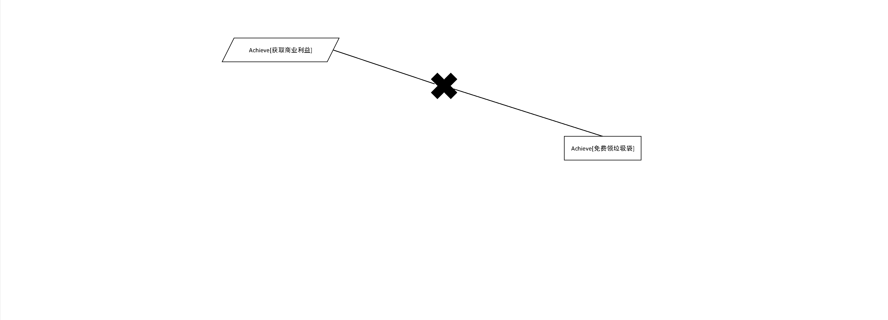

# 美扔-需求获取文档

==//排版==

## 小组成员

- 戴祺佳 181250023（组长）
- 曹邵恒 181250005
- 王海辰 181850154
- 徐宇轩 181250167

## 度量数值

- 面谈安排与正式面谈报告次数：
  - 前景范围次数：
  - 用户需求获取次数：
- 前景和范围的覆盖范围：

==//排版==

## 文档简介

本文档为需求与商业模式创新的第四次大作业，旨在使用需求获取方法对商业模式进行需求获取。

### 作业说明

- 任务

  - 需求获取安排计划书

    需要记录计划与实际执行情况

  - 目标模型分析

    使用目标模型进行逐层分析，包括但不限于目标精化、目标写作与冲突、目标实现等内容

  - 项目的前景与范围

    与甲方敲定本次需求开发迭代的商业模式部分

    - 确立的业务需求以及相应理由
    - 确立的系统特性以及相应理由
    - 系统用例图
    - 系统需要的假设、依赖、限制
    - 系统的操作环境与分析

  - 获取过程中的使用的面谈报告与原型物件

    - 要求详见课程内容

    - 建议使用原型，并记录对原型的反应与评价

  - 基于用例/场景的用户需求文档

    - 概述，包含项目背景与同甲方协商后达成的共识
    - 用户需求列表
    - 规范的用例描述
- 要求
  - 产物需要是一个pdf文档，包括以下内容：
    - 项目的前景与范围不需要覆盖甲方的整个商业模式，完成相应软件最独特的功能与对应的完整用户——系统互动即可
    - 甲乙方需配合工作
    - 文档排版整洁，满足度量数值
- 度量数值要求
  - 面谈安排与正式面谈报告不少于三次
    - 前景与范围不少于一次
    - 用户需求获取不少于两次
  - 前景和范围的要素覆盖不低于33%

### 内容说明

在本阶段，我们对甲方小组的商业模式进行了需求的获取操作。包含需求获取安排计划、目标模型分析、项目前景与范围、获取过程中使用的面谈报告与原型物件、基于用例/场景的用户需求文档。以上的需求获取过程将通过以下的文档内容加以记录和阐述。

==//排版==

[toc]

==//排版==

# 美扔需求获取

## 一、需求获取安排计划

### 1.1 引言

#### 1.1.1 编制目的

本部分为乙方小组进行需求工程过程实践中的产物，作用于需求获取阶段，主要描述需求获取阶段的计划安排，作为需求获取的执行指南和后续跟踪管理的依据。

#### 1.1.2 参考资料

1. 骆斌，丁二玉；需求工程：软件建模与分析--北京：高等教育出版社，2015.2

### 1.2 需求获取计划概要

#### 1.2.1 需求获取活动

在对已有的商业模式设计文档、商业模式评估文档进行阅读和分析之后，我们计划在整个需求获取阶段中进行以下活动：

- 研究应用背景，分析现有类似系统，建立初始知识框架（背景知识）
- 分析系统高层目标，理解用户意图，建立目标模型（目标模型）
- 进行涉众分析和其他内容，完成前景与范围（前景与范围）
- 使用各种需求获取方法进行需求获取工作（需求获取）
- 对需求获取活动的过程和结果进行记录、分析（完成获取）

#### 1.2.2 需求获取时间轴

以下为需求获取阶段各子任务的计划截止时间

- 背景知识：2020-12-13
- 目标分析：2020-12-18
- 前景与范围：2020-12-19
- 初步需求获取：2020-12-23
- 执行与完成获取：2020-12-25

### 1.3  需求获取各阶段明细

#### 1.3.1 背景知识

我们对甲方小组的商业模式设计过程所产生的文档进行研读，同时结合甲方小组所提供的参考资料进行背景知识的补充。借此形成一个基础的知识框架。

#### 1.3.2 目标分析                                                               

我们通过对甲方小组的商业模式设计进行分析以及进行面谈，确定美扔产品的高层次目标，进而对目标进行分析，建立目标模型，进而对业务需求与非功能需求进行确定。

#### 1.3.3 前景与范围

我们通过进行涉众分析和其他分析操作对项目的前景和范围进行确定，完成编制文档的前景与范围部分。

#### 1.3.4 初步需求获取

我们使用面谈和原型方法进行需求的获取，其中通过面谈与甲方小组对需求列表进行查漏补缺，获得更多信息，通过原型为双方小组就模糊不清的地方达成一致提供方便

#### 1.3.5 执行与完成获取

在完成之前的工作后，我们以及充分收集和理解了甲方小组商业模式设计转向软件产品的需求，在此阶段进行文档的编制与完善工作。

### 1.4 需求获取跟踪与反馈

| 活动名称       | 活动内容                                                     | 预计完成时间 | 实际完成时间 |
| -------------- | ------------------------------------------------------------ | ------------ | ------------ |
| 背景知识       | 阅读甲方小组提供的文档以及参考资料，建构背景知识体系         | 12-13        | 12-13        |
| 第一次面谈     | 对文档中表述不清的部分进行确认，对甲方小组的各层次目标进行识别与确认 | 12-16        | 12-16        |
| 目标分析       | 整理面谈结果，进行目标分析和目标模型构建                     | 12-17        |              |
| 第二次面谈     | 对已完成的分析结果进行确认，并对分析中发现的不清楚之处进行确认 | 12-18        |              |
| 前景与范围     | 进行涉众分析和其他分析过程，完成前景与范围的确定以及文档前景与范围部分的编制 | 12-19        |              |
| 第三次面谈     |                                                              |              | 12-20        |
| 初步需求获取   | 基于目标模型对需求进行初步获取，进行原型设计                 | 12-23        |              |
| 第四次面谈     |                                                              |              |              |
| 执行与完成获取 | 完成文档编制与完善                                           | 12-25        |              |

==//排版==

## 二、目标模型分析

### 2.1 高层目标获取

美扔产品的首要目标是公司获取商业利益，次要目标是帮助人们完成垃圾分类投放。

### 2.2 目标精化

- 目标——获取商业利益——AND精化：
  - 获得广告收益【achieve】，从店铺用户处收取的广告收益是平台运行的核心收益来源
  - 目标——获得广告收益——OR精化：
    - 增加广告数量【max】，广告产品的销售额由数量和单价决定，此为数量角度
    - 增加广告单价【max】，广告产品的销售额由数量和单价决定，此为单价角度
    - 目标——增加广告单价——AND精化：
      - 提升广告质量【max】，更高的广告质量能够产生更好的广告效果，并让店铺用户愿意为之买单
  - 获得数据服务收益【achieve】，为需要数据服务的机构提供数据支持并获得报酬是平台的次要收益来源
    - 提供店铺决策支撑服务【achieve】，通过附近地域的垃圾情况反推商品消费情况，为店铺提供决策信息
    - 进行垃圾数据汇总分析【maintain】，进行垃圾数据的汇总分析，为平台提供运营优化数据并为相关机构提供数据

- 目标——帮助完成垃圾分类——AND精化：

  - 进行垃圾数据汇总分析【achieve】，进行垃圾数据的汇总分析，为平台提供运营优化数据并为相关机构提供数据

  - 获取更多用户【max】，用户数量越多，平台就能运行得越顺畅，为完成垃圾分类越能提供帮助
  - 目标——获取更多用户——AND精化：
    - 提高效率【achieve】，提高扔垃圾与代扔垃圾的工作效率，更方便更快捷
    - 目标——提高效率——AND精化：
      - 进行精确匹配【achieve】，让最合适的人来做最合适的工作能够获得最高的效率
    - 提供省心的代扔服务【achieve】，扔垃圾用户只需约好订单，垃圾放置后不管
    - 目标——提供省心的代扔服务的——AND精化：、
      - 进行代扔过程监管【maintain】，让用户放置垃圾后便可以不管，省心省力
      - 目标——进行代扔过程监管——AND精化：
        - 进行交接监管【maintain】，在交接过程中进行监管，保证垃圾被及时取走
        - 进行投放监管【maintain】，在投放过程中进行监管，保证垃圾被正确投放
      - 执行营销手段【achieve】，通过补贴等手段让用户不用花很多钱就可以享受代扔服务
    - 提供赚钱的代扔工作【achieve】，代扔垃圾用户在平台接单有利可图
    - 帮助提高用户店铺知名度【max】，店铺用户在平台打广告能有效提高知名度
    - 目标——帮助提高用户店铺知名度——AND精化：
      - 增加广告数量【max】，广告数量越多，用户店铺的被宣传力度越大，知名度越能提高
    - 提供免费垃圾袋【achieve】，免费而方便获得的垃圾袋对用户有不小的吸引力
  - 避免用户流失【avoid】，与获得更多用户的理由相同，良好的客户关系有利于用户群体的扩大和保持
  - 目标——避免用户流失——AND精化：
    - 提高效率【achieve】，提高扔垃圾与代扔垃圾的工作效率，更方便更快捷
    - 目标——提高效率——AND精化：
      - 进行精确匹配【achieve】，让最合适的人来做最合适的工作能够获得最高的效率
    - 提供省心的代扔服务【achieve】，扔垃圾用户只需约好订单，垃圾放置后不管
    - 目标——提供省心的代扔服务的——AND精化：、
      - 进行代扔过程监管【maintain】，让用户放置垃圾后便可以不管，省心省力
      - 目标——进行代扔过程监管——AND精化：
        - 进行交接监管【maintain】，在交接过程中进行监管，保证垃圾被及时取走
        - 进行投放监管【maintain】，在投放过程中进行监管，保证垃圾被正确投放
      - 执行营销手段【achieve】，通过补贴等手段让用户不用花很多钱就可以享受代扔服务
    - 提供赚钱的代扔工作【achieve】，代扔垃圾用户在平台接单有利可图
    - 帮助提高用户店铺知名度【max】，店铺用户在平台打广告能有效提高知名度
    - 目标——帮助提高用户店铺知名度——AND精化：
      - 增加广告数量【max】，广告数量越多，用户店铺的被宣传力度越大，知名度越能提高
    - 提供免费垃圾袋【achieve】，免费而方便获得的垃圾袋对用户有不小的吸引力

### 2.3 目标冲突与协作

#### 2.3.1 协作部分

进行垃圾数据汇总分析时所收集的数据可以为精确匹配提供支持

#### 2.3.2 冲突部分

增加广告数量与增加广告费用是冲突的，平台必须平衡这两者

提供免费垃圾袋与获取商业利益是冲突的，但是作为平台吸引用户和维持用户的手段，提供免费垃圾袋是不可抛弃的目标

### 2.4 目标实现

- 操作

  - 为了增加广告数量，需要增加垃圾袋投放
  - 为了提升广告质量，需要提供广告设计服务
  - 为了提供商户决策支撑服务，需要进行用户信息收集与分析、人工智能分类与大数据分析
  - 为了进行垃圾数据汇总分析，需要进行人工智能分类与大数据分析
  - 为了进行精确匹配，需要进行算法设计
  - 为了进行交接监管，需要进行垃圾交接的时限控制
  - 为了进行投放监管，需要进行垃圾投放过程的拍照记录操作
  - 为了进行以上的监管，需要提供平台运营人员的操作手段
  - 为了提供免费垃圾袋，需要提供“附近的分发点”服务
  - 为了执行营销手段，需要提供设置平台营销手段的系统入口

- 主体：

  - 增加广告数量的主体是店主用户与系统
  - 提升广告质量的主体是店主用户与系统
  - 提供商户决策支撑服务的主体是店主用户与系统
  - 进行垃圾数据汇总分析的主体是系统、平台运营人员
  - 进行精确匹配的主体是系统、需扔垃圾用户与代扔垃圾用户
  - 进行交接监管的主体是系统、需扔垃圾用户与代扔垃圾用户、平台监管人员
  - 进行投放监管的主体是系统、需扔垃圾用户与代扔垃圾用户、平台监管人员
  - 提供免费垃圾袋的主体是系统、需扔垃圾用户、平台运营人员
  - 执行营销手段的主体是系统、平台运营人员

==//排版==

## 三、前景与范围

### 3.0 本次需求开发的商业模式部分

本次需求开发结合了甲方的商业模式画布和面谈讨论结果，覆盖了甲方两个最主要的目标——商业盈利和帮助完成垃圾分类。下面是本次需求开发对商业模式画布的覆盖情况，商业模式要点的覆盖率为68.75%。其中衍生产品相关部分、居委会、物业相关部分、数据服务收益部分被排除在本次开发之外。

| 画布部分 | 要点                                   | 覆盖 |
| -------- | -------------------------------------- | ---- |
| 客户细分 | 有垃圾代扔需求的人                     | 是   |
|          | 有时间精力从事垃圾代扔代分类的人       | 是   |
|          | 个体经营户                             | 是   |
| 客户关系 | 自动化服务                             | 是   |
|          | 客户共同创造                           | 否   |
| 渠道通路 | 物业、居委会                           | 否   |
|          | 平台自身、app应用市场                  | 是   |
|          | 衍生产品广告                           | 否   |
|          | 口口相传，老带新                       | 是   |
|          | 人工定点商谈                           | 是   |
| 价值主张 | 定制化垃圾代扔代分类业务               | 是   |
|          | 高效低廉的广告投放业务                 | 是   |
|          | 时间灵活且低门槛的代扔垃圾工作岗位     | 是   |
|          | 宣传垃圾分类知识、培养市民垃圾分类习惯 | 是   |
| 关键业务 | 衍生产品的再加工与赠送                 | 否   |
|          | 提供垃圾代扔代分类平台                 | 是   |
| 核心资源 | 知识资产                               | 是   |
|          | 人力成本                               | 是   |
|          | 平台&用户                              | 是   |
|          | 照片等数据                             | 是   |
| 重要合作 | 居委会、物业                           | 否   |
|          | 市政府、环保部门                       | 是   |
|          | 与数据分析公司进行合作                 | 否   |
| 成本结构 | 平台的开发与维护                       | 是   |
|          | 衍生产品的采购与再加工                 | 否   |
|          | 对垃圾代扔代分类的补贴费用             | 否   |
|          | 广告的再加工                           | 是   |
|          | 宣传以及合作成本                       | 是   |
| 收入来源 | 软件平台收益                           | 是   |
|          | 广告收入                               | 是   |
|          | 软件知识产权：数据利用                 | 否   |
|          | 衍生产品销售利润                       | 否   |
### 3.1 业务需求

#### 3.1.1 应用背景

随着社会的发展和城镇管理的进步，很多城市强制推行垃圾分类政策，要求市民必须定点定时按类别投放垃圾。这在提升资源利用水平，降低垃圾危害方面起到了正面的作用。但也存在垃圾分类的操作具有一定的学习成本、垃圾分类投放点距离住户较远，垃圾分类投放时段与住户的时间安排不符等问题，让一些自己分类投放垃圾有困难以都市白领为典型的人群无所适从。与此同时，在社区中也存在着一些闲散时间较多，拥有热心肠的以大爷大妈为典型的有能力为垃圾分类投放出力的人群。此外，社区中存在不少小店铺，他们需要为自己的店铺做广告，以提升知名度。

#### 3.1.2 业务需求

==//todo删去p5==

##### 3.1.2.1 具体业务需求

- p1:垃圾代扔需求者，他们希望有一个可以进行垃圾代扔对接的平台，可以登录注册，可以下订单，可以与执行者交互

- p2:垃圾代扔有一定区域性，必须在一定的区域内进行，能追踪执行者位置，执行者可以查看任务信息。

- p3:一些小的商户处于广告的灰色地带，没有钱进行大范围的广告推广，但是想要在一定范围的区域内提高知名度和口碑

- p4:垃圾代扔和执行代扔的人可能就垃圾是否处理完善的问题产生了纠纷，需要监管和反馈机制

- p5:部分政府部门针对区域投放垃圾箱的数量和地点把握尚不明确

##### 3.1.2.2 明确问题

| 要素|内容|
|----|----|
|ID|P1|
|提出者|用户|
|关联者|开发者|
|问题|需要一个可以解决对接垃圾代扔双方的平台 |
|影响|用户可能需要耗费很多时间在等待定时收取垃圾和垃圾分类的问题上，需要一个平台对接需求者和执行者|
|目标|做出一个可以进行购买垃圾代扔服务的系统，定制一个流程，达到垃圾代扔服务的需求者和执行者对接|

| 要素|内容|
|----|----|
|ID|P2|
|提出者|用户|
|关联者|开发者|
|问题|垃圾代扔服务有局域性，一个执行者必须在一定地区内工作，跨区域进行的成本代价太大|
|影响|成本太大，跨时间太长|
|目标|添加地图，使用地图定位用户的垃圾和给出垃圾代扔执行者的路线，且执行者可以看到订单信息|

| 要素|内容|
|----|----|
|ID|P3|
|提出者|商户|
|关联者|平台|
|问题|小商户希望可以通过平台推广自己的产品和服务|
|影响|小商户收入不高，没办法进行大范围的广告，但是有推广的需求|
|目标|建立广告服务的机制和模式，使得平台和商户对接，商户能够推广自己|

| 要素|内容|
|----|----|
|ID|P4|
|提出者|用户|
|关联者|管理者|
|问题|用户不确定代扔服务的质量，可能就垃圾收取的时间等等问题，使得双方产生了纠纷|
|影响|用户与用户之间的纠纷可能会使得双方花很多时间去调节|
|目标|建立反馈、举报机制，使得过程执行的监管更严格，服务质量更高|

| 要素|内容|
|----|----|
|ID|P5|
|提出者|政府|
|关联者|开发者|
|问题|政府不确定一定区域内的垃圾桶和垃圾站的数量，不确定具体类目的垃圾收集容器的投放位置|
|影响|占用一些公共区域，或者使得垃圾溢出，影响居民的正常生活|
|目标|建立信息收集机制，收集区域的垃圾数量和种类信息，提供给政府|

### 3.2 项目前景

#### 3.2.1 前景概述

对那些希望有丢垃圾需求的人来说，美扔平台是一个基于互联网的应用程序，它可以接受丢垃圾的任务，为有需求的人匹配合适的代丢垃圾的人，双方约定完垃圾交付和定价条件之后，有丢垃圾需求的人只需要把垃圾放置在指定的位置并拍照记录，他们就不需要关心之后的事情了。不仅如此，通过为用户提供附近的垃圾袋分发点指引，让他们能最方便地获得免费的垃圾袋。

对那些能够帮助别人丢垃圾的人来说，美扔平台是一个基于互联网的应用程序，它是获取代扔垃圾需求的平台，在匹配到对应的需求并约定好交付和定价条件之后，帮别人丢垃圾的人需要在约定的时间内取走垃圾并拍照记录，并前往垃圾分类投放处，打开垃圾袋，对垃圾进行拍照确认以及分类投放。

对那些有商业推广需求的小店铺来说，美扔平台是他们进行广告推广的平台，平台将与小店铺协作设计广告，将其印刷在垃圾袋上并进行免费分发，从而达成对小店铺和平台的宣传。

此外，平台通过用户产生的照片进行信息的收集，通过大数据和人工智能手段得到有价值的信息，这些信息能够为平台的运营提供帮助，同时能为合作方带来价值，为平台带来数据服务收入。

系统上下文图

#### 3.2.2 系统特性

##### 3.2.2.1 具体系统特性

| 标号 | 系统特性                     | 内容                                                         |
| ---- | ---------------------------- | ------------------------------------------------------------ |
| SF1  | 用户注册登录                 | 允许用户注册登录美扔平台，绑定手机                           |
| SF2  | 用户设置个人信息             | 用户可以设置个人信息，例如头像，地区，电话，邮箱等等         |
| SF3  | 需求方请求代扔               | 需求方可以选择请求垃圾代扔服务，填写好垃圾的地点，预估重量，选择时间，和选择是否需要进行分类，拍照，预付款，然后寻求执行方 |
| SF4  | 执行方抢单                   | 执行方可以看到一定地域范围内的订单，并选择是否接单           |
| SF5  | 执行方任务列表查看           | 执行方可以在订单栏看到任务进度，剩余代扔时间                 |
| SF6  | 执行方查看具体地点     | 执行方可以在任务界面看到任务的相关信息，地点等，并进行导航   |
| SF7  | 系统指定路线并实时导航| 系统可以实时导航，帮助执行者精确找到地点|
| SF8  | 需求方与执行方内置IM进行交互 | 需求方和执行方可以进行一对一的交流                           |
| SF9  | 反馈投诉                     | 需求方可以举报执行方没有完成任务，执行方可以举证需求方没有按时放置垃圾 |
| SF10  | 信用机制                     | 需求方和执行方拥有一定的信用分，当被投诉举证成功后会扣除相应的分数，在同等任务的优先级会相应降低 |
| SF11 | 用户查看垃圾袋提供者         | 用户可以在商户界面查看附近免费提供垃圾袋的商户或者投放点     |
| SF12 | 用户扫码获得垃圾袋           | 用户可以在商户界面选择扫码，扫得商家的二维码，并获得垃圾袋     |
| SF13 | 商户向平台购买广告服务       | 商户可以购买一定数量的垃圾袋来推广产品 |
| SF14 | 平台监管功能                 | 平台的监管部门会审查垃圾分类是否严格按照要求执行，若发现执行者不按要求执行进行相应的处罚 |
| SF15 | 数据收集                     | 平台收集相关的垃圾信息，交给相关部门如政府部门使用           |
|SF16|垃圾袋定制|商户可以直接与平台相关人员对接，沟通需要的定制图案|

##### 3.2.2.2 提出系统特性的理由

根据甲方要求，p5问题的处理不在本次项目范围之内，属于后续迭代要处理的问题

|要素|内容|
|----|----|
|ID|P1|
|解决方案描述|需求方可以选择请求垃圾分类和代扔服务|
|业务优势|上门服务，指定具体的垃圾地点，快速对接|
|代价|需要双方的参与，需要用户下单，执行方抢单，需要较好的抢单算法和分配合理的时间限制|

|要素|内容|
|----|----|
|ID|P2|
|解决方案描述|在本系统中，对于接单的人，需要有一定的地域限制，必须在周边的地区；对于执行者可以实时导航|
|业务优势|好的路线定制算法，执行方不需要借助其他软件导航|
|代价|需要开发出相应的地域匹配和路线计算的算法，还需要结合信用分来进行抢单匹配，需要算法支持|

|要素|内容|
|----|----|
|ID|P3|
|解决方案描述|本系统向小商户提供广告服务，小商户可以向平台购买广告服务，平台有偿为小商户设计垃圾袋等周边产品，并通过社区或者商户本身的渠道进行分发，以提高知名度|
|业务优势|用户可以免费获得周边产品，以便于广告的扩大|
|代价|平台需要雇佣一部分设计人员；平台推广模式需要一定的时间；平台需要与相关的供应商达成合作|

|要素|内容|
|----|----|
|ID|P4|
|解决方案描述|平台设置投诉、反馈渠道，且平台会长期监察执行者的分类情况|
|业务优势|售后服务比较可靠，让用户交易更加安心|
|代价|需要长期聘请大量的后期客服和监察人员，审查分类质量|

|要素|内容|
|----|----|
|ID|P5|
|解决方案描述|平台通过数据收集，收集执行者拍的垃圾分类的图，获取某个地域内的不同类别垃圾的种类和数量，反馈给相关部门，合理分配垃圾投放量|
|业务优势|经过一段时间业务累积可以获得大体量的数据|
|代价|需要好的识别算法，好的分析硬件和技术人员的维护|

##### 3.2.2.3 系统特征和业务需求对应表

| 系统特征编号|针对的问题 |解决问题需要具备的系统特征 |
|---|---|---|
|SF1|P1|用户可以登陆注册平台|
|SF2|P1|用户可以修改个人信息|
|SF3|P1|需求方可以请求代扔|
|SF4|P2|执行方可以抢单|
|SF5|P2|执行方可以看到任务列表|
|SF6|P2|执行方和需求方都可以看到任务执行相关信息和地点，实施加载进度|
|SF7|P2|系统指定路线并实时导航系统可以实时导航，帮助执行者精确找到地点|
|SF8|P1|用户双方可以交流一些特殊需求|
|SF9|P4|双方可以根据任务进行进行投诉|
|SF10|P4|举证成功会减低信用分|
|SF11|P3|用户可以用地图查看提供垃圾袋的地点|
|SF12|P3|用户可以扫码获取垃圾袋|
|SF13|P3|小商户可以向平台购买垃圾袋|
|SF14|P4|平台后期监察人员实时监控垃圾代扔行为|
|SF15|P5|平台收集垃圾数据|
|SF16|P3|平台与商户对接|

#### 3.2.3 系统用例图

- p1
  
- p2
  
- p3
  
- p4
  
- p5
  
- 系统
  

#### 3.2.4 假设和依赖

##### 假设

| ID   | 内容                                                         |
| ---- | ------------------------------------------------------------ |
| AS1  | 用户都具有基本的手机软件操作能力                             |
| AS2  | 大部分社区等政府机构允许并支持平台运行                       |
| AS3  | 用户暂存垃圾的操作不会遭到其他社区居民的明显反对             |
| AS4  | 帮助代扔垃圾的用户具有较高的垃圾分类知识水平和能力           |
| AS5  | 各个社区的人口分布均匀，能够产生足够的各类型用户群体         |
| AS6  | 机器视觉系统有能力从垃圾状态下对物体进行分类统计             |
| AS7  | 各个社区拥有自己的垃圾分类投放点                             |
| AS8  | 各个社区的个体经营户均有较强的业务扩展和广告需求并愿意付费   |
| AS9  | 用户在正常作息时间而非23:00至7:00这段时间有代扔垃圾需求      |
| AS10 | 代扔用户均具有足够的正义感和使命感进行垃圾分类情况的确认操作 |
| AS11 | 用户愿意针对使用过程出现的问题向平台进行反馈                 |
| AS12 | 用户能够接受每月不多于一次的服务崩溃                         |
| AS13 | 平台拥有自己的广告设计服务团队、监督仲裁和线下业务团队       |
| AS14 | 通过分析照片产生的数据能够带来足够的分析价值并让政府等其他有需求的机构为其付费 |
| AS15 | 用户均认可不精确到个人画像级别或匿名的的数据采集收集行为     |

##### 依赖

| ID   | 内容                                                         |
| ---- | ------------------------------------------------------------ |
| DE1  | 平台运行服务器部署在云端，需要云存储服务                     |
| DE2  | 平台需要在社区、街道支持进行下进行活动                       |
| DE3  | 平台与第三方支付平台进行集成，进行双向通信和变更             |
| DE4  | 平台与垃圾袋生产厂家对接，能够灵活生产不同样式不同数量的垃圾袋 |
| DE5  | 政府等监管机构允许平台受限制的数据收集行为                   |

### 3.3 项目范围

#### 3.3.1 限制与排除

|标号| 内容|
|-----|-----|
|LI1 |本系统不支持废品回收|
|LI2|本系统在不强制要求垃圾分类的城市不支持服务|
|LI3|本系统暂不支持垃圾分类衍生产品相关功能|
|LI4|本系统只在能完整允许并支持的社区进行运行|
|LI5|本系统不包括垃圾装袋服务|
|LI6|本系统不包括垃圾投放至分类投放点后的工作|
|LI7|本系统不包含线下部门的业务|

### 3.4 项目环境

#### 3.4.1 操作环境

##### 3.4.1.1 用户的地理集中情况

主要在强制需要垃圾分类的城市和地区

##### 3.4.1.2 各类用户使用系统的时间状况

|用户类别|使用时间状况|
|--------|--------|
|需求者|下单时间全天可以，但是限制执行订单时间在早七点到晚十一点间 |
|执行者|主要是在工作时间，被囊括于早七点到晚十一点间 |
|商户 | 全天段，主要是在正常商铺营业时间之内，具体根据种类而定|

##### 3.4.1.3 数据的生成与使用情况

|数据类型|生成出处|使用情况|
|---|----|---|
|订单信息|用户发起|用于订单生成到结束的整个过程，由垃圾代扔执行者和垃圾代扔需求者共同分享的数据|
|垃圾袋分发信息|商户和平台共享|用于进行宣传统计，商户也可以具体了解分发情况|
|垃圾收集信息|平台收集，交由政府相关部门|可以改善区域内垃圾桶的设置范围和数量，达到目标精确瞄准|
|用户资料|用户填写|个人信息，保密处理，不公开不共享|
|地图信息|用户定位或商户定位|用户定位垃圾信息，垃圾代扔执行者定位垃圾信息，用户定位分发垃圾袋的定点位置信息|

==//to do==

##### 3.4.1.4 访问数据最大响应时间

未知，与系统体量和服务器等等有关

##### 3.4.1.5 用户能否容忍服务中断

未知，猜测用户对于订单执行过程中数据丢失/订单被强制取消容忍度差

##### 3.4.1.6 是否需要提供访问安全控制和数据保护

是

#### 3.4.2 涉众分析

##### 3.4.2.1 涉众识别与描述

| 涉众                                 | 特征描述                                                     | 主要目标                                                     | 态度                                                         | 主要关注点                                                   | 约束条件                                                     |
| ------------------------------------ | ------------------------------------------------------------ | ------------------------------------------------------------ | ------------------------------------------------------------ | ------------------------------------------------------------ | ------------------------------------------------------------ |
| 有垃圾代扔需求的人                   | 有垃圾代扔需求的人主要是指上班族，工作和通勤占据每天的大部分时间，没有很多时间和精力进行垃圾分类投放，或工作时段与垃圾分时投放时段不匹配导致不方便分类投放垃圾 | 省心省力省钱地获得垃圾代扔代分类服务                         | 非常支持，但是希望代扔垃圾的价格不能太高，并对平台的数据收集操作有所顾虑 | 垃圾代扔服务的方便获得性；与自己的生活作息的可融合性；数据服务中个人信息与隐私的泄露情况 | 对个人信息的收集和使用情况进行提前告知，并通过同意书授权的方式获得用户信息的授权，在法律允许的范围内发挥数据的价值 |
| 有时间精力能力从事垃圾代扔代分类的人 | 有时间精力能力从事垃圾代扔代分类的人主要是指社区中的大爷大妈一类的人群，他们拥有很多闲暇时间可以进行一些工作，并也因为这一点对垃圾分类知识有较多的了解。此外，他们非常热心肠，愿意帮助需要代扔代分类的人，解决他们的生活困难。并希望通过帮别人代扔垃圾获得一定的经济报酬 | 帮助他人进行垃圾代扔代分类；通过垃圾代扔代分类获得一定的经济报酬 | 比较支持，但是对能不能获得与劳动付出向匹配的报酬有所顾虑，希望工作不要太麻烦 | 垃圾代扔代分类的需求有多麻烦，经济报酬的多少                 | 需要进行劳动权益的保护                                       |
| 个体经营户                           | 个体经营户指的是那些在社区中经营的小店铺，具有一定的客户需求，并希望能有更多的社区居民知道自己的店铺，愿意为此付出一定的经济报酬 | 推广自己的店铺                                               | 比较支持，但对自己需要付出的成本有极强的敏感性，             | 广告成本的高低                                               | 广告成本不能很高或付出较高的成本能得到足够的推广效果以覆盖此成本 |
| 垃圾分类处理专家                     | 垃圾分类处理专家指的是在环境保护与垃圾处理领域的专家，他们对垃圾的分类处理有很深的理解与迫切希望 | 让垃圾分类处理全面推广；让全国人民了解垃圾分类处理的好处并知道应该如何分类 | 强烈支持                                                     | 平台能否保证代扔代分类行为中垃圾分类的正确性，能否有利于推广垃圾分类知识和能力 | 需要垃圾分类正确性确认和垃圾分类知识推广，代扔分类需要得到领域专家的确认 |
| 政府力量                             | 政府是垃圾分类投放的推进者，人民权益的保护者                 | 实现环境保护、实现人民权益的保护                             | 比较支持，但会通过法律法规等手段对平台的行为进行限制以保护人民权益 | 平台的业务如何为垃圾分类投放提供帮助，平台的业务是否符合法律法规，是否有利于推进对人民的领导与权益的保护 | 向政府申请经营许可证，在法律法规许可范围内进行平台业务       |
| 开发者                               | 开发者是指美扔软件系统的设计开发者                           | 使用软件技术高效地开发具有完善功能的系统，并从中获得利润     | 强烈支持                                                     | 平台的需求、设计、构建、运行情况，平台的利润，技术上的可行性 | 控制成本、扩大收益                                           |
| 平台运营者                           | 平台运营者负责在代扔业务出现纠纷时进行仲裁；在用户反映平台问题时进行反馈与收集；通过营销手段扩大平台用户 | 方便地对系统进行运营管理，实现业务活动以获得经济利益并推进帮助人们进行垃圾分类的高层目标 | 比较支持，但对运营工作的复杂性感到担忧                       | 系统的使用方便性，用户的反馈情况，平台业务的运行情况         | 必须是平台雇员，使用系统前需要进行培训                       |
| 广告设计部门                         | 广告设计部门负责为小店铺用户提供广告设计服务                 | 获得广告设计工作                                             | 比较支持                                                     | 系统的使用方便性                                             | 必须是平台雇员需要优秀的平面设计能力                         |
| 平台线下部门                         | 平台线下部门负责平台业务线下部分的实施，如垃圾袋的制造分发，社区政府的联系联络等 | 平台的业务能顺利运行，获得经济利益                           | 比较支持，希望平台能平稳运行                                 | 系统为线下部门提供的信息                                     | 系统通过数据分析为线下部门提供方便                           |
| 维护人员                             | 维护人员负责系统的日常维护工作                               | 平台的业务能顺利运行，获得经济利益                           | 比较支持，希望平台的运行不出问题                             | 软件和硬件系统的稳定性和可维护性                             | 系统需要提高健壮性，避免出现问题                             |

##### 3.4.2.2 涉众评估

| 涉众群体                             | 任务                                     | 群体数量     | 优先级 |
| ------------------------------------ | ---------------------------------------- | ------------ | ------ |
| 有垃圾代扔需求的人                   | 使用平台获得垃圾代扔代分类服务           | 百万级       | 1      |
| 有时间精力能力从事垃圾代扔代分类的人 | 使用平台提供垃圾代扔代分类服务           | 百万级       | 1      |
| 个体经营户                           | 使用平台获得广告服务                     | 数万家或更多 | 1      |
| 垃圾分类处理专家                     | 推广垃圾分类和垃圾分类知识               | 数十人       | 2      |
| 政府                                 | 推广垃圾分类和垃圾分类知识，保护人民权益 | /            | 2      |
| 开发者                               | 完成软件系统的开发                       | 数十人       | 3      |
| 平台运营者                           | 使用软件系统完成平台业务                 | 数十至上百人 | 3      |
| 广告设计部门                         | 使用软件系统为店铺客户提供广告设计业务   | 数人         | 3      |
| 平台线下部门                         | 进行平台业务的线下部分                   | 数十至上百人 | 3      |
| 维护人员                             | 进行平台系统的维护                       | 数十人       | 3      |

==//排版==

## 四、面谈报告与原型

### 4.1 面谈报告

#### 4.1.1 第一次面谈

##### 4.1.1.1 概要

| 面谈编号 | M1                                   |
| :------- | ------------------------------------ |
| 会见者   | 戴祺佳  曹邵恒  王海辰  徐宇轩       |
| 被会见者 | 田鸿龙  柳斯宁  乔涤生  梅凯         |
| 日期     | 2020-12-16                           |
| 会见目标 | 确认甲方文档有疑惑的内容和各层次目标 |

##### 4.1.1.2 谈话要点与被会见者的观点

1. **设计本产品是因为发现了哪些问题？**

我们最近都知道，根据《南京市生活垃圾管理条例》，南京已经正式开始垃圾分类了。众所周知，垃圾分类有很多好处。首先，可以减少环境污染，因为现代垃圾含有很多化学物质，可能会导致发病率的提升；其次，有利于再生资源的利用等等。但是在实际执行的过程中，我们发现垃圾分类给我们的生活带来了一定程度的“不便利”。比如说，有些人的工作很忙，而垃圾分类需要一定的时间和精力，他们很难在规定的投放时间内把垃圾扔掉，而又有一些空闲时间多可以有精力做垃圾分类的群体，比如年龄大的人。前者普遍收入较高，他们愿意以付费的方式找人代完成垃圾分类、扔垃圾的工作，这里面是有一定市场的。

2. **希望本产品能够为组织（公司）帮助达成哪些目标？**

我们本质上还是一个以盈利为目的的平台，获取更大的经济收入是我们的主要目标。但是我们同时也希望，伴随着使用“美扔”的人越来越多，垃圾分类的意识也将渐渐被大众所接受。

3. **我们注意到垃圾分类的政府计划活动特性，平台与政府、社区是如何合作的？**

//to do

起初我们考虑是否要把“美扔”做成一个和政府合作的公益性质的平台，但是这样做违背了我们商业模式设计的初衷。所以在我们以盈利为目的的前提下，与社区或者政府的合作只是我们推广平台、提升用户体验的一种手段。比如我们会将印制了店铺logo的垃圾袋的线下分发工作交一部分给用户量比较大的社区，做垃圾分类宣传和教学等等。

4. **平台最终设计的收入结构是怎么样的？**

我们平台的收入主要有两个方面，第一是垃圾袋的广告，其次是用户数据带来的收入。正如我们在客户洞察时所表现的那样，一些小的店铺是我们重要的客户。他们可能规模不大但是需要有一定的渠道来做广告推广，在他们支付给我们一定的费用后，我们的垃圾袋上就可以印制一定规模小店铺主所想要的广告信息。随着我们平台规模变大，广告效益会更好，收入也就更多。另一方面数据来自于我们对用户行为采集到的数据，这些数据可以从很多方面给我们平台带来收益。

5. **衍生产品是指什么？**

衍生产品也就是在我们平台这个运营模式下诞生的一些必需品，他们能从一定程度上给我们平台带了直接的收益或者长远的效益。举例来说，之前提到的垃圾袋广告模式就算是一种衍生品，除此以外，比如弹簧秤这种在整个业务过程中必须使用的必需品可以给我们带来经济收入。

6. **平台最终设计的成本结构是怎么样的？**

//to do

我们平台的成本主要是软件开发成本，以及初期的推广成本。起初我们设计平台要从每一笔订单中抽取中介费，但是这样固然能使得我们的收益提高，但是客观上也会影响用户的体验，所以为了留住和吸引更多的用户，我们决定取消平台中介费，或者是初期取消中介费，这样使得我们平台在初期成本结构较为复杂。

7. **广告投放是如何进行的？(用户如何获得垃圾袋？)**

正如我们刚才提到的，广告收入是我们最主要的收入，所以我们的广告投入是着重考虑的点。而我们的广告的主要载体也是确定的吗，在目前的阶段就是垃圾袋。我们考虑到以下两种模式，首先在社区以及合作店铺中设置一些消耗人力成本的免费垃圾袋提供点，其次是在社区的一些地方设置“扫码领垃圾袋”的硬件设备。通过这两种方式，我们让用户拿到垃圾费的必需品（垃圾袋）的同时也投放了广告。

8. **平台准备直接雇佣专业垃圾分类人员吗？**

考虑到我们平台存在一个冷启动的问题，也就是说在平台推广初期，愿意花钱扔垃圾的人和愿意帮别人分类、扔垃圾的人数量可能有一个很大的不平衡，从而导致可能存在相当一部分人的扔垃圾订单没人接。为了有效地缓和这样的问题，我们在初期可能会将一部分工作外包出去，请一些从事这方面工作的人，但是我们平台本身和他们并不是雇佣关系。

#### 4.1.2 第二次面谈

##### 4.1.2.1 概要

| 面谈编号 | M2                             |
| :------- | ------------------------------ |
| 会见者   | 戴祺佳  曹邵恒  王海辰  徐宇轩 |
| 被会见者 | 田鸿龙  柳斯宁  乔涤生  梅凯   |
| 日期     | 2020-12-18                     |
| 会见目标 | 对第一次面谈存疑的细节的确认   |

##### 4.1.2.2  谈话要点与被会见者的观点

1. **在与小店铺进行广告推广服务时，垃圾袋的广告设计是由谁提供？**

因为开发成本、广告制作设计成本是我们平台成本结构的重要组成部分，所以理所当然由我们平台来主导广告的设计工作。因为一些小的店铺主也不会有广告设计的相关经验，所以我们会收取一定的费用并提供样本供商铺主选择，经过协商确认之后再进行广告分发工作。

2. **请问整个广告业务的流程是什么？**

首先是店铺需要在平台上，与我们建立联系；接着平台和店铺共同对广告样式进行设计，这里也就是我们成本结构中的广告设计部分；之后呢，平台在垃圾袋上印制广告，并把一定数量的垃圾袋送给到店铺主手里，这样店铺也就成为一个广告分发点。

3. **所以我们需要为用户，也就是有代扔、代分类需求的人提供附件能获取到垃圾袋的地图是吗?**

是这样的，在地图上应该标注能领取到免费垃圾袋的店铺和扫码领垃圾袋的设备。

4. **代扔者和需求方的交接工作是共同约定的吗？比如垃圾交付的时限？**

这方面主要是双方在平台形成一种共识或者说约定。一般来说，我们可以做一下这样规定，比如在家门口就是一小时之内交付，在楼栋单元门口就是十分钟内交付，而在小区门口就需要双方面对面交付。

5. **那垃圾交付的具体流程是怎么样的呢？**

大致分为以下几步：

需求者发布任务**⇒**系统根据定价和约定的服务类型进行匹配（平台将通过算法尽量避免社区外的“执行者”接到社区内的“需求者”的单，以社区内“执行者”为优先**⇒**执行者接受任务**⇒**需求者在约定地点放下垃圾，拍照**⇒**执行者取垃圾，拍照**⇒**执行者投放垃圾并确认垃圾分类得当，拍照

6. **有哪些会引起信用分发生变化的操作呢？**

主要依据图片作为证据进行判断：

- 需求者未放置指定位置
- 执行者未按时取垃圾
- 执行者未完成垃圾投放
- 需求者垃圾分类错误

7. **需求方支付佣金的行为发生在什么时候？需要走平台吗？**

用户在下单的时候就需要支付费用，佣金在平台这里中转，当审核机制结束后佣金会转交到执行方手中。

#### 4.1.3 第三次面谈

##### 4.1.3.1 概要

| 面谈编号 | M3                             |
| :------- | ------------------------------ |
| 会见者   | 戴祺佳  曹邵恒  王海辰  徐宇轩 |
| 被会见者 | 田鸿龙  柳斯宁  乔涤生  梅凯   |
| 日期     | 2020-12-20                     |
| 会见目标 | 对前景范围和涉众的确认         |

##### 4.1.3.2  谈话要点与被会见者的观点

1. 请问在美扔中的用户是否需要实名认证？

我们认为是需要的。首先，实名认证是我们平台保护用户账号的一个重要手段，考虑到在我们平台上是涉及支付佣金等行为的，用户的账户安全尤为重要。其次只有实名认证通过后才能获得更好更完整的服务，在我们平台开展活动，成为代扔垃圾代分类垃圾的执行方或者在平台上发布代扔的需求。

2. 那么用户之间需要知道彼此的信息吗？

应该是需要知道的。这点上可以参考诸如美团之类的app，因为我们的平台的关键价值主张是为用户提供这样一个点对点的机会，所以有带扔垃圾需求的人一定是需要知道代扔者的一些信息，比如电话联系方式，以往评价等等。而作为代扔者，对代扔者的联系方式、交易地址等信息也是需要知道的。但是更隐私的一些信息，比如身份证等实名认证信息，诚信分等，是由我们平台内部监管的信息。

3. 是否考虑到之前设计的数据服务中可能存在的侵犯用户隐私的情况？

额，如果直接贩卖隐私数据是潜在的违法行为，也是一种“灰色地带”。但是我们可以将数据不与具体用户绑定，而是与某个地区绑定，帮助我们平台内部分析用户行为，提高垃圾袋投放精度，以更好地迭代我们的功能和推出更好的服务。同时，我们可以把这样一些区域性的数据给政府部门合作等等。

4. 咱们“美扔”平台是做手机app还是做网页端呢？如果是手机端是否需要ios和android都做呢？

考虑到用我们平台的场景，一定是要做手机端的。因为当用户需要扔垃圾或者有人接单的时候，是肯定不会愿意去打开个网页的，那样不仅麻烦而且影响用户体验。此外，我们的平台是非常依赖用户粘性和用户数量的，所以同时支持ios和android是必要的一个条件。

//to do 涉众 想先确定原型

#### 4.1.4 第四次面谈

##### 4.1.4.1 概要

| 面谈编号 | M4                             |
| :------- | ------------------------------ |
| 会见者   | 戴祺佳  曹邵恒  王海辰  徐宇轩 |
| 被会见者 | 田鸿龙  柳斯宁  乔涤生  梅凯   |
| 日期     | 2020-12-24                     |
| 会见目标 |                                |

##### 4.1.4.2  谈话要点与被会见者的观点

1. 你们认为哪些需求和功能是最为重要，需要在阶段一就得到比较完整的实现的？

首先我们平台主打的服务是代扔，也就是说用户发布代扔需求和用户接取代扔单子的功能是一定要实现的，其次，考虑到我们的主要收入是来源于对中小型店铺的广告，所以店铺主作为我们的重要用户细分之一，也是需要实现的。一些需求比如对用户上传照片的图像分析，不作为我们第一阶段就要实现的核心功能。、

2. 那下面我们就三个模块再详细地确认一下，分别是代扔需求发布者、接单者、小店铺主三种。

是的，这是我们的最主要的客户细分，是需要在这一阶段体现出来的。

3. 对于代扔需求发布者而言，他的界面需要的就是在提交一个表单后，平台接受表单再将表单发送给其他接单者是吗？如果是，那么表单应该包含哪些主要信息呢？

是这样的，表单由用户提交，发送到平台，平台再发布出去，所有的接单者都会看到这个单子，第一个抢到这个单子的人作为该需求方的接单者。用户提交的表单需要包含的信息很多，像基本信息，比如用户的联系方式、地址、备注信息等，是一定要有的，其次由于我们的服务分成代扔和代分类两种，在表单中要得到体现，因为二者包括价格是有很多不同的。

4. 那在订单进行中，是否需要提供一种即时通讯方式?

是需要这样的IM的，同时要注意需要给双方拍照的接口，因为用户发布代扔需求时候需要拍照，接单者完成任务的时候也需要拍照确认，这些是我们判断这个订单是否成功的一个重要标准，也作为后续可能产生的纠纷的证据。

5. 那是否需要一个反馈机制，以防止用户订单确认结束之后，可能存在的纠纷情况?

按道理来说是这样的，比如接单者没有在协商定好的时间内取走垃圾，导致需求方被投诉等情况出现，这些是需要发布代扔需求者拥有一个对已完成的订单投诉或表示认可的渠道的。这样一个渠道可以帮助我们更好地去评估接单者的业务水平，进一步提升后续用户体验。

6. 那对于小店主的界面，是否仅需要提供一个发布广告需求的方式即可？

是这样的，店主通过一个类似“金钱-数量-广告规模”的订单向平台发布推广需求，之后平台方再和店主共同协商广告内容，帮助设计形式。

7. 那店主和普通用户之间是否没有直接的交互？

是这样的，总体来说他是独立于整个扔垃圾的流程之外的。但是用户可以通过扫码（我们可能在店铺主这里设置免费领取垃圾袋的服务点）与店铺主产生线下的交互，这和我们平台没有直接的关系的体现。

//to do 更多细节

### 4.2 原型

==//排版==

## 五、基于用例/场景的用户需求文档

### 5.1 概述

美扔产品建立一个平台，为需要扔垃圾的“任务发布者”和帮别人代扔垃圾的“任务接收者”建立联系，此举能够解决“任务发布者”的痛点，让他们的垃圾得到分类投放，让垃圾分类举措得到推进，同时也能为“任务接收者”提供一定的报酬。在注意到现有的垃圾代扔服务都有或多或少的监管不足的现状基础上，产品通过在每一个关键操作进行拍照记录的方式对垃圾代扔任务进行监管。

同时，平台与社区中的小店铺合作，为他们设计广告，将广告印制在垃圾袋上，通过在小店铺免费发放垃圾袋的方式推动垃圾代扔业务的运转，同时为店铺进行推广。

此外，随着大数据和人工智能技术的发展，数据的价值越来越高。通过对用户产生的垃圾的数据进行收集，从中有机会获得价值。

根据与甲方达成的共识，数据分析服务由于会收集用户的个人信息，存在法律和道德上的争论，故不包含在本次需求开发过程中。

### 5.2 用户需求列表

#### 5.2.1 功能需求列表

| ID   | 需求内容|优先级|
| ---- | ---- | ---- |
|UR1|用户可以修改个人信息|8|
|UR2|用户需求方可以发起订单|10|
|UR3|用户可以与自己的对接方发起沟通|10|
|UR4|用户可以接受对接方的沟通请求|10|
|UR5|用户执行方可以抢接订单|10|
|UR6|用户执行方可以查看任务列表|10|
|UR7|用户执行方可以查看地址信息|10|
|UR8|商户可以编辑修改商户信息|8|
|UR9|商户可以提供二维码|10|
|UR10|商户可以购买广告服务|10|
|UR11|商户可以请求广告定制|10|
|UR12|用户需求方可以查看商户信息|8|
|UR13|用户需求方可以扫描二维码|10|
|UR14|平台方设计工作人员可以提供广告定制服务|10|
|UR15|用户可以发起举报投诉|10|
|UR16|平台方监察工作人员可以解决投诉举报|10|
|UR17|平台方监察工作人员可以监察订单|10|
|UR18|平台方监察工作人员可以管理信用分|8|
     

#### 5.2.2 性能需求列表

| 类别   | ID   | 需求内容                                              |
| ------ | ---- | ----------------------------------------------------- |
| 速度   | PR1  | 更新系统内各模块数据的处理时间：<1s                   |
|        | PR2  | 用户（需求方）发起订单到订单进入推荐系统的时间：<10s  |
|        | PR3  | 用户（执行方）点击抢单到实际被分配获得订单的时间：<1s |
|        | PR4  | 用户在即时通讯工具中发消息的响应时间：<1s             |
|        | PR5  | 用户（执行方）刷新订单池到显示完成订单列表的时间：<2s |
| 容量   | PR6  | 系统内能存储至少500w个用户的数据信息                  |
| 负载   | PR7  | 系统应该允许10w个用户同时访问时能正常工作             |
|        | PR8  | 系统应该允许50个用户同时抢同一个订单时不出现差错      |
| 实时性 | PR9  | 系统的订单产生与分配需要及时入库                      |

#### 5.2.3 质量需求列表

| ID   | 特征     | 需求内容                               |
| ---- | -------- | -------------------------------------- |
| QR1  | 功能性   | 系统满足用户所需要的所有需求，功能完备 |
| QR2  | 可移植性 | 系统为程序员定制，不需要考虑可移植性   |
| QR3  | 可维护性 | 系统易于维护，易于进行修改和缺陷剔除   |
| QR4  | 效率     | 系统在执行订单产生和分配任务时效率高   |
| QR5  | 可靠性   | 系统在崩溃时不会丢失数据               |
| QR6  | 可用性   | 系统界面简单易用易操作                 |

#### 5.2.4 约束

| ID   | 内容                                         |
| ---- | -------------------------------------------- |
| C1   | 系统每月不得出现超过一次服务中断             |
| C2   | 系统的最大响应时间不得超过5s                 |
| C3   | 系统需要保护用户信息，不允许个人隐私信息泄露 |
| C4   | 如业务扩展有需要，系统的计算资源能被方便增加 |

### 5.3 用例列表

| ID   |  UC1 |
|  ----  | ----  |
|名称|修改个人信息|
|创建者|曹邵恒|
|创建日期|2020.12.15|
|最后一次更新者|曹邵恒|
|最后一次更新日期|2020.12.15|
|参与者|用户需求方|
|描述|用户通过与系统交互更改个人信息|
|优先级|中|
|触发条件|用户在系统中选择更改个人信息功能|
|前置条件||
|后置条件||
|正常流程||
|分支流程||
|异常流程||
|相关用例||
|业务规则||
|特殊需求||
|假设||
|待确定问题||

| ID   |  UC2 |
|  ----  | ----  |
|名称|发起订单|
|创建者|曹邵恒|
|创建日期|2020.12.15|
|最后一次更新者|曹邵恒|
|最后一次更新日期|2020.12.15|
|参与者|用户需求方|
|描述||
|优先级||
|触发条件||
|前置条件||
|后置条件||
|正常流程||
|分支流程||
|异常流程||
|相关用例||
|业务规则||
|特殊需求||
|假设||
|待确定问题||

| ID   |  UC3 |
|  ----  | ----  |
|名称|发起沟通|
|创建者|曹邵恒|
|创建日期|2020.12.15|
|最后一次更新者|曹邵恒|
|最后一次更新日期|2020.12.15|
|参与者|用户需求方，用户执行方|
|描述||
|优先级||
|触发条件||
|前置条件||
|后置条件||
|正常流程||
|分支流程||
|异常流程||
|相关用例||
|业务规则||
|特殊需求||
|假设||
|待确定问题||

| ID   |  UC4 |
|  ----  | ----  |
|名称|接受沟通|
|创建者|曹邵恒|
|创建日期|2020.12.15|
|最后一次更新者|曹邵恒|
|最后一次更新日期|2020.12.15|
|参与者|用户需求方，用户执行方|
|描述||
|优先级||
|触发条件||
|前置条件||
|后置条件||
|正常流程||
|分支流程||
|异常流程||
|相关用例||
|业务规则||
|特殊需求||
|假设||
|待确定问题||

| ID   |  UC5 |
|  ----  | ----  |
|名称|抢接订单|
|创建者|曹邵恒|
|创建日期|2020.12.15|
|最后一次更新者|曹邵恒|
|最后一次更新日期|2020.12.15|
|参与者|用户执行方|
|描述||
|优先级||
|触发条件||
|前置条件||
|后置条件||
|正常流程||
|分支流程||
|异常流程||
|相关用例||
|业务规则||
|特殊需求||
|假设||
|待确定问题||

| ID   |  UC6 |
|  ----  | ----  |
|名称|查看任务列表|
|创建者|曹邵恒|
|创建日期|2020.12.15|
|最后一次更新者|曹邵恒|
|最后一次更新日期|2020.12.15|
|参与者|用户执行方|
|描述||
|优先级||
|触发条件||
|前置条件||
|后置条件||
|正常流程||
|分支流程||
|异常流程||
|相关用例||
|业务规则||
|特殊需求||
|假设||
|待确定问题||

| ID   |  UC7 |
|  ----  | ----  |
|名称|查看地址信息|
|创建者|曹邵恒|
|创建日期|2020.12.15|
|最后一次更新者|曹邵恒|
|最后一次更新日期|2020.12.15|
|参与者|用户执行方|
|描述||
|优先级||
|触发条件||
|前置条件||
|后置条件||
|正常流程||
|分支流程||
|异常流程||
|相关用例||
|业务规则||
|特殊需求||
|假设||
|待确定问题||

| ID   |  UC8 |
|  ----  | ----  |
|名称|编辑修改商户信息|
|创建者|曹邵恒|
|创建日期|2020.12.15|
|最后一次更新者|曹邵恒|
|最后一次更新日期|2020.12.15|
|参与者|商户|
|描述||
|优先级||
|触发条件||
|前置条件||
|后置条件||
|正常流程||
|分支流程||
|异常流程||
|相关用例||
|业务规则||
|特殊需求||
|假设||
|待确定问题||

| ID   |  UC9 |
|  ----  | ----  |
|名称|提供二维码|
|创建者|曹邵恒|
|创建日期|2020.12.15|
|最后一次更新者|曹邵恒|
|最后一次更新日期|2020.12.15|
|参与者|商户|
|描述||
|优先级||
|触发条件||
|前置条件||
|后置条件||
|正常流程||
|分支流程||
|异常流程||
|相关用例||
|业务规则||
|特殊需求||
|假设||
|待确定问题||

| ID   |  UC10 |
|  ----  | ----  |
|名称|购买广告服务|
|创建者|曹邵恒|
|创建日期|2020.12.15|
|最后一次更新者|曹邵恒|
|最后一次更新日期|2020.12.15|
|参与者|商户|
|描述||
|优先级||
|触发条件||
|前置条件||
|后置条件||
|正常流程||
|分支流程||
|异常流程||
|相关用例||
|业务规则||
|特殊需求||
|假设||
|待确定问题||

| ID   |  UC11 |
|  ----  | ----  |
|名称|请求广告定制|
|创建者|曹邵恒|
|创建日期|2020.12.15|
|最后一次更新者|曹邵恒|
|最后一次更新日期|2020.12.15|
|参与者|商户|
|描述||
|优先级||
|触发条件||
|前置条件||
|后置条件||
|正常流程||
|分支流程||
|异常流程||
|相关用例||
|业务规则||
|特殊需求||
|假设||
|待确定问题||

| ID   |  UC12 |
|  ----  | ----  |
|名称|查看商户信息|
|创建者|曹邵恒|
|创建日期|2020.12.15|
|最后一次更新者|曹邵恒|
|最后一次更新日期|2020.12.15|
|参与者|用户需求方|
|描述||
|优先级||
|触发条件||
|前置条件||
|后置条件||
|正常流程||
|分支流程||
|异常流程||
|相关用例||
|业务规则||
|特殊需求||
|假设||
|待确定问题||

| ID   |  UC13 |
|  ----  | ----  |
|名称|扫描二维码|
|创建者|曹邵恒|
|创建日期|2020.12.15|
|最后一次更新者|曹邵恒|
|最后一次更新日期|2020.12.15|
|参与者|用户需求方|
|描述||
|优先级||
|触发条件||
|前置条件||
|后置条件||
|正常流程||
|分支流程||
|异常流程||
|相关用例||
|业务规则||
|特殊需求||
|假设||
|待确定问题||

| ID   |  UC14 |
|  ----  | ----  |
|名称|提供广告定制服务|
|创建者|曹邵恒|
|创建日期|2020.12.15|
|最后一次更新者|曹邵恒|
|最后一次更新日期|2020.12.15|
|参与者|平台方设计工作人员|
|描述||
|优先级||
|触发条件||
|前置条件||
|后置条件||
|正常流程||
|分支流程||
|异常流程||
|相关用例||
|业务规则||
|特殊需求||
|假设||
|待确定问题||

| ID   |  UC15 |
|  ----  | ----  |
|名称|发起举报投诉|
|创建者|曹邵恒|
|创建日期|2020.12.15|
|最后一次更新者|曹邵恒|
|最后一次更新日期|2020.12.15|
|参与者|用户执行方，用户需求方|
|描述||
|优先级||
|触发条件||
|前置条件||
|后置条件||
|正常流程||
|分支流程||
|异常流程||
|相关用例||
|业务规则||
|特殊需求||
|假设||
|待确定问题||

| ID   |  UC16 |
|  ----  | ----  |
|名称|解决举报投诉|
|创建者|曹邵恒|
|创建日期|2020.12.15|
|最后一次更新者|曹邵恒|
|最后一次更新日期|2020.12.15|
|参与者|平台方监察工作人员|
|描述||
|优先级||
|触发条件||
|前置条件||
|后置条件||
|正常流程||
|分支流程||
|异常流程||
|相关用例||
|业务规则||
|特殊需求||
|假设||
|待确定问题||

| ID   |  UC17 |
|  ----  | ----  |
|名称|监察订单|
|创建者|曹邵恒|
|创建日期|2020.12.15|
|最后一次更新者|曹邵恒|
|最后一次更新日期|2020.12.15|
|参与者|平台方监察工作人员|
|描述||
|优先级||
|触发条件||
|前置条件||
|后置条件||
|正常流程||
|分支流程||
|异常流程||
|相关用例||
|业务规则||
|特殊需求||
|假设||
|待确定问题||

| ID   |  UC18 |
|  ----  | ----  |
|名称|管理信用分|
|创建者|曹邵恒|
|创建日期|2020.12.15|
|最后一次更新者|曹邵恒|
|最后一次更新日期|2020.12.15|
|参与者|平台方监察工作人员|
|描述||
|优先级||
|触发条件||
|前置条件||
|后置条件||
|正常流程||
|分支流程||
|异常流程||
|相关用例||
|业务规则||
|特殊需求||
|假设||
|待确定问题||

