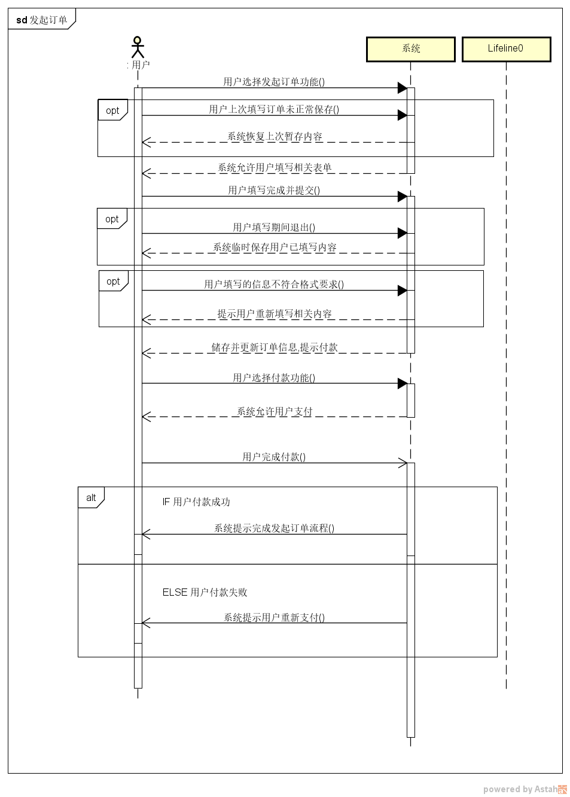

# 美扔-需求分析文档

## 小组成员

- 戴祺佳 181250023（组长）
- 曹邵恒 181250005
- 王海辰 181850154
- 徐宇轩 181250167

## 度量数值

## 文档简介

本文档为需求与商业模式创新的第五次大作业，旨在使用需求分析方法对需求进行分析，构建需求规格说明。

### 作业说明

- 任务

  - 分析模型

    使用概念类图、顺序图、状态图对用户需求进行建模

  - 需求跟踪矩阵（可选）

    要求见样例文档

  - 软件需求规格说明

    使用分析模型精化抽取系统级需求，编制完整的定制化的需求规格说明文档

### 内容说明

在本阶段，我们依照之前已完成的用户需求文档，构建了用户需求模型，并通过分析模型构建出系统级需求，进而完成软件需求规格说明文档。以上的需求分析过程将通过以下的文档内容进行记录和阐述。

[toc]

# 美扔-需求分析

## 一、分析模型

### 用户需求列表

| ID   | 需求内容                   | 优先级 |
| ---- | -------------------------- | ------ |
| UR1  | 用户修改个人信息           | 中     |
| UR2  | 用户需求方发起订单         | 高     |
| UR3  | 用户需求方取消订单         | 高     |
| UR4  | 需求执行双方进行沟通       | 高     |
| UR5  | 用户执行方抢接订单         | 高     |
| UR6  | 用户执行方查看可接任务列表 | 高     |
| UR7  | 用户执行方查看导航         | 高     |
| UR8  | 商户编辑商户信息           | 中     |
| UR9  | 商户购买广告服务           | 高     |
| UR10 | 商户查看广告情况           | 中     |
| UR11 | 用户需求方扫二维码         | 高     |
| UR12 | 平台设计人员进行广告定制   | 高     |
| UR13 | 用户发起举报投诉           | 高     |
| UR14 | 平台仲裁人员处理举报投诉   | 高     |
| UR15 | 用户执行方执行订单         | 高     |

### 1.1 UR1-用户修改个人信息

#### 1.1.1 概念类图

##### 1.1.1.1 图要说明的问题

##### 1.1.1.2 图本身

##### 1.1.1.3 图的简要介绍

#### 1.1.2 顺序图

##### 1.1.2.1 图要说明的问题

##### 1.1.2.2 图本身

##### 1.1.2.3 图的简要介绍

#### 1.1.3 状态图

##### 1.1.3.1 图要说明的问题

##### 1.1.3.2 图本身

##### 1.1.3.3 图的简要介绍

### 1.2 UR2-用户需求方发起订单

#### 1.2.1 概念类图

##### 1.2.1.1 图要说明的问题

##### 1.2.1.2 图本身

##### 1.2.1.3 图的简要介绍

#### 1.2.2 顺序图

##### 1.2.2.1 图要说明的问题

##### 1.2.2.2 图本身

##### 1.2.2.3 图的简要介绍

#### 1.2.3 状态图

##### 1.2.3.1 图要说明的问题

##### 1.2.3.2 图本身

##### 1.2.3.3 图的简要介绍

### 1.3 UR3-用户需求方取消订单

#### 1.3.1 概念类图

##### 1.3.1.1 图要说明的问题

##### 1.3.1.2 图本身

##### 1.3.1.3 图的简要介绍

#### 1.3.2 顺序图

##### 1.3.2.1 图要说明的问题

##### 1.3.2.2 图本身

##### 1.3.2.3 图的简要介绍

#### 1.3.3 状态图

##### 1.3.3.1 图要说明的问题

##### 1.3.3.2 图本身

##### 1.3.3.3 图的简要介绍

### 1.4 UR4-需求执行双方进行沟通

#### 1.4.1 概念类图

##### 1.4.1.1 图要说明的问题

##### 1.4.1.2 图本身

##### 1.4.1.3 图的简要介绍

#### 1.4.2 顺序图

##### 1.4.2.1 图要说明的问题

##### 1.4.2.2 图本身

##### 1.4.2.3 图的简要介绍

#### 1.4.3 状态图

##### 1.4.3.1 图要说明的问题

##### 1.4.3.2 图本身

##### 1.4.3.3 图的简要介绍

### 1.5 UR5-用户执行方抢接订单

#### 1.5.1 概念类图

##### 1.5.1.1 图要说明的问题

##### 1.5.1.2 图本身

##### 1.5.1.3 图的简要介绍

#### 1.5.2 顺序图

##### 1.5.2.1 图要说明的问题

##### 1.5.2.2 图本身

##### 1.5.2.3 图的简要介绍

#### 1.5.3 状态图

##### 1.5.3.1 图要说明的问题

##### 1.5.3.2 图本身

##### 1.5.3.3 图的简要介绍

### 1.6 UR6-用户执行方查看可接任务列表

#### 1.6.1 概念类图

##### 1.6.1.1 图要说明的问题

##### 1.6.1.2 图本身

##### 1.6.1.3 图的简要介绍

#### 1.6.2 顺序图

##### 1.6.2.1 图要说明的问题

##### 1.6.2.2 图本身

##### 1.6.2.3 图的简要介绍

#### 1.6.3 状态图

##### 1.6.3.1 图要说明的问题

##### 1.6.3.2 图本身

##### 1.6.3.3 图的简要介绍

### 1.7 UR7-用户执行方查看导航

#### 1.7.1 概念类图

##### 1.7.1.1 图要说明的问题

##### 1.7.1.2 图本身

##### 1.7.1.3 图的简要介绍

#### 1.7.2 顺序图

##### 1.7.2.1 图要说明的问题

##### 1.7.2.2 图本身

##### 1.7.2.3 图的简要介绍

#### 1.7.3 状态图

##### 1.7.3.1 图要说明的问题

##### 1.7.3.2 图本身

##### 1.7.3.3 图的简要介绍

### 1.8 UR8-商户编辑商户信息

#### 1.8.1 概念类图

##### 1.8.1.1 图要说明的问题

##### 1.8.1.2 图本身

##### 1.8.1.3 图的简要介绍

#### 1.8.2 顺序图

##### 1.8.2.1 图要说明的问题

##### 1.8.2.2 图本身

##### 1.8.2.3 图的简要介绍

#### 1.8.3 状态图

##### 1.8.3.1 图要说明的问题

##### 1.8.3.2 图本身

##### 1.8.3.3 图的简要介绍

### 1.9 UR9-商户购买广告服务

#### 1.9.1 概念类图

##### 1.9.1.1 图要说明的问题

##### 1.9.1.2 图本身

##### 1.9.1.3 图的简要介绍

#### 1.9.2 顺序图

##### 1.9.2.1 图要说明的问题

##### 1.9.2.2 图本身

##### 1.9.2.3 图的简要介绍

#### 1.9.3 状态图

##### 1.9.3.1 图要说明的问题

##### 1.9.3.2 图本身

##### 1.9.3.3 图的简要介绍

### 1.10 UR10-商户查看广告情况

#### 1.10.1 概念类图

##### 1.10.1.1 图要说明的问题

##### 1.10.1.2 图本身

##### 1.10.1.3 图的简要介绍

#### 1.10.2 顺序图

##### 1.10.2.1 图要说明的问题

##### 1.10.2.2 图本身

##### 1.10.2.3 图的简要介绍

#### 1.10.3 状态图

##### 1.10.3.1 图要说明的问题

##### 1.10.3.2 图本身

##### 1.10.3.3 图的简要介绍

### 1.11 UR11-用户需求方扫二维码

#### 1.11.1 概念类图

##### 1.11.1.1 图要说明的问题

##### 1.11.1.2 图本身

##### 1.11.1.3 图的简要介绍

#### 1.11.2 顺序图

##### 1.11.2.1 图要说明的问题

##### 1.11.2.2 图本身

##### 1.11.2.3 图的简要介绍

#### 1.11.3 状态图

##### 1.11.3.1 图要说明的问题

##### 1.11.3.2 图本身

##### 1.11.3.3 图的简要介绍

### 1.12 UR12-平台设计人员进行广告定制

#### 1.12.1 概念类图

##### 1.12.1.1 图要说明的问题

##### 1.12.1.2 图本身

##### 1.12.1.3 图的简要介绍

#### 1.12.2 顺序图

##### 1.12.2.1 图要说明的问题

##### 1.12.2.2 图本身

##### 1.12.2.3 图的简要介绍

#### 1.12.3 状态图

##### 1.12.3.1 图要说明的问题

##### 1.12.3.2 图本身

##### 1.12.3.3 图的简要介绍

### 1.13 UR13-用户发起举报投诉

#### 1.13.1 概念类图

##### 1.13.1.1 图要说明的问题

##### 1.13.1.2 图本身

##### 1.13.1.3 图的简要介绍

#### 1.13.2 顺序图

##### 1.13.2.1 图要说明的问题

##### 1.13.2.2 图本身

##### 1.13.2.3 图的简要介绍

#### 1.13.3 状态图

##### 1.13.3.1 图要说明的问题

##### 1.13.3.2 图本身

##### 1.13.3.3 图的简要介绍

### 1.14 UR14-平台仲裁人员处理举报投诉

#### 1.14.1 概念类图

##### 1.14.1.1 图要说明的问题

##### 1.14.1.2 图本身

##### 1.14.1.3 图的简要介绍

#### 1.14.2 顺序图

##### 1.14.2.1 图要说明的问题

##### 1.14.2.2 图本身

##### 1.14.2.3 图的简要介绍

#### 1.14.3 状态图

##### 1.14.3.1 图要说明的问题

##### 1.14.3.2 图本身

##### 1.14.3.3 图的简要介绍

### 1.15 UR15-用户执行方执行订单

#### 1.15.1 概念类图

##### 1.15.1.1 图要说明的问题

##### 1.15.1.2 图本身

##### 1.15.1.3 图的简要介绍

#### 1.15.2 顺序图

##### 1.15.2.1 图要说明的问题

##### 1.15.2.2 图本身

##### 1.15.2.3 图的简要介绍

#### 1.15.3 状态图

##### 1.15.3.1 图要说明的问题

##### 1.15.3.2 图本身

##### 1.15.3.3 图的简要介绍

## 二、需求跟踪矩阵

### 1.需求列表

业务需求+用户需求 以及分析模型精化获得的系统级需求

### 2.需求规格矩阵

## 三、软件需求规格说明文档

### 1. 引言

#### 1.1  目的

​	本文档描述了“美扔”产品的功能需求和非功能需求，所有以后的开发工作和测试文档都会以此文档为基础，除特殊说明外，本文档所包含的需求都是高优先级需求

#### 1.2  范围

​	美扔产品的主要预期功能包括为代扔垃圾业务的双方牵线搭桥，进行垃圾代扔，同时通过垃圾袋身广告为社区中个体经营户的小店铺提供广告服务。在此同时，通过对用户扔垃圾的数据进行收集与分析，提高运营效率降低成本并通过提供数据服务产生一定的收入

#### 1.3  定义、首字母缩写和缩略语

​	略

#### 1.4  参考文献

骆斌，丁二玉；需求工程：软件建模与分析--北京：高等教育出版社，2015.2

#### 1.5  文档组织

​	本文档主要参考教材中的软件需求规格说明模板进行组织，主要包括引言、总体描述、详细需求描述几个部分

### 2.总体描述

#### 2.1  产品前景

随着社会的发展和城镇管理的进步，很多城市强制推行垃圾分类政策，要求市民必须定点定时按类别投放垃圾。这在提升资源利用水平，降低垃圾危害方面起到了正面的作用。但也存在垃圾分类的操作具有一定的学习成本、垃圾分类投放点距离住户较远，垃圾分类投放时段与住户的时间安排不符等问题，让一些自己分类投放垃圾有困难以都市白领为典型的人群无所适从。与此同时，在社区中也存在着一些闲散时间较多，拥有热心肠的以大爷大妈为典型的有能力为垃圾分类投放出力的人群。此外，社区中存在不少个体经营户经营的小店铺，他们需要为自己的店铺做广告，以提升知名度

借此机会，美扔产品将基于满足以上各种用户的需求进行设计和运行

#### 2.2  产品功能

对那些希望有丢垃圾需求的人来说，美扔平台是一个基于互联网的应用程序，它可以接受丢垃圾的任务，为有需求的人匹配合适的代丢垃圾的人，双方约定完垃圾交付和定价条件之后，有丢垃圾需求的人只需要把垃圾放置在指定的位置并拍照记录，他们就不需要关心之后的事情了。不仅如此，通过为用户提供附近的垃圾袋分发点指引，让他们能最方便地获得免费的垃圾袋

对那些能够帮助别人丢垃圾的人来说，美扔平台是一个基于互联网的应用程序，它是获取代扔垃圾需求的平台，在匹配到对应的需求并约定好交付和定价条件之后，帮别人丢垃圾的人需要在约定的时间内取走垃圾并拍照记录，并前往垃圾分类投放处，打开垃圾袋，对垃圾进行拍照确认以及分类投放

对那些有商业推广需求的个体经营户来说，美扔平台是他们进行广告推广的平台，平台将与个体经营户协作设计广告，将其印刷在垃圾袋上并进行免费分发，从而达成对店铺和平台的宣传。

此外，平台通过用户产生的照片进行信息的收集，通过大数据和人工智能手段得到有价值的信息，这些信息能够为平台的运营提供帮助

##### 系统特性列表

| ID   | 系统特性                     | 内容                                                         |
| ---- | ---------------------------- | ------------------------------------------------------------ |
| FE1  | 用户注册登录                 | 允许用户注册登录美扔平台，绑定手机                           |
| FE2  | 用户设置个人信息             | 用户可以设置个人信息，例如姓名、头像、所在地区、电话等       |
| FE3  | 需求方发起代扔订单           | 需求方发起代扔订单，填写垃圾暂存地点，预估重量，选择时间，选择是否需要进行分类，预付款，然后寻求执行方 |
| FE4  | 执行方抢单                   | 执行方可以看到自己周边一定地域范围内的代扔订单，并选择是否接单 |
| FE5  | 执行方查看当前订单           | 执行方可以在订单页面看到当前的订单数、订单进度，剩余取垃圾时限等相关信息 |
| FE6  | 执行方获得导航               | 系统提供在线地图与路线导航，为执行者提供完成所接订单的最优化路线 |
| FE7  | 需求方与执行方通过IM进行交互 | 需求方和执行方可以进行一对一的交流，沟通任务内容，同时通过系统消息的形式对业务流程进行规范和控制 |
| FE8  | 反馈与投诉                   | 任务运行中需要在规定的几个节点进行规定形式的拍照作为监管的手段。需求方可以举报执行方没有取走垃圾，执行方可以举报需求方没有按时放置垃圾或按要求正确分类 |
| FE9  | 信用机制                     | 需求方和执行方拥有一定的信用分，当被投诉举证成功后会扣除相应的分数，以匹配优先级降低作为惩罚。用户可以通过顺利正确完成一次订单增加自己的信用分 |
| FE10 | 用户查看垃圾袋投放点         | 用户可以查看附近免费提供垃圾袋的商户或者投放点               |
| FE11 | 用户扫码获得垃圾袋           | 用户可以在垃圾袋投放点进行扫码得到商家的推广信息，并免费获得垃圾袋 |
| FE12 | 商户购买广告服务             | 商户可以向平台购买垃圾袋广告服务，广告投放情况将通过IM进行反馈 |
| FE13 | 垃圾袋广告定制               | 商户可以通过IM与平台广告设计部门对接，沟通需要的定制广告     |

#### 2.3  用户特征

| 用户                                 | 特征描述                                                     |
| ------------------------------------ | ------------------------------------------------------------ |
| 有垃圾代扔需求的人                   | 群体数量大约百万级，有垃圾代扔需求的人主要是指上班族，工作和通勤占据每天的大部分时间，没有很多时间和精力进行垃圾分类投放，或工作时段与垃圾分时投放时段不匹配导致不方便分类投放垃圾，希望省心省力省钱地获得垃圾代扔代分类服务；优先级最高 |
| 有时间精力能力从事垃圾代扔代分类的人 | 群体数量大约百万级，有时间精力能力从事垃圾代扔代分类的人主要是指社区中的大爷大妈一类的人群，他们拥有很多闲暇时间可以进行一些工作，并也因为这一点对垃圾分类知识有较多的了解。此外，他们非常热心肠，愿意帮助需要代扔代分类的人，解决他们的生活困难。并希望通过帮别人代扔垃圾获得一定的经济报酬，希望帮助他人进行垃圾代扔代分类；希望通过垃圾代扔代分类获得一定的经济报酬；优先级最高 |
| 个体经营户                           | 群体数量大约万级，个体经营户指的是那些在社区中经营的小店铺，具有一定的客户需求，并希望能有更多的社区居民知道自己的店铺，愿意为此付出一定的经济报酬；希望推广自己的店铺；优先级最高 |
| 平台仲裁部门                         | 群体数量大约数十人，平台仲裁部门负责在代扔业务出现纠纷时进行仲裁；希望方便地执行仲裁任务；优先级次高 |
| 广告设计部门                         | 群体数量大约数十人，广告设计部门负责为小店铺用户提供广告设计服务；希望方便地执行广告设计任务；优先级次高 |

#### 2.4 约束

- 规章政策：需要遵守国家与隐私相关的法律法规
- 硬件限制：用户端运行在手机APP上，需要提供Android和IOS版本，平台工作人员端运行在PC机上
- 并发操作：需要支持十万人级别的并发，以保证上班高峰期的系统运行
- 高阶语言要求：使用任意高阶语言进行开发，现定为java
- 安全性考虑：从用户的垃圾照片中收集的数据需要进行严格控制，确保安全

#### 2.5 假设和依赖

##### 假设

| ID   | 内容                                                         |
| ---- | ------------------------------------------------------------ |
| AS1  | 用户都具有基本的手机软件操作能力                             |
| AS2  | 大部分社区等政府机构允许并支持平台运行                       |
| AS3  | 用户暂存垃圾的操作不会遭到其他社区居民的明显反对             |
| AS4  | 帮助代扔垃圾的用户具有较高的垃圾分类知识水平和能力           |
| AS5  | 各个社区的人口分布均匀，能够产生足够的各类型用户群体         |
| AS6  | 机器视觉系统有能力从垃圾状态下对物体进行分类统计             |
| AS7  | 各个社区拥有自己的垃圾分类投放点                             |
| AS8  | 各个社区的个体经营户均有较强的业务扩展和广告需求并愿意付费   |
| AS9  | 用户在正常作息时间而非23:00至7:00这段时间有代扔垃圾需求      |
| AS10 | 代扔用户均具有足够的正义感和使命感进行垃圾分类情况的确认操作 |
| AS11 | 用户愿意针对使用过程出现的问题向平台进行反馈                 |
| AS12 | 用户能够接受每月不多于一次的服务崩溃                         |
| AS13 | 平台拥有自己的广告设计服务团队、监督仲裁和线下业务团队       |
| AS14 | 通过分析照片产生的数据能够带来足够的分析价值并让政府等其他有需求的机构为其付费 |
| AS15 | 用户均认可不精确到个人画像级别或匿名的的数据采集收集行为     |

##### 依赖

| ID   | 内容                                                         |
| ---- | ------------------------------------------------------------ |
| DE1  | 平台运行服务器部署在云端，需要云存储服务                     |
| DE2  | 平台需要在社区、街道支持进行下进行活动                       |
| DE3  | 平台与第三方支付平台进行集成，进行双向通信和变更             |
| DE4  | 平台与垃圾袋生产厂家对接，能够灵活生产不同样式不同数量的垃圾袋 |
| DE5  | 政府等监管机构允许平台受限制的数据收集行为                   |

### 3. 详细需求描述

#### 3.1 对外接口需求

#### 3.1.1 用户界面

系统应使用尽可能简洁的用户图形界面，为各类或熟悉或不熟悉手机使用的用户提供方便

系统应尽可能减少完成一次交互的操作数和跳转数，做到快速使用，节约用户的操作时间

系统应至少包括以下界面：

- 用户登录/注册页面
- 用户个人信息/商户个人信息页面
- 用户需求方提交订单/管理订单页面
- 用户执行方接受订单/管理订单页面
- 用户执行方执行指引(导航)页面
- 即时通讯工具通讯录和聊天界面
- 商铺购买广告服务页面
- 仲裁工作页面
- 广告设计工作页面

屏幕风格设计案例如下图

#### 3.1.2 硬件接口

- 系统支持的硬件类型有
  - 客户端：运行IOS系统的苹果手机、运行Android系统的手机
  - 公司端：运行Windows系统的PC

#### 3.1.3 软件接口

- 系统需要与公司线下部门的软件系统进行对接

- 系统需要为可能的数据服务需求方提供数据接口

#### 3.1.4 通信接口

- 系统使用HTTPS通信协议在客户端与服务器之间传输信息
- 系统的客户端软件需要在3G、4G、5G和WIFI网络环境下正常运行
- 系统的公司端软件需要在有线连接网络环境下正常运行
- 用户的个人信息及从用户处收集的垃圾信息需要加密传输
- 与用户个人相关的垃圾分析信息需要脱敏处理

### 3.2 功能需求

#### 3.2.1 系统特性 1

##### 3.2.1.1 特性描述

##### 3.2.1.2 刺激/响应序列

##### 3.2.1.3 相关功能需求

#### 3.2.2 系统特性 2

##### 3.2.2.1 特性描述

##### 3.2.2.2 刺激/响应序列

##### 3.2.2.3 相关功能需求

///每一个都是以上模板

### 3.3 性能需求

| 类别   | ID   | 需求内容                                              |
| ------ | ---- | ----------------------------------------------------- |
| 速度   | PR1  | 更新系统内各模块数据的处理时间：<1s                   |
|        | PR2  | 用户（需求方）发起订单到订单进入推荐系统的时间：<10s  |
|        | PR3  | 用户（执行方）点击抢单到实际被分配获得订单的时间：<1s |
|        | PR4  | 用户在即时通讯工具中发消息的响应时间：<1s             |
|        | PR5  | 用户（执行方）刷新订单池到显示完成订单列表的时间：<2s |
| 容量   | PR6  | 系统内能存储至少500w个用户的数据信息                  |
| 负载   | PR7  | 系统应该允许10w个用户同时访问时能正常工作             |
|        | PR8  | 系统应该允许50个用户同时抢同一个订单时不出现差错      |
| 实时性 | PR9  | 系统的订单产生与分配需要及时入库                      |

### 3.4 约束

- 系统的运行需要符合相关法律法规的约束
- 系统的运行需要获得相关社区大部分居民的同意

### 3.5 质量属性  

| ID   | 特征     | 需求内容                               |
| ---- | -------- | -------------------------------------- |
| QR1  | 功能性   | 系统满足用户所需要的所有需求，功能完备 |
| QR2  | 可移植性 | 系统为程序员定制，不需要考虑可移植性   |
| QR3  | 可维护性 | 系统易于维护，易于进行修改和缺陷剔除   |
| QR4  | 效率     | 系统在执行订单产生和分配任务时效率高   |
| QR5  | 可靠性   | 系统在崩溃时不会丢失数据               |
| QR6  | 可用性   | 系统界面简单易用易操作                 |

### 3.6 其他需求

由于迭代开发以及作业属性的特性，本系统的开发进行了前景与范围的剪切，以下部分的内容被排除在本次开发之外

| 标号 | 内容                                       |
| ---- | ------------------------------------------ |
| LI1  | 本系统不支持废品回收                       |
| LI2  | 本系统在不强制要求垃圾分类的城市不支持服务 |
| LI3  | 本系统暂不支持垃圾分类衍生产品相关功能     |
| LI4  | 本系统不包括垃圾装袋服务                   |
| LI5  | 本系统不包括垃圾投放至分类投放点后的工作   |
| LI6  | 本系统不包含线下部门的业务                 |