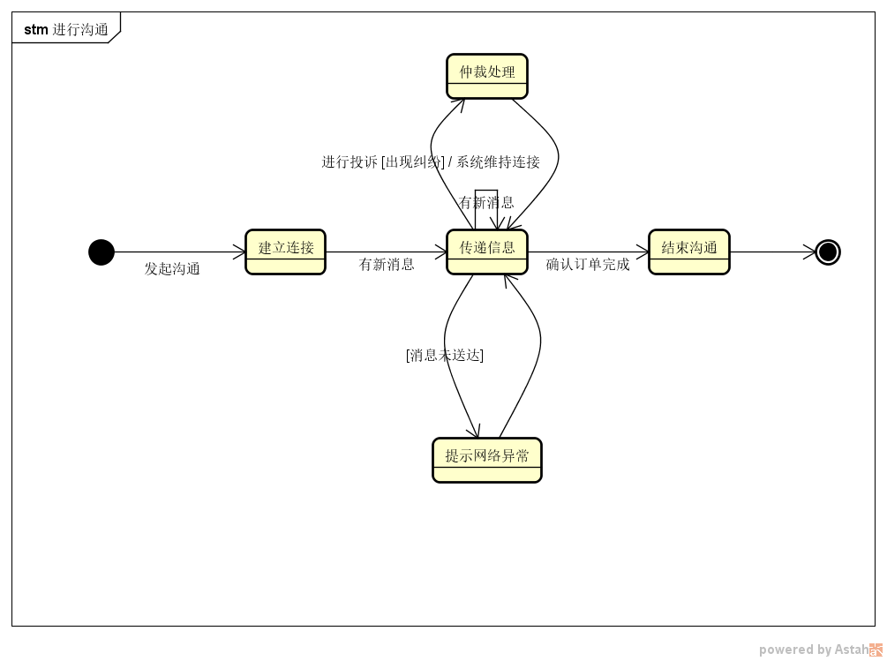

# 美扔-需求分析文档

## 小组成员

- 戴祺佳 181250023（组长）
- 曹邵恒 181250005
- 王海辰 181850154
- 徐宇轩 181250167

## 度量数值

## 文档简介

本文档为需求与商业模式创新的第五次大作业，旨在使用需求分析方法对需求进行分析，构建需求规格说明。

### 作业说明

- 任务

  - 分析模型

    使用概念类图、顺序图、状态图对用户需求进行建模

  - 需求跟踪矩阵（可选）

    要求见样例文档

  - 软件需求规格说明

    使用分析模型精化抽取系统级需求，编制完整的定制化的需求规格说明文档

### 内容说明

在本阶段，我们依照之前已完成的用户需求文档，构建了用户需求模型，并通过分析模型构建出系统级需求，进而完成软件需求规格说明文档。以上的需求分析过程将通过以下的文档内容进行记录和阐述。

[toc]

# 美扔-需求分析

## 一、分析模型

### 用户需求列表

| ID   | 需求内容                   | 优先级 |
| ---- | -------------------------- | ------ |
| UR1  | 用户修改个人信息           | 中     |
| UR2  | 用户需求方发起订单         | 高     |
| UR3  | 用户需求方取消订单         | 高     |
| UR4  | 需求执行双方进行沟通       | 高     |
| UR5  | 用户执行方抢接订单         | 高     |
| UR6  | 用户执行方查看可接任务列表 | 高     |
| UR7  | 用户执行方查看导航         | 高     |
| UR8  | 商户编辑商户信息           | 中     |
| UR9  | 商户购买广告服务           | 高     |
| UR10 | 商户查看广告情况           | 中     |
| UR11 | 用户需求方扫二维码         | 高     |
| UR12 | 平台设计人员进行广告定制   | 高     |
| UR13 | 用户发起举报投诉           | 高     |
| UR14 | 平台仲裁人员处理举报投诉   | 高     |
| UR15 | 用户执行方执行订单         | 高     |

### 1.1 UR1-用户修改个人信息

#### 1.1.1 概念类图

##### 1.1.1.1 图要说明的问题

##### 1.1.1.2 图本身

##### 1.1.1.3 图的简要介绍

#### 1.1.2 顺序图

##### 1.1.2.1 图要说明的问题

##### 1.1.2.2 图本身

##### 1.1.2.3 图的简要介绍

#### 1.1.3 状态图

##### 1.1.3.1 图要说明的问题

##### 1.1.3.2 图本身

##### 1.1.3.3 图的简要介绍

### 1.2 UR2-用户需求方发起订单

#### 1.2.1 概念类图

##### 1.2.1.1 图要说明的问题

##### 1.2.1.2 图本身

##### 1.2.1.3 图的简要介绍

#### 1.2.2 顺序图

##### 1.2.2.1 图要说明的问题

##### 1.2.2.2 图本身

##### 1.2.2.3 图的简要介绍

#### 1.2.3 状态图

##### 1.2.3.1 图要说明的问题

##### 1.2.3.2 图本身

##### 1.2.3.3 图的简要介绍

### 1.3 UR3-用户需求方取消订单

#### 1.3.1 概念类图

##### 1.3.1.1 图要说明的问题

##### 1.3.1.2 图本身

##### 1.3.1.3 图的简要介绍

#### 1.3.2 顺序图

##### 1.3.2.1 图要说明的问题

##### 1.3.2.2 图本身

##### 1.3.2.3 图的简要介绍

#### 1.3.3 状态图

##### 1.3.3.1 图要说明的问题

##### 1.3.3.2 图本身

##### 1.3.3.3 图的简要介绍

### 1.4 UR4-需求执行双方进行沟通

#### 1.4.1 概念类图

##### 1.4.1.1 图要说明的问题

该图描述了需求执行双方进行沟通的概念类图

##### 1.4.1.2 图本身

##### 1.4.1.3 图的简要介绍

#### 1.4.2 顺序图

##### 1.4.2.1 图要说明的问题

该图描述了需求执行双方进行沟通的顺序图

##### 1.4.2.2 图本身

##### 1.4.2.3 图的简要介绍

该图包括用户和系统两个对象。用户选择发起沟通功能后，系统为双方建立IM连接。在连接建立后，系统为双方传递消息，如果网络异常则提示检查网络状态。如果在用户确认订单完成前，用户进行投诉，则系统维持IM连接直到仲裁结束之后得到仲裁结果，并将结果返回给用户。当用户确认订单完成后，系统结束连接。

#### 1.4.3 状态图

##### 1.4.3.1 图要说明的问题

##### 1.4.3.2 图本身

##### 1.4.3.3 图的简要介绍

首先是开始状态，当用户发起沟通后进入连接建立状态。有消息则进入传递消息状态，并且在持续有新消息的状态下保持在传递消息状态。如果消息传递失败，则提示网络异常。如果用户进行投诉，则进入仲裁处理状态，并在仲裁结果得出后回到传递消息状态。当用户确认订单完成后，系统进入结束沟通态，并终止。

### 1.5 UR5-用户执行方抢接订单

#### 1.5.1 概念类图

##### 1.5.1.1 图要说明的问题

该图描述的是用户执行方抢接订单的概念类图

##### 1.5.1.2 图本身

##### 1.5.1.3 图的简要介绍

#### 1.5.2 顺序图

##### 1.5.2.1 图要说明的问题

该图描述的是用户执行方抢接订单的顺序图

##### 1.5.2.2 图本身

##### 1.5.2.3 图的简要介绍

该图包括用户和系统两个对象。当用户执行方选择一订单进行某一订单的抢单后，系统通过算法匹配是否抢到了订单。如果当前用户没有抢到订单，则系统提示抢单失败；否则系统提示抢单成功。如果在系统返回消息前订单被取消，则系统提示当前订单已经被取消。

#### 1.5.3 状态图

##### 1.5.3.1 图要说明的问题

该图描述的是用户执行方抢接订单的状态图

##### 1.5.3.2 图本身

##### 1.5.3.3 图的简要介绍

首先是开始状态，当用户选择抢单后进入订单分配状态，如果抢单失败则提示失败信息并结束，否则提示抢单成功。成功后如果订单被取消，则提示取消信息并结束，否则直接结束。

### 1.6 UR6-用户执行方查看可接任务列表

#### 1.6.1 概念类图

##### 1.6.1.1 图要说明的问题

该图描述的是用户执行方查看可接任务列表的概念类图

##### 1.6.1.2 图本身

##### 1.6.1.3 图的简要介绍

#### 1.6.2 顺序图

##### 1.6.2.1 图要说明的问题

该图描述的是用户执行方查看可接任务列表的顺序图

##### 1.6.2.2 图本身

##### 1.6.2.3 图的简要介绍

该图包括用户和系统两部分，用户执行方选择查看可接的任务列表。如果此时有订单可接受，则系统展示可接受的订单列表，否则系统提示无订单可接。

#### 1.6.3 状态图

##### 1.6.3.1 图要说明的问题

该图描述的是用户执行方查看可接任务列表的状态图

##### 1.6.3.2 图本身

##### 1.6.3.3 图的简要介绍

首先是开始状态，当用户执行者选择查看任务列表后进入任务列表展示状态，之后如果有可接任务进入展示可接任务态，否则进入提示无订单可接状态。最后进入终止态。

### 1.7 UR7-用户执行方查看导航

#### 1.7.1 概念类图

##### 1.7.1.1 图要说明的问题

该图是用户执行方查看导航的概念类图

##### 1.7.1.2 图本身

##### 1.7.1.3 图的简要介绍

#### 1.7.2 顺序图

##### 1.7.2.1 图要说明的问题

该图是用户执行方查看导航的顺序图

##### 1.7.2.2 图本身

##### 1.7.2.3 图的简要介绍

该图包括用户执行者和系统。用户请求系统提供导航信息，系统通过地图展示相关的地址、路线信息

#### 1.7.3 状态图

##### 1.7.3.1 图要说明的问题

该图是用户执行方查看导航的状态图

##### 1.7.3.2 图本身

##### 1.7.3.3 图的简要介绍

首先是开始状态，当用户请求查看导航信息时，系统通过地图进行路线展示，并在到达目的地后终止。

### 1.8 UR8-商户编辑商户信息

#### 1.8.1 概念类图

##### 1.8.1.1 图要说明的问题

该图描述了商户编辑商户信息的概念类图

##### 1.8.1.2 图本身

##### 1.8.1.3 图的简要介绍

#### 1.8.2 顺序图

##### 1.8.2.1 图要说明的问题

该图描述了商户编辑商户信息的顺序图

##### 1.8.2.2 图本身

##### 1.8.2.3 图的简要介绍

该图主要包括用户和系统。当商户提交更改信息请求后，系统允许商户更改信息。商户填写信息表单并保存，如果商户填写的信息不符合格式要求，则提示商户重新填写，如果填写不完整，则提示填写完整，如果商户在填写期间退出则系统终止本次交互。否则，系统更新商户信息。

#### 1.8.3 状态图

##### 1.8.3.1 图要说明的问题

该图描述了商户编辑商户信息的状态图

##### 1.8.3.2 图本身

##### 1.8.3.3 图的简要介绍

首先进入开始状态，当商户选择更改信息，系统进入信息更改界面。如果表单不完整就提交，则提示商户填写完整，并在一定延迟后回到信息更改界面；如果格式不正确，则提示重新填写，并在一定延迟后回到信息更改界面。之后如果正确填写表单并保存，则更新商户信息，在更新结束后结束。否则如果选择退出，则进入退出状态并结束。

### 1.9 UR9-商户购买广告服务

#### 1.9.1 概念类图

##### 1.9.1.1 图要说明的问题

该图描述了商户购买广告服务的概念类图

##### 1.9.1.2 图本身

##### 1.9.1.3 图的简要介绍

#### 1.9.2 顺序图

##### 1.9.2.1 图要说明的问题

该图描述了商户购买广告服务的顺序图

##### 1.9.2.2 图本身

##### 1.9.2.3 图的简要介绍

该图主要包括商户和系统两个对象。商户首先选择进行广告定制服务，系统响应并允许用户进行广告定制服务。商户填写基本信息并提交，如果信息规范则系统建立商户和设计人员的IM沟通，否则如果商户填写的信息有误或者不完整，系统提示重新填写。随后商户和设计人员沟通设计并进行确认操作，如果商户放弃定制则流程结束且系统关闭商户和设计人员的沟通通道，否则系统提示商户付款并且选择付款方式。当用户选择支付方式后，如果支付成功，则系统生成订单，否则系统提示重新付款。

#### 1.9.3 状态图

##### 1.9.3.1 图要说明的问题

该图描述了商户购买广告服务的状态图

##### 1.9.3.2 图本身

##### 1.9.3.3 图的简要介绍

首先是开始状态，当商户选择进行广告定制后进入表单填写态，如果商户填写的表单不符合要求则提示重新填写并且返回表单填写态，如果填写成功并提交就进入IM连接建立态。如果在沟通过程中商户放弃设计则系统进入终止设计状态并且结束，否则沟通后商户选择付款方式并在付款成功后生成订单结束。如果付款失败则提示失败回到付款界面。

### 1.10 UR10-商户查看广告情况

#### 1.10.1 概念类图

##### 1.10.1.1 图要说明的问题

该图描述了商户查看广告情况的概念类图

##### 1.10.1.2 图本身

##### 1.10.1.3 图的简要介绍

#### 1.10.2 顺序图

##### 1.10.2.1 图要说明的问题

该图描述了商户查看广告情况的顺序图

##### 1.10.2.2 图本身

##### 1.10.2.3 图的简要介绍

该图包括的对象主要是用户和系统。商户选择广告服务中使用的IM并且请求查看广告情况，如果用户没有购买过广告服务则系统显示商户还没有购买过广告服务并且终止流程；否则，系统显示广告服务的统计信息

#### 1.10.3 状态图

##### 1.10.3.1 图要说明的问题

该图描述了商户查看广告情况的状态图

##### 1.10.3.2 图本身

##### 1.10.3.3 图的简要介绍

首先是开始状态，当商户请求查看广告服务情况后系统进入展示广告情况状态，如果购买过广告，则转而展示广告服务统计信息并结束，否则提示未购买广告并结束

### 1.11 UR11-用户需求方扫二维码

#### 1.11.1 概念类图

##### 1.11.1.1 图要说明的问题

该图描述了用户需求方扫二维码的概念类图

##### 1.11.1.2 图本身

##### 1.11.1.3 图的简要介绍

#### 1.11.2 顺序图

##### 1.11.2.1 图要说明的问题

该图描述了用户需求方扫二维码的顺序图

##### 1.11.2.2 图本身

##### 1.11.2.3 图的简要介绍

该图主要包括用户和系统。当用户选择扫二维码并且领取垃圾袋的服务后，系统将提示用户扫描二维码。当用户扫描二维码后，如果扫码失败则重新扫描。如果扫描成功，系统存储垃圾袋发放信息，之后展示商户信息允许发放垃圾袋。如果存储垃圾袋发放信息失败，则系统提示重新扫码

#### 1.11.3 状态图

##### 1.11.3.1 图要说明的问题

该图描述了用户需求方扫二维码的状态图

##### 1.11.3.2 图本身

##### 1.11.3.3 图的简要介绍

首先是开始状态，当用户选择扫码服务后，系统进入二维码展示态，之后用户扫描二维码，如果失败，系统进入提示刷新二维码状态并在一定延迟后进入二维码展示态。否则，系统存储垃圾袋发放信息，在发放成功后展示商户信息并结束。

### 1.12 UR12-平台设计人员进行广告定制

#### 1.12.1 概念类图

##### 1.12.1.1 图要说明的问题

该图描述了平台设计人员进行广告定制的概念类图

##### 1.12.1.2 图本身

##### 1.12.1.3 图的简要介绍

#### 1.12.2 顺序图

##### 1.12.2.1 图要说明的问题

该图描述了平台设计人员进行广告定制的顺序图

##### 1.12.2.2 图本身

##### 1.12.2.3 图的简要介绍

该图主要包括用户和系统。当平台设计人员登录系统后，将等待直至有商户请求，系统将异步地为其分配有请求的商户并通过IM建立和商户的沟通

#### 1.12.3 状态图

##### 1.12.3.1 图要说明的问题

该图描述了平台设计人员进行广告定制的状态图

##### 1.12.3.2 图本身

##### 1.12.3.3 图的简要介绍

首先是开始状态，当平台设计人员登录后进入登录状态，当系统分配商户后进入双方沟通状态，当完成沟通后，系统进入线下对接态并结束；否则商户放弃购买则进入停止沟通态并结束

### 1.13 UR13-用户发起举报投诉

#### 1.13.1 概念类图

##### 1.13.1.1 图要说明的问题

该图描述了用户发起举报投诉的概念类图

##### 1.13.1.2 图本身

##### 1.13.1.3 图的简要介绍

#### 1.13.2 顺序图

##### 1.13.2.1 图要说明的问题

该图描述了用户发起举报投诉的顺序图

##### 1.13.2.2 图本身

##### 1.13.2.3 图的简要介绍

该图主要包括用户和系统两个角色。当用户发起举报投诉后，系统允许用户输入举报信息。用户输入举报信息提交至系统，系统向平台仲裁人员展示输入的举报信息和这次任务的照片。在仲裁处理完成后，系统向用户展示仲裁结果

#### 1.13.3 状态图

##### 1.13.3.1 图要说明的问题

该图描述了用户发起举报投诉的状态图

##### 1.13.3.2 图本身

##### 1.13.3.3 图的简要介绍

首先是开始状态，然后系统展示举报信息表单，当表单格式不符合要求时，系统进入提示重新填写状态，在一定时间间隔后回到举报信息表单态，当表单格式符合要求后且分配仲裁人员，系统将展示本次任务的相关信息，当仲裁人员决定结果后，系统进入仲裁结果展示态，随后结束。

#### 1.14.1 概念类图

##### 1.14.1.1 图要说明的问题

该图描述了平台仲裁人员处理举报投诉的概念类图

##### 1.14.1.2 图本身

##### 1.14.1.3 图的简要介绍

#### 1.14.2 顺序图

##### 1.14.2.1 图要说明的问题

该图描述了平台仲裁人员处理举报投诉的顺序图

##### 1.14.2.2 图本身

##### 1.14.2.3 图的简要介绍、

图的主要对象包括用户和系统。当用户（平台仲裁人员）请求进行仲裁处理后，系统允许用户进行仲裁处理，并且返回待仲裁订单的详细信息。随后用户进行仲裁并且填写表单提交至系统，系统判断内容是否合法，如果合法则更新举报投诉订单状态且更新相应用户信息，否则系统提示重新填写

#### 1.14.3 状态图

##### 1.14.3.1 图要说明的问题

该图描述了平台仲裁人员处理举报投诉的状态图

##### 1.14.3.2 图本身

##### 1.14.3.3 图的简要介绍

首先是开始状态，当用户选择某个仲裁请求后，系统进入仲裁表单展示状态，当用户填写仲裁表单并提交后，系统进入内容判断，如果合法，则更新相应内容并且结束；否则，系统将进入重新填写提示状态，在一定时间后，回到仲裁表单展示状态。

### 1.15 UR15-用户执行方执行订单

#### 1.15.1 概念类图

##### 1.15.1.1 图要说明的问题

该图描述了用户执行方执行订单的概念类图

##### 1.15.1.2 图本身

##### 1.15.1.3 图的简要介绍

#### 1.15.2 顺序图

##### 1.15.2.1 图要说明的问题

该图描述了用户执行方执行订单的顺序图

##### 1.15.2.2 图本身

##### 1.15.2.3 图的简要介绍

图中涉及到的对象主要是用户和系统。用户执行者在完成垃圾投放任务后请求上传垃圾相关的信息，当系统允许后用户执行者选择一张证明他任务完成的图片进行上传。系统将判断照片是否有效，当照片是无效信息时，将提示用户执行者重新上传，否则系统存储信息更新订单

#### 1.15.3 状态图

##### 1.15.3.1 图要说明的问题

该图描述了用户执行者执行订单的状态图

##### 1.15.3.2 图本身

##### 1.15.3.3 图的简要介绍

首先是开始状态，当用户请求上传垃圾信息后，系统进入垃圾上传状态，当用户选择照片并且上传后，系统对内容进行检查，如果信息有效，进入存储更新状态，并且结束；否则，系统进入提醒重新上传态，在用户重新上传后进入内容检查态

## 二、需求跟踪矩阵

### 1.需求列表

BR1：在系统使用6个月后，以社区为单位的垃圾正确投放率平均上升20%

BR2：在系统使用6个月后，以社区为单位的垃圾投放耗时平均降低20%

BR3：在系统使用6个月后，以社区为单位的平台用户个体经营户客流量上升10%

BR4：在系统使用3个月后，以社区为单位的垃圾投放数据得到稳定分析模型

BR5：在系统使用9个月后，平台实现盈利

UR1：用户修改个人信息

SR1:

(1) 系统允许用户提交修改个人信息请求

(2) 系统提供用户个人信息修改栏

(3) 系统保存用户修改信息，并提示修改成功

UR2：用户需求方发起订单

SR2:

(1) 系统允许用户申请提交订单

(2) 系统允许用户填写订单详细信息，包括时间、地点等

(3) 系统允许支付

(3) 若支付成功，系统保存订单信息，提示订单提交成功

UR3：用户需求方取消订单

SR3：

(1) 系统允许用户对已经发起的订单执行取消

(2) 系统判断该订单是否满足取消添加，如果是，提示取消成功

(3) 系统处理退款事务

UR4：需求执行双方进行沟通

SR4:

(1) 系统为沟通双方建立IM连接

(2) 系统允许双方发送消息

(3) 系统允许用户确认结束订单

(4) 若用户确认结束订单，系统终止连接

UR5：用户执行方抢接订单

SR5:

(1) 系统为用户执行方提供目前可以接受的订单列表（详见SR6）

(2) 系统允许用户执行方请求接受订单

(3) 系统根据算法判断哪个请求接受订单的执行者为接单成功，提示接单成功；其他执行者提示接单失败

UR6：用户执行方查看可接任务列表

SR6:

(1) 系统显示距离用户执行者最近的订单列表

(2) 系统允许按照距离、报酬等标准进行排序

(3) 系统允许用户执行者查看某一具体订单的详情信息，包括地点、时间、报酬等

UR7：用户执行方查看导航

SR7:

(1) 系统提供用户执行方到订单目的地的导航路线

(2) 系统提供按照最短路径、最短时间等多种规划方式让用户选择

(3) 当用户执行者有多个订单时，系统提供多点路线规划

UR8：商户编辑商户信息

SR8:

(1) 系统允许商户提交修改商户信息请求

(2) 系统提供商户信息修改栏，包括地理位置、店名等

(3) 系统保存商户修改信息，并提示修改成功

UR9：商户购买广告服务

SR9:

(1) 系统允许商户提交购买广告服务的请求

(2) 系统允许商户填写购买广告的规模

(3) 当商户确认购买订单后，跳转到支付界面，在支付后提示支付成功

(4) 系统提供商户与公司广告部门的沟通渠道，负责设计广告（详见SR12）

UR10：商户查看广告情况

SR10:

(1) 系统允许商户查看已经购买的广告设计情况

(2) 系统允许用户查看购买的广告分发情况

UR11：用户需求方扫二维码

SR11:

(1) 系统自动生成二维码

(2) 系统存储垃圾袋发放信息

(3) 系统展示商家信息

(4) 系统允许发放垃圾袋

UR12：平台设计人员进行广告定制

SR12:

(1) 系统允许设计人员通过IM和商户沟通（详见SR4）

(2) 系统允许商户放弃购买广告服务

UR13：用户发起举报投诉

SR13:

(1) 系统允许用户申请投诉

(2) 系统允许用户填写投诉信息

(3) 系统向平台仲裁人员展示输入的举报信息和此次任务的照片

(4) 系统接受仲裁人员的仲裁结果

(5) 系统向用户显示仲裁结果

UR14：平台仲裁人员处理举报投诉

(1) 系统向仲裁人员展示待处理订单

(2) 系统允许平台仲裁人员进行处理操作，并展示详细信息

(3) 系统允许仲裁人员提交仲裁结果

(4) 系统判断内容是否合法，若合法则更新举报投诉与相应用户信息

UR15：用户执行方执行订单

SR15:

(1) 系统允许用户执行者提交执行订单请求

(2) 系统允许用户执行者上传垃圾信息

(3) 系统判断照片是否相关且有效，若有效，则储存信息，更新订单信息

### 2.需求规格矩阵

| 需求编号 | 需求类别 | 需求来源   | 具有难度 | 可行性 | 风险 | 改善产品功能 | 改善产品性能 | 增加用户满意度 | 增加产品竞争力 | 是否实现 | 优先级 | 未实现原因 | 是否出现变更 | 变更基线 | 变更记录 |
| -------- | -------- | ---------- | -------- | ------ | ---- | ------------ | ------------ | -------------- | -------------- | -------- | ------ | ---------- | ------------ | -------- | -------- |
| BR1      | 业务需求 | 用户       | 否       | 是     | 否   | 是           | 否           | 是             | 是             | 是       | 4      |            | 否           |          |          |
| BR2      | 业务需求 | 客户       | 是       | 是     | 否   | 是           | 否           | 是             | 是             | 是       | 5      |            | 否           |          |          |
| BR3      | 业务需求 | 客户       | 是       | 是     | 否   | 是           | 否           | 是             | 是             | 是       | 5      |            | 否           |          |          |
| BR4      | 业务需求 | 客户       | 否       | 是     | 否   | 是           | 否           | 是             | 是             | 是       | 5      |            | 否           |          |          |
| BR5      | 业务需求 | 客户       | 是       | 是     | 否   | 是           | 否           | 是             | 是             | 是       | 5      |            | 否           |          |          |
| UR1      | 用户需求 | 用户       | 否       | 是     | 否   | 是           | 否           | 是             | 否             | 是       | 4      |            | 否           |          |          |
| SR1      | 系统需求 | 用户       | 否       | 是     | 否   | 是           | 否           | 是             | 否             | 是       | 4      |            | 否           |          |          |
| UR2      | 用户需求 | 用户       | 否       | 是     | 否   | 是           | 否           | 是             | 否             | 是       | 5      |            | 否           |          |          |
| SR2      | 系统需求 | 用户       | 否       | 是     | 否   | 是           | 否           | 是             | 否             | 是       | 5      |            | 否           |          |          |
| UR3      | 用户需求 | 用户       | 否       | 是     | 否   | 是           | 否           | 是             | 否             | 是       | 5      |            | 否           |          |          |
| SR3      | 系统需求 | 用户       | 否       | 是     | 否   | 是           | 否           | 是             | 否             | 是       | 5      |            | 否           |          |          |
| UR4      | 用户需求 | 用户       | 否       | 是     | 否   | 是           | 否           | 是             | 否             | 是       | 5      |            | 否           |          |          |
| SR4      | 系统需求 | 用户       | 否       | 是     | 否   | 是           | 否           | 是             | 是             | 是       | 5      |            | 否           |          |          |
| UR5      | 用户需求 | 用户       | 否       | 是     | 否   | 是           | 否           | 是             | 是             | 是       | 5      |            | 否           |          |          |
| SR5      | 系统需求 | 用户       | 否       | 是     | 否   | 是           | 否           | 是             | 否             | 是       | 5      |            | 否           |          |          |
| UR6      | 用户需求 | 用户       | 否       | 是     | 否   | 是           | 否           | 是             | 是             | 是       | 5      |            | 否           |          |          |
| SR6      | 系统需求 | 用户       | 否       | 是     | 否   | 是           | 否           | 是             | 是             | 是       | 5      |            | 否           |          |          |
| UR7      | 用户需求 | 用户执行者 | 否       | 是     | 否   | 是           | 否           | 是             | 否             | 是       | 5      |            | 否           |          |          |
| SR7      | 系统需求 | 用户执行者 | 否       | 是     | 否   | 是           | 否           | 是             | 否             | 是       | 5      |            | 否           |          |          |
| UR8      | 用户需求 | 商户       | 否       | 是     | 否   | 是           | 否           | 是             | 否             | 是       | 5      |            | 否           |          |          |
| SR8      | 系统需求 | 商户       | 否       | 是     | 否   | 是           | 否           | 是             | 否             | 是       | 4      |            | 否           |          |          |
| UR9      | 用户需求 | 商户       | 否       | 是     | 否   | 是           | 否           | 是             | 否             | 是       | 4      |            | 否           |          |          |
| SR9      | 系统需求 | 商户       | 否       | 是     | 否   | 是           | 否           | 是             | 否             | 是       | 5      |            | 否           |          |          |
| UR10     | 用户需求 | 用户       | 否       | 是     | 否   | 是           | 否           | 否             | 否             | 是       | 4      |            | 否           |          |          |
| SR10     | 系统需求 | 用户       | 否       | 是     | 否   | 是           | 否           | 否             | 否             | 是       | 4      |            | 否           |          |          |
| UR11     | 用户需求 | 商户       | 否       | 是     | 否   | 是           | 否           | 是             | 否             | 是       | 5      |            | 否           |          |          |
| SR11     | 系统需求 | 商户       | 否       | 是     | 否   | 是           | 否           | 是             | 否             | 是       | 5      |            | 否           |          |          |
| UR12     | 用户需求 | 用户       | 否       | 是     | 否   | 是           | 否           | 是             | 否             | 是       | 5      |            | 否           |          |          |
| SR12     | 系统需求 | 用户       | 否       | 是     | 否   | 是           | 否           | 是             | 否             | 是       | 5      |            | 否           |          |          |
| UR13     | 用户需求 | 用户       | 否       | 是     | 否   | 是           | 否           | 是             | 否             | 是       | 5      |            | 否           |          |          |
| SR13     | 系统需求 | 用户       | 否       | 是     | 否   | 是           | 否           | 是             | 否             | 是       | 5      |            | 否           |          |          |
| UR14     | 用户需求 | 用户       | 否       | 是     | 否   | 是           | 否           | 是             | 否             | 是       | 5      |            | 否           |          |          |
| SR14     | 系统需求 | 用户       | 否       | 是     | 否   | 是           | 否           | 是             | 否             | 是       | 5      |            | 否           |          |          |
| UR15     | 用户需求 | 用户       | 否       | 是     | 否   | 是           | 否           | 是             | 否             | 是       | 5      |            | 否           |          |          |
| SR15     | 系统需求 | 用户       | 否       | 是     | 否   | 是           | 否           | 是             | 否             | 是       | 5      |            | 否           |          |          |

## 三、软件需求规格说明文档

### 1. 引言

#### 1.1  目的

​	本文档描述了“美扔”产品的功能需求和非功能需求，所有以后的开发工作和测试文档都会以此文档为基础，除特殊说明外，本文档所包含的需求都是高优先级需求

#### 1.2  范围

​	美扔产品的主要预期功能包括为代扔垃圾业务的双方牵线搭桥，进行垃圾代扔，同时通过垃圾袋身广告为社区中个体经营户的小店铺提供广告服务。在此同时，通过对用户扔垃圾的数据进行收集与分析，提高运营效率降低成本并通过提供数据服务产生一定的收入

#### 1.3  定义、首字母缩写和缩略语

​	略

#### 1.4  参考文献

骆斌，丁二玉；需求工程：软件建模与分析--北京：高等教育出版社，2015.2

#### 1.5  文档组织

​	本文档主要参考教材中的软件需求规格说明模板进行组织，主要包括引言、总体描述、详细需求描述几个部分

### 2.总体描述

#### 2.1  产品前景

随着社会的发展和城镇管理的进步，很多城市强制推行垃圾分类政策，要求市民必须定点定时按类别投放垃圾。这在提升资源利用水平，降低垃圾危害方面起到了正面的作用。但也存在垃圾分类的操作具有一定的学习成本、垃圾分类投放点距离住户较远，垃圾分类投放时段与住户的时间安排不符等问题，让一些自己分类投放垃圾有困难以都市白领为典型的人群无所适从。与此同时，在社区中也存在着一些闲散时间较多，拥有热心肠的以大爷大妈为典型的有能力为垃圾分类投放出力的人群。此外，社区中存在不少个体经营户经营的小店铺，他们需要为自己的店铺做广告，以提升知名度

借此机会，美扔产品将基于满足以上各种用户的需求进行设计和运行

#### 2.2  产品功能

对那些希望有丢垃圾需求的人来说，美扔平台是一个基于互联网的应用程序，它可以接受丢垃圾的任务，为有需求的人匹配合适的代丢垃圾的人，双方约定完垃圾交付和定价条件之后，有丢垃圾需求的人只需要把垃圾放置在指定的位置并拍照记录，他们就不需要关心之后的事情了。不仅如此，通过为用户提供附近的垃圾袋分发点指引，让他们能最方便地获得免费的垃圾袋

对那些能够帮助别人丢垃圾的人来说，美扔平台是一个基于互联网的应用程序，它是获取代扔垃圾需求的平台，在匹配到对应的需求并约定好交付和定价条件之后，帮别人丢垃圾的人需要在约定的时间内取走垃圾并拍照记录，并前往垃圾分类投放处，打开垃圾袋，对垃圾进行拍照确认以及分类投放

对那些有商业推广需求的个体经营户来说，美扔平台是他们进行广告推广的平台，平台将与个体经营户协作设计广告，将其印刷在垃圾袋上并进行免费分发，从而达成对店铺和平台的宣传。

此外，平台通过用户产生的照片进行信息的收集，通过大数据和人工智能手段得到有价值的信息，这些信息能够为平台的运营提供帮助

**业务需求**

BR1：在系统使用6个月后，以社区为单位的垃圾正确投放率平均上升20%

BR2：在系统使用6个月后，以社区为单位的垃圾投放耗时平均降低20%

BR3：在系统使用6个月后，以社区为单位的平台用户个体经营户客流量上升10%

BR4：在系统使用3个月后，以社区为单位的垃圾投放数据得到稳定分析模型

BR5：在系统使用9个月后，平台实现盈利

##### 系统特性列表

| ID   | 系统特性                     | 内容                                                         |
| ---- | ---------------------------- | ------------------------------------------------------------ |
| FE1  | 用户注册登录                 | 允许用户注册登录美扔平台，绑定手机                           |
| FE2  | 用户设置个人信息             | 用户可以设置个人信息，例如姓名、头像、所在地区、电话等       |
| FE3  | 需求方发起代扔订单           | 需求方发起代扔订单，填写垃圾暂存地点，预估重量，选择时间，选择是否需要进行分类，预付款，然后寻求执行方 |
| FE4  | 执行方抢单                   | 执行方可以看到自己周边一定地域范围内的代扔订单，并选择是否接单 |
| FE5  | 执行方查看当前订单           | 执行方可以在订单页面看到当前的订单数、订单进度，剩余取垃圾时限等相关信息 |
| FE6  | 执行方获得导航               | 系统提供在线地图与路线导航，为执行者提供完成所接订单的最优化路线 |
| FE7  | 需求方与执行方通过IM进行交互 | 需求方和执行方可以进行一对一的交流，沟通任务内容，同时通过系统消息的形式对业务流程进行规范和控制 |
| FE8  | 反馈与投诉                   | 任务运行中需要在规定的几个节点进行规定形式的拍照作为监管的手段。需求方可以举报执行方没有取走垃圾，执行方可以举报需求方没有按时放置垃圾或按要求正确分类 |
| FE9  | 信用机制                     | 需求方和执行方拥有一定的信用分，当被投诉举证成功后会扣除相应的分数，以匹配优先级降低作为惩罚。用户可以通过顺利正确完成一次订单增加自己的信用分 |
| FE10 | 用户查看垃圾袋投放点         | 用户可以查看附近免费提供垃圾袋的商户或者投放点               |
| FE11 | 用户扫码获得垃圾袋           | 用户可以在垃圾袋投放点进行扫码得到商家的推广信息，并免费获得垃圾袋 |
| FE12 | 商户购买广告服务             | 商户可以向平台购买垃圾袋广告服务，广告投放情况将通过IM进行反馈 |
| FE13 | 垃圾袋广告定制               | 商户可以通过IM与平台广告设计部门对接，沟通需要的定制广告     |

#### 2.3  用户特征

| 用户                                 | 特征描述                                                     |
| ------------------------------------ | ------------------------------------------------------------ |
| 有垃圾代扔需求的人                   | 群体数量大约百万级，有垃圾代扔需求的人主要是指上班族，工作和通勤占据每天的大部分时间，没有很多时间和精力进行垃圾分类投放，或工作时段与垃圾分时投放时段不匹配导致不方便分类投放垃圾，希望省心省力省钱地获得垃圾代扔代分类服务；优先级最高 |
| 有时间精力能力从事垃圾代扔代分类的人 | 群体数量大约百万级，有时间精力能力从事垃圾代扔代分类的人主要是指社区中的大爷大妈一类的人群，他们拥有很多闲暇时间可以进行一些工作，并也因为这一点对垃圾分类知识有较多的了解。此外，他们非常热心肠，愿意帮助需要代扔代分类的人，解决他们的生活困难。并希望通过帮别人代扔垃圾获得一定的经济报酬，希望帮助他人进行垃圾代扔代分类；希望通过垃圾代扔代分类获得一定的经济报酬；优先级最高 |
| 个体经营户                           | 群体数量大约万级，个体经营户指的是那些在社区中经营的小店铺，具有一定的客户需求，并希望能有更多的社区居民知道自己的店铺，愿意为此付出一定的经济报酬；希望推广自己的店铺；优先级最高 |
| 平台仲裁部门                         | 群体数量大约数十人，平台仲裁部门负责在代扔业务出现纠纷时进行仲裁；希望方便地执行仲裁任务；优先级次高 |
| 广告设计部门                         | 群体数量大约数十人，广告设计部门负责为小店铺用户提供广告设计服务；希望方便地执行广告设计任务；优先级次高 |

#### 2.4 约束

- 规章政策：需要遵守国家与隐私相关的法律法规
- 硬件限制：用户端运行在手机APP上，需要提供Android和IOS版本，平台工作人员端运行在PC机上
- 并发操作：需要支持十万人级别的并发，以保证上班高峰期的系统运行
- 高阶语言要求：使用任意高阶语言进行开发，现定为java
- 安全性考虑：从用户的垃圾照片中收集的数据需要进行严格控制，确保安全

#### 2.5 假设和依赖

##### 假设

| ID   | 内容                                                         |
| ---- | ------------------------------------------------------------ |
| AS1  | 用户都具有基本的手机软件操作能力                             |
| AS2  | 大部分社区等政府机构允许并支持平台运行                       |
| AS3  | 用户暂存垃圾的操作不会遭到其他社区居民的明显反对             |
| AS4  | 帮助代扔垃圾的用户具有较高的垃圾分类知识水平和能力           |
| AS5  | 各个社区的人口分布均匀，能够产生足够的各类型用户群体         |
| AS6  | 机器视觉系统有能力从垃圾状态下对物体进行分类统计             |
| AS7  | 各个社区拥有自己的垃圾分类投放点                             |
| AS8  | 各个社区的个体经营户均有较强的业务扩展和广告需求并愿意付费   |
| AS9  | 用户在正常作息时间而非23:00至7:00这段时间有代扔垃圾需求      |
| AS10 | 代扔用户均具有足够的正义感和使命感进行垃圾分类情况的确认操作 |
| AS11 | 用户愿意针对使用过程出现的问题向平台进行反馈                 |
| AS12 | 用户能够接受每月不多于一次的服务崩溃                         |
| AS13 | 平台拥有自己的广告设计服务团队、监督仲裁和线下业务团队       |
| AS14 | 通过分析照片产生的数据能够带来足够的分析价值并让政府等其他有需求的机构为其付费 |
| AS15 | 用户均认可不精确到个人画像级别或匿名的的数据采集收集行为     |

##### 依赖

| ID   | 内容                                                         |
| ---- | ------------------------------------------------------------ |
| DE1  | 平台运行服务器部署在云端，需要云存储服务                     |
| DE2  | 平台需要在社区、街道支持进行下进行活动                       |
| DE3  | 平台与第三方支付平台进行集成，进行双向通信和变更             |
| DE4  | 平台与垃圾袋生产厂家对接，能够灵活生产不同样式不同数量的垃圾袋 |
| DE5  | 政府等监管机构允许平台受限制的数据收集行为                   |

### 3. 详细需求描述

#### 3.1 对外接口需求

#### 3.1.1 用户界面

系统应使用尽可能简洁的用户图形界面，为各类或熟悉或不熟悉手机使用的用户提供方便

系统应尽可能减少完成一次交互的操作数和跳转数，做到快速使用，节约用户的操作时间

系统应至少包括以下界面：

- 用户登录/注册页面
- 用户个人信息/商户个人信息页面
- 用户需求方提交订单/管理订单页面
- 用户执行方接受订单/管理订单页面
- 用户执行方执行指引(导航)页面
- 即时通讯工具通讯录和聊天界面
- 商铺购买广告服务页面
- 仲裁工作页面
- 广告设计工作页面

屏幕风格设计案例如下图

#### 3.1.2 硬件接口

- 系统支持的硬件类型有
  - 客户端：运行IOS系统的苹果手机、运行Android系统的手机
  - 公司端：运行Windows系统的PC

#### 3.1.3 软件接口

- 系统需要与公司线下部门的软件系统进行对接

- 系统需要为可能的数据服务需求方提供数据接口

#### 3.1.4 通信接口

- 系统使用HTTPS通信协议在客户端与服务器之间传输信息
- 系统的客户端软件需要在3G、4G、5G和WIFI网络环境下正常运行
- 系统的公司端软件需要在有线连接网络环境下正常运行
- 用户的个人信息及从用户处收集的垃圾信息需要加密传输
- 与用户个人相关的垃圾分析信息需要脱敏处理

### 3.2 功能需求

#### 3.2.1 用户修改个人信息

##### 3.2.1.1 特性描述

用户可以自助设置或修改个人信息

##### 3.2.1.2 刺激/响应序列

刺激：用户点击修改个人信息按钮

响应：系统显示可修改的输入栏

刺激：用户填写或删改内容，点击确认

响应：系统保存修改内容，提示修改成功

##### 3.2.1.3 相关功能需求

|编号|描述|
|---|---|
|User.ChooseChange | 用户点击修改个人信息|
|User.ChooseChange.FillIn|用户填写内容 |
|User.ChooseChange.FillIn.Cancel|用户放弃修改信息 |
|User.ChooseChange.Succeed |系统个人信息修改成功|

#### 3.2.2 用户需求方发起订单

##### 3.2.2.1 特性描述

用户需求方选择订单信息，发起订单

##### 3.2.2.2 刺激/响应序列

刺激:用户需求方选择上门地点和预估垃圾重量，以及预计的投放时间，点击确认下单

响应:系统提示下单成功，存储并更新订单信息,提示付款

刺激:用户点击付款，跳转至第三方付款，完成付款

响应:系统提示付款成功

##### 3.2.2.3 相关功能需求

|编号|描述|
|---|---|
|Demander.PlaceOrder | 需求方发起订单|
|Demander.PlaceOrder.FillIn | 需求方填写订单必要信息 |
|Demander.PlaceOrder.Succeed|系统确认需求方下单成功|
|Demander.PlaceOrder.Pay|需求方进行支付|
|Demander.PlaceOrder.Pay.Succeed |系统确认需求方支付成功 |

#### 3.2.3 用户需求方取消订单

##### 3.2.3.1 特性描述

用户需求方在订单界面选择未执行的订单，取消订单

##### 3.2.3.2 刺激/响应序列

刺激：用户需求方点击我的订单按钮

响应：系统跳转至订单界面

刺激：用户点击未执行/未接单的订单

响应：系统跳转至订单的详情界面

刺激：用户选择取消订单

响应：系统将订单的状态修改未已取消，停止此订单的抢单，退还款至原账户

##### 3.2.3.3 相关功能需求

|编号|描述|
|---|---|
|Demander.CheckOrder|用户需求方打开我的订单 |
|Demander.CheckOrder.Detail |用户需求方打开订单详情 |
|Demander.CheckOrder.Detail.CancelOrder|用户需求方选择取消订单 |
|Demander.CheckOrder.Detail.CancelOrder.Succeed |用户需求方取消订单成功 |
|Demander.CheckOrder.Detail.Payback|系统退款给需求方至原账户|

#### 3.2.4 需求执行双方进行沟通

##### 3.2.4.1 特性描述

需求方和执行方进行其他信息的交流

##### 3.2.4.2 刺激/响应序列

刺激：一方选择发起沟通

响应：系统建立IM连接，传递双方消息

刺激：用户双方确认订单完成

响应：系统关闭IM连接

##### 3.2.4.3 相关功能需求

|编号|描述|
|---|---|
|User.Connection.Ask|用户请求建立连接 |
|User.Connection.Begin|系统建立连接|
|User.Connection.Pass|系统传递消息|
|User.Connection.Terminate |用户请求终止连接|
|User.Connection.End|系统终止连接 |

#### 3.2.5 用户执行方抢接订单

##### 3.2.5.1 特性描述

用户执行方通过抢单获取更多订单

##### 3.2.5.2 刺激/响应序列

刺激:用户执行方在抢单界面点击当前可抢订单的抢单键进行抢单

响应:系统提示抢单结果

##### 3.2.5.3 相关功能需求

|编号|描述|
|---|---|
|Executant.GrabOrder |用户执行者点击抢单 |
|Executant.GrabOrder.Succeed |系统提示抢单成功 |
|Executant.GrabOrder.Fail |系统提示抢单失败 |

#### 3.2.6 用户执行方查看可接任务列表

##### 3.2.6.1 特性描述

用户执行方查看可接任务列表

##### 3.2.6.2 刺激/响应序列

刺激:用户执行方点击进入可抢单界面

响应:系统跳转至可抢单界面，以列表形式展示可接任务列表

刺激：用户选择排序方式

响应：系统以特定方式排序可接任务列表

##### 3.2.6.3 相关功能需求

|编号|描述|
|---|---|
|Executant.LookupOrder |用户执行方查看可接任务列表 |
|Executant.LookupOrder.Sort |用户执行方按某种排序方式查看可接任务列表 |
|Executant.LookupOrder.Show |系统展示可接任务列表 |

#### 3.2.7 用户执行方查看导航

##### 3.2.7.1 特性描述

用户执行方查看到交接地址和投放垃圾的最优路线

##### 3.2.7.2 刺激/响应序列

刺激:用户执行方在订单详情点击查看导航按钮

响应:系统跳转至地图界面，展示相关地址、路线信息

##### 3.2.7.3 相关功能需求

|编号|描述|
|---|---|
|Executant.Navigation.Ask |用户请求导航 |
|Executant.Navigation.Show |系统通过导航展示具体信息 |

#### 3.2.8 商户编辑商户信息

##### 3.2.8.1 特性描述

商户编辑修改信息

##### 3.2.8.2 刺激/响应序列

刺激：商户点击修改个人信息按钮

响应：系统显示可修改的输入栏

刺激：商户填写或删改内容，点击确认

响应：系统保存修改内容，提示修改成功

##### 3.2.8.3 相关功能需求

|编号|描述|
|---|---|
|Merchant.ChooseChange | 商户点击修改个人信息|
|Merchant.ChooseChange.FillIn|商户填写内容 |
|Merchant.ChooseChange.Cancel|商户取消填写内容 |
|Merchant.ChooseChange.Succeed |系统个人信息修改成功|

#### 3.2.9 商户购买广告服务并查看

##### 3.2.9.1 特性描述

商户购买广告服务，请求平台帮助其设计广告并进行投放，并查看广告情况

##### 3.2.9.2 刺激/响应序列

刺激:商户选择广告定制

响应:系统跳转至广告定制界面

刺激:商户填写基本信息并提交

响应:系统确认收到，建立与设计人员的IM沟通

刺激:商户与设计人员沟通，确认设计稿

响应:系统提示商户购买服务

刺激:商户选择广告类型并付款

响应:系统提示付款成功,生成订单

刺激:商户选择查看广告情况

响应:系统显示广告服务统计消息

##### 3.2.9.3 相关功能需求
|编号|描述|
|---|---|
|Merchant.AD.CustomMake.Ask|商户请求广告定制服务 |
|Merchant.AD.CustomMake.FillIn |商户填写基本需求信息 |
|Merchant.AD.CustomMake.Confirm|商户与设计人员沟通并确认样式|
|Merchant.AD.CustomMake.Buy |商户购买广告服务 |
|Merchant.AD.CustomMake.PaySucceed |系统确认收款，生成订单 |
|Merchant.AD.CustomMake.Check |商户选择查看广告情况 |
|Merchant.AD.CustomMake.Show |系统显示广告服务统计消息|

#### 3.2.10 用户需求方扫描商户二维码

##### 3.2.10.1 特性描述

用户需求方扫描商户二维码来获取垃圾袋

##### 3.2.10.2 刺激/响应序列

刺激:用户点击进入二维码扫描获取垃圾袋服务界面

响应:系统跳转至扫码界面

刺激:用户扫描二维码

响应:系统存储垃圾袋发放信息

响应:商户收到扫码成功信息

##### 3.2.10.3 相关功能需求

|编号|描述|
|---|---|
|Demander.Bag.Enter |用户请求进入二维码扫描获取垃圾袋服务界面|
|Demander.Bag.Scan |用户扫描提供的二维码 |
|Demander.Bag.Store |系统存储垃圾袋发放信息 |
|Demander.Bag.Succeed |商户收到扫码成功的信息 |

#### 3.2.11 平台设计人员进行广告定制

##### 3.2.11.1 特性描述

平台设计人员进行广告定制服务

##### 3.2.11.2 刺激/响应序列

刺激:设计人员打开分配的任务

响应:系统跳转至订单界面，建立IM连接

刺激:设计人员和商户讨论完，完成广告设计，提交给系统

响应:系统提示提交成功

##### 3.2.11.3 相关功能需求

|编号|描述|
|---|---|
|Desinger.Task.Begin |设计人员打开分配的任务 |
|Desinger.Task.Confirm |设计人员确认设计稿并提交 |
|Desinger.Task.Confirm.Succeed |系统提示提交成功 |

#### 3.2.12 用户发起举报投诉

##### 3.2.12.1 特性描述

因为订单执行不满意，用户发起举报投诉

##### 3.2.12.2 刺激/响应序列

刺激:用户点击举报投诉

响应:系统提供表单填写举报信息

刺激:用户提交举报信息

响应:系统提示提交成功，平台仲裁人员收到仲裁案

刺激:用户查看投诉结果

响应:系统展示仲裁结果

##### 3.2.12.3 相关功能需求

|编号|描述|
|---|---|
|Demander.Complaint.Launch|用户发起投诉 |
|Demander.Complaint.FillIn |用户填写投诉表单 |
|Demander.Complaint.Cancel |用户取消填写投诉表单 |
|Demander.Complaint.Launch.Succeed |系统提示发起投诉成功 |
|Demander.Complaint.Check |用户查看投诉结果 |
|Demander.Complaint.Show|系统展示仲裁结果|

#### 3.2.13 平台仲裁人员处理举报投诉

##### 3.2.13.1 特性描述

平台仲裁人员处理举报和投诉

##### 3.2.13.2 刺激/响应序列

刺激:平台仲裁人员选择查看待处理的仲裁列表

响应:系统展示仲裁列表

刺激:平台仲裁人员选择查看某一个待处理的仲裁订单

响应:系统展示仲裁订单详细信息

刺激:平台仲裁人员仲裁后提交结果处理表单

响应:系统反馈给用户处理结果

##### 3.2.13.3 相关功能需求

|编号|描述|
|---|---|
|Intercessor.Complaint.Check |仲裁人员查看仲裁请求 |
|Intercessor.Complaint.Showlist |系统展示仲裁订单列表 |
|Intercessor.Complaint.Detail |系统展示某仲裁订单详细信息 |
|Intercessor.Complaint.Judge |仲裁人员仲裁并填写结果 |
|Intercessor.Complaint.ResultFeedback |系统反馈仲裁结果|

#### 3.2.14 用户执行方执行订单

##### 3.2.14.1 特性描述

执行者执行订单

##### 3.2.14.2 刺激/响应序列

刺激:执行者打开垃圾信息上传界面

响应:系统跳转至信息上传界面

刺激:执行者选择照片上传

响应:系统更新订单信息，并存储

##### 3.2.14.3 相关功能需求

|编号|描述|
|---|---|
|Executant.Order.Open|执行者打开信息上传界面 |
|Executant.Order.Enter |系统跳转至信息上传界面 |
|Executant.Order.Upload |执行者上传图片 |
|Executant.Order.Update |系统更新订单信息 |

### 3.3 性能需求

| 类别   | ID   | 需求内容                                              |
| ------ | ---- | ----------------------------------------------------- |
| 速度   | PR1  | 更新系统内各模块数据的处理时间：<1s                   |
|        | PR2  | 用户（需求方）发起订单到订单进入推荐系统的时间：<10s  |
|        | PR3  | 用户（执行方）点击抢单到实际被分配获得订单的时间：<1s |
|        | PR4  | 用户在即时通讯工具中发消息的响应时间：<1s             |
|        | PR5  | 用户（执行方）刷新订单池到显示完成订单列表的时间：<2s |
| 容量   | PR6  | 系统内能存储至少500w个用户的数据信息                  |
| 负载   | PR7  | 系统应该允许10w个用户同时访问时能正常工作             |
|        | PR8  | 系统应该允许50个用户同时抢同一个订单时不出现差错      |
| 实时性 | PR9  | 系统的订单产生与分配需要及时入库                      |

### 3.4 约束

- 系统的运行需要符合相关法律法规的约束
- 系统的运行需要获得相关社区大部分居民的同意

### 3.5 质量属性  

| ID   | 特征     | 需求内容                               |
| ---- | -------- | -------------------------------------- |
| QR1  | 功能性   | 系统满足用户所需要的所有需求，功能完备 |
| QR2  | 可移植性 | 系统为程序员定制，不需要考虑可移植性   |
| QR3  | 可维护性 | 系统易于维护，易于进行修改和缺陷剔除   |
| QR4  | 效率     | 系统在执行订单产生和分配任务时效率高   |
| QR5  | 可靠性   | 系统在崩溃时不会丢失数据               |
| QR6  | 可用性   | 系统界面简单易用易操作                 |

### 3.6 其他需求

由于迭代开发以及作业属性的特性，本系统的开发进行了前景与范围的剪切，以下部分的内容被排除在本次开发之外

| 标号 | 内容                                       |
| ---- | ------------------------------------------ |
| LI1  | 本系统不支持废品回收                       |
| LI2  | 本系统在不强制要求垃圾分类的城市不支持服务 |
| LI3  | 本系统暂不支持垃圾分类衍生产品相关功能     |
| LI4  | 本系统不包括垃圾装袋服务                   |
| LI5  | 本系统不包括垃圾投放至分类投放点后的工作   |
| LI6  | 本系统不包含线下部门的业务                 |